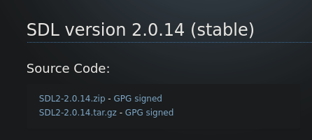

[[<-back](./INSTALLATION.md)]

# Installation
Here are the procedures to install SDL2 on various systems.

## Setting up SDL 2 on Linux
### Ubuntu (Debian)
``` Shell
> sudo apt install libsdl2-dev libsdl2-doc libsdl2-gfx-dev
> sudo apt install libsdl2-image-dev libsdl2-ttf-dev libsdl2-mixer-dev libsdl2-net-dev
```
### Manjaro (Arch)
``` Shell
> sudo pacman -S sdl2 sdl2_gfx
> sudo pacman -S sdl2_image sdl2_ttf sdl2_mixer sdl2_net
```
### From sources
1. Get the sources (tar.gz) from the official [SDL](http://libsdl.org/download-2.0.php) site.


2. Extract the archive and cd to the folder that got extracted.

``` Shell
> cd Download
> tar -xpvf ./SDL2-2.0.14.tar.gz
```

3. Configure the installation using

``` Shell
> ./configure
```

4. Compile the source using the make command

``` Shell
> make all
```

5. Finally, install the package using the make command

``` Shell
> sudo make install
```

Note: If you do a manual install you may have to specify where the headers and library files are for your compiler/IDE.

------
Now that you've installed the development libraries, it's time to start up your __IDE/compiler__.

------
[[<-back](./INSTALLATION.md)]