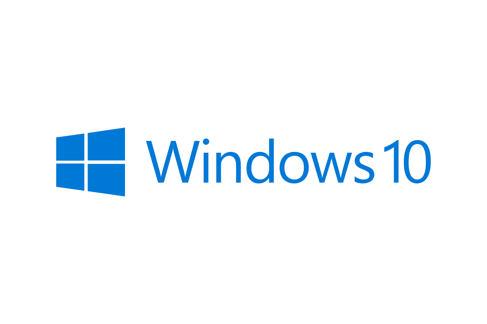

[[<-back](./README.md)]

# Installation

Here are the procedures to install SDL2 on various systems.
Click on your Operating System below.

|  OS  | Link |
|--- | :-: |
| [Linux](./INSTALLATION-LINUX.md)     |           |
| [Windows](./INSTALLATION-WINDOWS.md) |  |

------
[[<-back](./README.md)]
