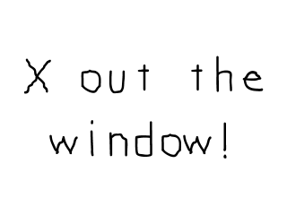

[[<-back](../README.md)]

# Event Driven Programming

Besides just putting images on the screen, games require that you handle input from the user. You can do that with SDL using the event handling system.



 In our code after SDL is initialized and the media is loaded (as mentioned in [the previous tutorial](../lesson-02/README.md)), we declare a quit flag that keeps track of whether the user has quit or not. Since we just started the application at this point, it is obviously initialized to false.

We also declare an [SDL_Event](http://wiki.libsdl.org/SDL_Event?highlight=%28%5CbCategoryStruct%5Cb%29%7C%28CategoryEvents%29) union. A SDL event is some thing like a [key press](http://wiki.libsdl.org/SDL_KeyboardEvent?highlight=%28\bCategoryStruct\b%29|%28CategoryEvents%29), [mouse motion](http://wiki.libsdl.org/SDL_MouseMotionEvent?highlight=%28\bCategoryStruct\b%29|%28CategoryEvents%29), [joy button](http://wiki.libsdl.org/SDL_JoyButtonEvent?highlight=%28\bCategoryStruct\b%29|%28CategoryEvents%29) press, etc. In this application we're going to look for quit events to end the application.

``` C++
            //	Main loop flag
            bool quit = false;

            //	Event handler
            SDL_Event e;

```

In the previous tutorials, we had the program wait for a few seconds before closing. In this application we're having the application wait until the user quits before closing.

So we'll have the application loop while the user has not quit. This loop that keeps running while the application is active is called the main loop, which is sometimes called the game loop. It is the core of any game application.

``` C++
            //	While application is running
            while ( !quit )
            {
```

At the top of our main loop we have our event loop. What this does is keep processing the event queue until it is empty.

When you press a key, move the mouse, or touch a touch screen you put events onto the event queue.


``` C++
                //	Handle events on queue
                while ( SDL_PollEvent( &e ) != 0 )
                {
                    //	User requests quit
                    if	( e.type == SDL_QUIT )
                    {
                        quit = true;
                    }
                }
```

The event queue will then store them in the order the events occured waiting for you to process them. When you want to find out what events occured so you can process them, you poll the event queue to get the most recent event by calling `SDL_PollEvent`. What [SDL_PollEvent](http://wiki.libsdl.org/SDL_PollEvent?highlight=%28\bCategoryEvents\b%29|%28CategoryEnum%29|%28CategoryStruct%29) does is take the most recent event from the event queue and puts the data from the event into the `SDL_Event` we passed into the function.

`SDL_PollEvent` will keep taking events off the queue until it is empty. When the queue is empty, `SDL_PollEvent` will return `0`. So what this piece of code does is keep polling events off the event queue until it's empty. If an event from the event queue is an `SDL_QUIT` event (which is the event when the user Xs out the window), we set the quit flag to true so we can exit the application. 


After we're done processing the events for our frame, we draw to the screen and update it (as discussed in the [previous tutorial](../lesson-02/README.md)). If the quit flag was set to true, the application will exit at the end of the loop. If it is still false it will keep going until the user Xs out the window.

``` C++
                //	Apply the image
                SDL_BlitSurface( gXOut, NULL, gScreenSurface, NULL );
            
                //	Update the surface
                SDL_UpdateWindowSurface( gWindow );
            }
```
----
[[<-back](../README.md)]
