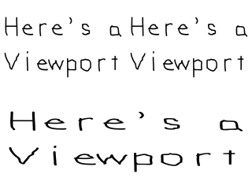
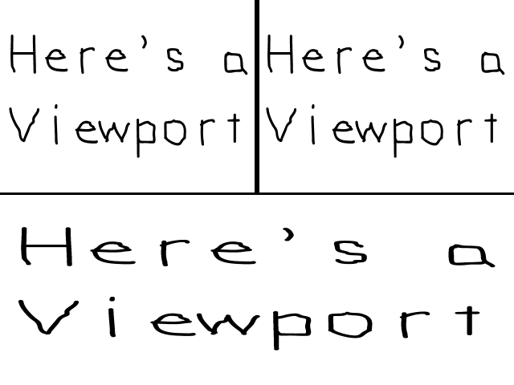

[[<-back](../README.md)]

# The Viewport

Some times you only want to render part of the screen for things like minimaps. Using the viewport you can control where you render on the screen.



---

After we clear the screen, it's time to get drawing. There's 3 regions we're going to draw a full screen image to:



First we're going to render the top left. This is as easy as creating a rectangle with half the width/height as the screen, and passing this region to [`SDL_RenderSetViewport`](http://wiki.libsdl.org/SDL_RenderSetViewport). Any rendering done after that call will render inside the region defined by the given viewport. It will also use the coordinate system of the window it was created in, so the bottom of the view we created will still be y = 480 even though it's only 240 pixels down from the top.

``` C++
                //  Top left corner viewport
                SDL_Rect    topLeftViewport;
                topLeftViewport.x = 0;
                topLeftViewport.y = 0;
                topLeftViewport.w = SCREEN_WIDTH    / 2;
                topLeftViewport.h = SCREEN_HEIGHT   / 2;
                SDL_RenderSetViewport( gRenderer, &topLeftViewport );

                //  Render texture to screen
                SDL_RenderCopy( gRenderer, gTexture, NULL, NULL );
```

Here we define the top right area and draw to it. It's pretty much the same as before, only now the x coordinate is half the screen over.

``` C++
                //  Top right viewport
                SDL_Rect topRightViewport;
                topRightViewport.x = SCREEN_WIDTH   / 2;
                topRightViewport.y = 0;
                topRightViewport.w = SCREEN_WIDTH   / 2;
                topRightViewport.h = SCREEN_HEIGHT  / 2;
                SDL_RenderSetViewport( gRenderer, &topRightViewport );

                //  Render texture to screen
                SDL_RenderCopy( gRenderer, gTexture, NULL, NULL );
```

Finally we render one more time in the bottom half of the screen. Again, the viewport will use the same coordinate system as the window it is used in, so the image will appear squished since the viewport is half the height.

``` C++
                //  Bottom viewport
                SDL_Rect bottomViewport;
                bottomViewport.x = 0;
                bottomViewport.y = SCREEN_HEIGHT / 2;
                bottomViewport.w = SCREEN_WIDTH;
                bottomViewport.h = SCREEN_HEIGHT / 2;
                SDL_RenderSetViewport( gRenderer, &bottomViewport );

                //  Render texture to screen
                SDL_RenderCopy( gRenderer, gTexture, NULL, NULL );
```

And eventually, we render all viewports
``` C++
                //  Update screen
                SDL_RenderPresent( gRenderer );
```

---

[[<-back](../README.md)]
