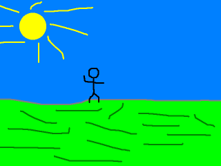

[[<-back](../README.md)]

# Color Keying



When rendering multiple images on the screen, having images with transparent backgrounds is usually necessary. Fortunately SDL provides an easy way to do this using color keying.

---

For this tutorial we're going to wrap the SDL_Texture in a class to make some things easier. For example, if you want to get certain information about the texture such as its width or height you would have to use some SDL functions to query the information for the texture. Instead what we're going to do is use a class to wrap and store the information about the texture.

It's a fairly straight forward class in terms of design. It has a constructor/destructor pair, a file loader, a deallocator, a renderer that takes in a position, and functions to get the texture's dimensions. For member variables, it has the texture we're going to wrap, and variables to store the width/height.

``` C++
//  Texture wrapper class
class LTexture
{
    public:
        //  Initializes variables
        LTexture();

        //  Deallocates memory
        ~LTexture();

        //  Loads image at specified path
        bool loadFromFile   ( std::string path );

        //  Deallocates texture
        void free();

        //  Renders texture at given point
        void render         ( int x, int y );

        //  Gets image dimensions
        int getWidth    ();
        int getHeight   ();

    private:
        //  The actual hardware texture
        SDL_Texture*    mTexture;

        //  Image dimensions
        int mWidth;
        int mHeight;
};
```

For this scene there's two textures we're going to load here declared as "gFooTexture" and "gBackgroundTexture". We're going to take this foo' texture:


Color key the cyan (light blue) colored background and render it on top of this background:


``` C++
//  The window we'll be rendering to
SDL_Window*     gWindow     = NULL;

//  The window renderer
SDL_Renderer*   gRenderer   = NULL;

//  Scene textures
LTexture    gFooTexture;
LTexture    gBackgroundTexture;
```

The constructor initializes variables and the destructor calls the deallocator which we'll cover later.

``` C++
LTexture::LTexture()
{
    //  Initialize
    mTexture= NULL;
    mWidth  = 0;
    mHeight = 0;
}

LTexture::~LTexture()
{
    //  Deallocate
    free();
}
```

The texture loading function pretty much works like it did in the [texture loading tutorial](../lesson-06/README.md) but with some small but important tweaks. First off we deallocate the texture in case there's one that's already loaded.

``` C++
bool LTexture::loadFromFile( std::string path )
{
    //  Get rid of preexisting texture
    free();
```

Next, we color key the image with [`SDL_SetColorKey`](http://wiki.libsdl.org/SDL_SetColorKey) before creating a texture from it. The first argument is the surface we want to color key, the second argument covers whether we want to enable color keying, and the last argument is the pixel we want to color key with.

The most cross platform way to create a pixel from RGB color is with [`SDL_MapRGB`](http://wiki.libsdl.org/SDL_MapRGB). The first argument is the format we want the pixel in. Fortunately the loaded surface has a format member variable. The last three variables are the red, green, and blue components for color you want to map. Here we're mapping cyan which is red `0`, green `255`, blue `255`.

``` C++
    //  The final texture
    SDL_Texture*    newTexture = NULL;

    //  Load image at specified path
    SDL_Surface*    loadedSurface = IMG_Load( path.c_str() );
    if  ( loadedSurface == NULL )
    {
        printf(
            "Unable to load image %s! "
            "SDL_image Error: %s\n"     ,
            path.c_str()                ,
            IMG_GetError()
        );
    }
    else
    {
        //  Color key image
        SDL_SetColorKey(
            loadedSurface               ,
            SDL_TRUE                    ,
            SDL_MapRGB( loadedSurface->format, 0, 0xFF, 0xFF )
        );

```

After color keying the loaded surface, we create a texture from the loaded and color keyed surface. If the texture was created successfully, we store the width/height of the texture and return whether the texture loaded successfully.

``` C++
        //  Create texture from surface pixels
        newTexture  =
            SDL_CreateTextureFromSurface( gRenderer, loadedSurface );
        if  ( newTexture == NULL )
        {
            printf(
                "Unable to create texture from %s! "
                "SDL Error: %s\n"                   ,
                path.c_str()                        ,
                SDL_GetError()
            );
        }
        else
        {
            //  Get image dimensions
            mWidth  = loadedSurface->w;
            mHeight = loadedSurface->h;
        }

        //  Get rid of old loaded surface
        SDL_FreeSurface( loadedSurface );
    }

    //  Return success
    mTexture = newTexture;
    return mTexture != NULL;
}
```

The deallocator simply checks if a texture exists, destroys it, and reinitializes the member variables.

``` C++
void LTexture::free()
{
    //  Free texture if it exists
    if  ( mTexture != NULL )
    {
        SDL_DestroyTexture( mTexture );
        mTexture= NULL;
        mWidth  = 0;
        mHeight = 0;
    }
}
```

Here you see why we needed a wrapper class. Up until now, we have been pretty much been rendering full screen images so we didn't need to specify position. Because we didn't need to specify position, we just called SDL_RenderCopy with the last two arguments as NULL.

When rendering a texture in a certain place, you need to specify a destination rectangle that sets the x/y position and width/height. We can't specify the width/height without knowing the original image's dimensions. So here when we render our texture we create a rectangle with the position arguments and the member width/height, and pass in this rectangle to SDL_RenderCopy.

``` C++
void LTexture::render( int x, int y )
{
    //  Set rendering space and render to screen
    SDL_Rect renderQuad = { x, y, mWidth, mHeight };
    SDL_RenderCopy(
        gRenderer       ,
        mTexture        ,
        NULL            ,
        &renderQuad
    );
}
```

These last member functions allow us to get the width/height when we need them.

``` C++
int LTexture::getWidth()
{
    return mWidth;
}

int LTexture::getHeight()
{
    return mHeight;
}
```

### Here are the image loading functions in action.

``` C++
bool loadMedia()
{
    //  Loading success flag
    bool success = true;

    //  Load Foo' texture
    if  ( !gFooTexture.loadFromFile( "./foo.png" ) )
    {
        printf( "Failed to load Foo' texture image!\n" );
        success = false;
    }

    //  Load background texture
    if  ( !gBackgroundTexture.loadFromFile( "./background.png" ) )
    {
        printf( "Failed to load background texture image!\n" );
        success = false;
    }

    return success;
}
```

And here are the deallocators.

``` C++
void close()
{
    //  Free loaded images
    gFooTexture.        free();
    gBackgroundTexture. free();

    //  Destroy window
    SDL_DestroyRenderer ( gRenderer );
    SDL_DestroyWindow   ( gWindow );
    gWindow     = NULL;
    gRenderer   = NULL;

    //  Quit SDL subsystems
    IMG_Quit();
    SDL_Quit();
}
```

Here is the main loop with our textures rendering. It's a basic loop that handles events, clears the screen, renders the background, renders the stick figure on top of it, and updates the screen.

An important thing to note is that order matters when you're rendering multiple things to the screen every frame. If we render the stick figure first, the background will render over it and you won't be able to see the stick figure.

``` C++
            //  While application is running
            while   ( !quit )
            {
                //  Handle events on queue
                while   ( SDL_PollEvent( &e ) != 0 )
                {
                    //  User requests quit
                    if  ( e.type == SDL_QUIT )
                    {
                        quit = true;
                    }
                }

                //  Clear screen
                SDL_SetRenderDrawColor  ( gRenderer, 0xFF, 0xFF, 0xFF, 0xFF );
                SDL_RenderClear         ( gRenderer );

                //  Render background texture to screen
                gBackgroundTexture.render( 0, 0 );

                //  Render Foo' to the screen
                gFooTexture.render  ( 240, 190 );

                //  Update screen
                SDL_RenderPresent   ( gRenderer );
            }
```

---

[[<-back](../README.md)]
