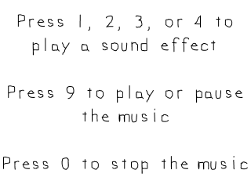

# Sound Effects and Music



Up until now we've only been dealing with video and input. Most games made require some sort of sound and here we'll be using SDL_mixer to play audio for us.

------
#### SDL Mixer

[SDL_mixer](http://www.libsdl.org/projects/SDL_mixer/) is a library we use to make audio playing easier (because it can get [complicated](http://wiki.libsdl.org/CategoryAudio)). We have to set it up just like we set up [SDL_image](https://lazyfoo.net/tutorials/SDL/06_extension_libraries_and_loading_other_image_formats/index.php). Like before, it's just a matter of having the headers files, library files, and binary files in the right place with your compiler configured to use them.

``` C++
//  Using SDL, SDL_image, SDL_mixer, standard IO, and strings
#include <SDL.h>
#include <SDL_image.h>
#include <SDL_mixer.h>
#include <stdio.h>
#include <string>
```

The SDL_mixer data type for music is [Mix_Music](http://www.libsdl.org/projects/SDL_mixer/docs/SDL_mixer_86.html) and one for short sounds is [Mix_Chunk](http://www.libsdl.org/projects/SDL_mixer/docs/SDL_mixer_85.html). Here we declare pointers for the music and sound effects we'll be using.

``` C++
//  The music that will be played
Mix_Music *gMusic   = NULL;

//  The sound effects that will be used
Mix_Chunk *gScratch = NULL;
Mix_Chunk *gHigh    = NULL;
Mix_Chunk *gMedium  = NULL;
Mix_Chunk *gLow     = NULL;
```

Since we're using music and sound effects, we need to initialize audio along with video for this demo.

``` C++
//  Initialize SDL
if  ( SDL_Init( SDL_INIT_VIDEO | SDL_INIT_AUDIO ) < 0 )
{
    printf( "SDL could not initialize! SDL Error: %s\n", SDL_GetError() );
    success = false;
}
```

To initialize SDL_mixer we need to call [Mix_OpenAudio](http://www.libsdl.org/projects/SDL_mixer/docs/SDL_mixer_11.html). The first argument sets the sound frequency, and 44100 is a standard frequency that works on most systems. The second argument determines the sample format, which again here we're using the default. The third argument is the number of hardware channels, and here we're using 2 channels for stereo. The last argument is the sample size, which determines the size of the chunks we use when playing sound. 2048 bytes (AKA 2 kilobyes) worked fine for me, but you may have to experiment with this value to minimize lag when playing sounds.

If there's any errors with SDL_mixer, they're reported with Mix_GetError.

``` C++
//  Initialize PNG loading
int imgFlags = IMG_INIT_PNG;
if  ( !( IMG_Init( imgFlags ) & imgFlags ) )
{
    printf( "SDL_image could not initialize! SDL_image Error: %s\n", IMG_GetError() );
    success = false;
}

//  Initialize SDL_mixer
if  ( Mix_OpenAudio( 44100, MIX_DEFAULT_FORMAT, 2, 2048 ) < 0 )
{
    printf( "SDL_mixer could not initialize! SDL_mixer Error: %s\n", Mix_GetError() );
    success = false;
}
```

Here we load our splash texture and sound.

To load music we call [Mix_LoadMUS](http://www.libsdl.org/projects/SDL_mixer/docs/SDL_mixer_55.html) and to load sound effect we call [Mix_LoadWAV](http://www.libsdl.org/projects/SDL_mixer/docs/SDL_mixer_19.html).

``` C++
bool loadMedia()
{
    //  Loading success flag
    bool success = true;

    //  Load prompt texture
    if  ( !gPromptTexture.loadFromFile( "./prompt.png" ) )
    {
        printf( "Failed to load prompt texture!\n" );
        success = false;
    }

    //  Load music
    gMusic = Mix_LoadMUS( "./beat.wav" );
    if  ( gMusic == NULL )
    {
        printf( "Failed to load beat music! SDL_mixer Error: %s\n", Mix_GetError() );
        success = false;
    }
    
    //  Load sound effects
    gScratch = Mix_LoadWAV( "./scratch.wav" );
    if  ( gScratch == NULL )
    {
        printf( "Failed to load scratch sound effect! SDL_mixer Error: %s\n", Mix_GetError() );
        success = false;
    }
    
    gHigh = Mix_LoadWAV( "./high.wav" );
    if  ( gHigh == NULL )
    {
        printf( "Failed to load high sound effect! SDL_mixer Error: %s\n", Mix_GetError() );
        success = false;
    }

    gMedium = Mix_LoadWAV( "./medium.wav" );
    if  ( gMedium == NULL )
    {
        printf( "Failed to load medium sound effect! SDL_mixer Error: %s\n", Mix_GetError() );
        success = false;
    }

    gLow = Mix_LoadWAV( "./low.wav" );
    if  ( gLow == NULL )
    {
        printf( "Failed to load low sound effect! SDL_mixer Error: %s\n", Mix_GetError() );
        success = false;
    }

    return success;
}
```

When we're done with audio and want to free it, we call [Mix_FreeMusic](http://www.libsdl.org/projects/SDL_mixer/docs/SDL_mixer_56.html) to free music and [Mix_FreeChunk](http://www.libsdl.org/projects/SDL_mixer/docs/SDL_mixer_24.html) to free a sound effect. We call [Mix_Quit](http://www.libsdl.org/projects/SDL_mixer/docs/SDL_mixer_10.html) to close down SDL_mixer.

``` C++
void close()
{
    //  Free loaded images
    gPromptTexture.free();

    //  Free the sound effects
    Mix_FreeChunk( gScratch );
    Mix_FreeChunk( gHigh );
    Mix_FreeChunk( gMedium );
    Mix_FreeChunk( gLow );
    gScratch= NULL;
    gHigh   = NULL;
    gMedium = NULL;
    gLow    = NULL;
    
    //  Free the music
    Mix_FreeMusic( gMusic );
    gMusic  = NULL;

    //  Destroy window    
    SDL_DestroyRenderer ( gRenderer );
    SDL_DestroyWindow   ( gWindow   );
    gWindow = NULL;
    gRenderer = NULL;

    //  Quit SDL subsystems
    Mix_Quit();
    IMG_Quit();
    SDL_Quit();
}
```

------
#### [Mix_PlayChannel](http://www.libsdl.org/projects/SDL_mixer/docs/SDL_mixer_28.html)
In the event loop, we play a sound effect when the 1, 2, 3, or 4 keys are pressed. The way to play a Mix_Chunk is by calling [Mix_PlayChannel](http://www.libsdl.org/projects/SDL_mixer/docs/SDL_mixer_28.html). The first argument is the channel you want to use to play it. Since we don't care which channel it comes out of, we set the channel to negative 1 which will use the nearest available channel. The second argument is the sound effect and last argument is the number of times to repeat the effect. We only want it to play once per button press, so we have it repeat 0 times.

A channel in this case is not the same as a hardware channel that can represent the left and right channel of a stereo system. Every sound effect that's played has a channel associated with it. When you want to pause or stop an effect that is playing, you can halt its channel.

``` C++
//  Handle key press
else if ( e.type == SDL_KEYDOWN )
{
switch( e.key.keysym.sym )
{
    //  Play high sound effect
    case SDLK_1:
        Mix_PlayChannel( -1, gHigh, 0 );
        break;
                            
    //  Play medium sound effect
    case SDLK_2:
        Mix_PlayChannel( -1, gMedium, 0 );
        break;
                            
    //  Play low sound effect
    case SDLK_3:
        Mix_PlayChannel( -1, gLow, 0 );
        break;
                            
    //  Play scratch sound effect
    case SDLK_4:
        Mix_PlayChannel( -1, gScratch, 0 );
        break;
```

For this demo, we want to play/pause the music on a 9 keypress and stop the music on a 0 keypress.

When the 9 key pressed we first check if the music is not playing with [Mix_PlayingMusic](http://www.libsdl.org/projects/SDL_mixer/docs/SDL_mixer_71.html). If it isn't, we start the music with [Mix_PlayMusic](http://www.libsdl.org/projects/SDL_mixer/docs/SDL_mixer_57.html). The first argument is the music we want to play and the last argument is the number of times to repeat it. Negative 1 is a special value saying we want to loop it until it is stopped.

If there is music playing, we check if the music is paused using [Mix_PausedMusic](http://www.libsdl.org/projects/SDL_mixer/docs/SDL_mixer_72.html). If the music is paused, we resume it using [Mix_ResumeMusic](http://www.libsdl.org/projects/SDL_mixer/docs/SDL_mixer_63.html). If the music is not paused we pause it using [Mix_PauseMusic](http://www.libsdl.org/projects/SDL_mixer/docs/SDL_mixer_62.html).

When 0 is pressed, we stop music if it's playing using [Mix_HaltMusic](http://www.libsdl.org/projects/SDL_mixer/docs/SDL_mixer_67.html).

``` C++
    case SDLK_9:
        //  If there is no music playing
        if  ( Mix_PlayingMusic() == 0 )
        {
            //  Play the music
            Mix_PlayMusic( gMusic, -1 );
        }
        //  If music is being played
        else
        {
            //  If the music is paused
            if  ( Mix_PausedMusic() == 1 )
            {
                //  Resume the music
                Mix_ResumeMusic();
            }
            //  If the music is playing
            else
            {
                //  Pause the music
                Mix_PauseMusic();
            }
        }
        break;
                            
        case SDLK_0:
            //  Stop the music
            Mix_HaltMusic();
            break;
    }
}
```