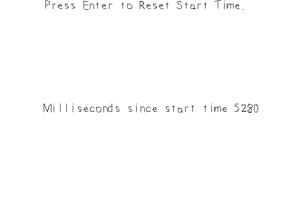

# Timing

Another important part of any sort of gaming API is the ability to handle time. In this tutorial we'll make a timer we can restart.



------
For this tutorial we'll be using string streams and have to include the sstream header which should come standard with your C++ compiler.

``` C++
//  Using SDL, SDL_image, SDL_ttf,
//  standard IO, strings, and string streams
#include <SDL.h>
#include <SDL_image.h>
#include <SDL_ttf.h>
#include <stdio.h>
#include <string>
#include <sstream>
```

As mentioned in the [font rendering tutorial](https://lazyfoo.net/tutorials/SDL/16_true_type_fonts/index.php), you want to minimize the amount of times you render text. We'll have a texture to prompt input and a texture to display the current time in milliseconds. The time texture changes every frame so we have to render that every frame, but the prompt texture doesn't change so we can render it once in the file loading function.

``` C++
bool loadMedia()
{
    //  Loading success flag
    bool success = true;

    //  Open the font
    gFont = TTF_OpenFont( "./img/lazy.ttf", 28 );
    if  ( gFont == NULL )
    {
        printf( "Failed to load lazy font! SDL_ttf Error: %s\n", TTF_GetError() );
        success = false;
    }
    else
    {
        //  Set text color as black
        SDL_Color textColor = { 0, 0, 0, 255 };
        
        //  Load prompt texture
        if  ( !gPromptTextTexture.loadFromRenderedText( "Press Enter to Reset Start Time.", textColor ) )
        {
            printf( "Unable to render prompt texture!\n" );
            success = false;
        }
    }

    return success;
}
```

Before we enter the main loop we want to declare some variables. The two we want to pay attention to is the startTime variable (which is an Unsigned integer that's 32bits) and the timeText variable which is a string stream.

For those of you who have never used string streams, just know that they function like iostreams only instead of reading or writing to the console, they allow you to read and write to a string in memory. It'll be easier to see when we see them used further on in the program.

``` C++
            //  Main loop flag
            bool quit = false;

            //  Event handler
            SDL_Event e;

            //  Set text color as black
            SDL_Color textColor = { 0, 0, 0, 255 };

            //  Current time start time
            Uint32 startTime = 0;

            //  In memory text stream
            std::stringstream timeText;
```

There's a function called [SDL_GetTicks](http://wiki.libsdl.org/SDL_GetTicks) which returns the time since the program started in milliseconds. For this demo, we'll be having a timer that restarts every time we press the return key.

Remember how we initialized the start time to 0 at the start of the program? This means the timer's time is just the current time since the program started returned by SDL_GetTicks. If we were to restart the timer when SDL_GetTicks was at 5000 milliseconds (5 seconds), then at 10,000 milliseconds the current time - the start time would be 10000 minus 5000 would be 5000 milliseconds. So even though the timer contained by SDL_GetTicks hasn't restarted, we can have a timer keep track of a relative start time and reset its start time.

``` C++
            //  While application is running
            while ( !quit )
            {
                //  Handle events on queue
                while ( SDL_PollEvent( &e ) != 0 )
                {
                    //  User requests quit
                    if  ( e.type == SDL_QUIT )
                    {
                        quit = true;
                    }
                    //  Reset start time on return keypress
                    else if ( e.type == SDL_KEYDOWN && e.key.keysym.sym == SDLK_RETURN )
                    {
                        startTime = SDL_GetTicks();
                    }
                }
```

Here we're using our string stream. First we call str with an empty string to initialize it to be empty. Then we treat it like cout and print to it "Milliseconds since start time " and the current time minus the relative start time so it will print the time since we last started the timer.

``` C++
                //  Set text to be rendered
                timeText.str( "" );
                timeText << "Milliseconds since start time " << SDL_GetTicks() - startTime; 
```

Now that we have the time in a string stream, we can get a string from it and use it to render the current time to a texture.
``` C++
                //  Render text
                if  ( !gTimeTextTexture.loadFromRenderedText( timeText.str().c_str(), textColor ) )
                {
                    printf( "Unable to render time texture!\n" );
                }
```
 
Finally we render the prompt texture and the time texture to the screen.

``` C++
                //  Clear screen
                SDL_SetRenderDrawColor(
                    gRenderer   ,
                    0xFF        ,
                    0xFF        ,
                    0xFF        ,
                    0xFF
                );
                SDL_RenderClear( gRenderer );

                //  Render textures
                gPromptTextTexture.render( ( SCREEN_WIDTH - gPromptTextTexture.getWidth() ) / 2, 0 );
                gTimeTextTexture.render( ( SCREEN_WIDTH - gPromptTextTexture.getWidth() ) / 2, ( SCREEN_HEIGHT - gPromptTextTexture.getHeight() ) / 2 );

                //  Update screen
                SDL_RenderPresent( gRenderer );
```
