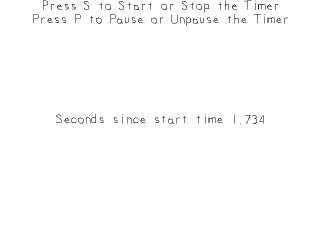

[[<-back](../README.md)]

# Advanced Timers

Now that we've made a [basic timer with SDL](../lesson-22/README.md), it's time to make one that can start/stop/pause.



----
### Timer

For these new features, we're going to make a timer class. It has all the basic function to start/stop/pause/unpause the timer and check its status. In terms of data members, we have the start time like before, a variable to store the time when paused, and status flags to keep track of whether the timer is running or paused.

``` C++
//	The application time based timer
class LTimer
{
    public:
        //	Initializes variables
        LTimer();

        //	The various clock actions
        void start();
        void stop();
        void pause();
        void unpause();

        //	Gets the timer's time
        Uint32 getTicks();

        //	Checks the status of the timer
        bool isStarted();
        bool isPaused();

    private:
        //	The clock time when the timer started
        Uint32 mStartTicks;

        //	The ticks stored when the timer was paused
        Uint32 mPausedTicks;

        //	The timer status
        bool mPaused;
        bool mStarted;
};
```

Our constructor initializes the internal data members.

``` C++
LTimer::LTimer()
{
    //	Initialize the variables
    mStartTicks	= 0;
    mPausedTicks	= 0;

    mPaused	= false;
    mStarted= false;
}
```

The `start` function sets the started and paused flags, gets the timer's start time and initializes the pause time to 0. For this timer, if we want to restart it we just call start again. Since we can start the timer if it is paused and/or running, we should make sure to clear out the paused data.

``` C++
void LTimer::start()
{
    //	Start the timer
    mStarted	= true;

    //	Unpause the timer
    mPaused		= false;

    //Get the current clock time
    mStartTicks	= SDL_GetTicks();
    mPausedTicks	= 0;
}
```


The `stop` function basically reinitializes all the variables.

``` C++
void LTimer::stop()
{
    //  Stop the timer
    mStarted = false;

    //  Unpause the timer
    mPaused  = false;

    //  Clear tick variables
    mStartTicks = 0;
    mPausedTicks= 0;
}
```

When pausing, we want to check if the timer is running because it doesn't make sense to pause a timer that hasn't started. If the timer is running, we set the pause flag, store the time when the timer was paused in `mPausedTicks`, and reset the start time.

``` C++
void LTimer::pause()
{
    //  If the timer is running and isn't already paused
    if  ( mStarted && !mPaused )
    {
        //  Pause the timer
        mPaused = true;

        //  Calculate the paused ticks
        mPausedTicks = SDL_GetTicks() - mStartTicks;
        mStartTicks  = 0;
    }
}
```

So when we unpause the timer, we want to make sure the timer is running and paused because we can't unpause a timer that's stopped or running. We set the paused flag to false and set the new start time.

Say if you start the timer when `SDL_GetTicks()` reports 5000 ms and then you pause it at 10000 ms. This means the relative time at the time of pausing is 5000 ms. If we were to unpause it when `SDL_GetTicks()` was at 20000 ms, the new start time would be 20000 ms - 5000 ms or 15000 ms. This way the relative time will still be 5000 ms away from the current `SDL_GetTicks()` time.

```C++
void LTimer::unpause()
{
    //  If the timer is running and paused
    if  ( mStarted && mPaused )
    {
        //  Unpause the timer
        mPaused = false;

        //  Reset the starting ticks
        mStartTicks = SDL_GetTicks() - mPausedTicks;

        //  Reset the paused ticks
        mPausedTicks = 0;
    }
}
```

Getting the time is a little bit tricky since our timer can be running, paused, or stopped. If the timer is stopped, we just return the initial 0 value. If the timer is paused, we return the time stored when paused. If the timer is running and not paused, we return the time relative to when it started.

```C++
Uint32 LTimer::getTicks()
{
    //  The actual timer time
    Uint32 time = 0;

    //  If the timer is running
    if  ( mStarted )
    {
        //  If the timer is paused
        if  ( mPaused )
        {
            //  Return the number of ticks when the timer was paused
            time = mPausedTicks;
        }
        else
        {
            //  Return the current time minus the start time
            time = SDL_GetTicks() - mStartTicks;
        }
    }

    return time;
}
```

Here we have some acccessor functions to check the status of the timer.

``` C++
bool LTimer::isStarted()
{
    //  Timer is running and paused or unpaused
    return mStarted;
}

bool LTimer::isPaused()
{
    //  Timer is running and paused
    return mPaused && mStarted;
}
```

Before we enter the main loop, we declare a timer object and a string stream to turn the time value into text.

``` C++
            //  Main loop flag
            bool quit = false;

            //  Event handler
            SDL_Event e;

            //  Set text color as black
            SDL_Color textColor = { 0, 0, 0, 255 };

            //  The application timer
            LTimer timer;

            //  In memory text stream
            std::stringstream timeText;
```

When we press `s` key, we check if the timer is started. If it is, we stop it. If it isn't, we start it. When we press `p`, we check if the timer is paused. If it is, we unpause it. Otherwise we pause it.

``` C++
                    else if  ( e.type == SDL_KEYDOWN )
                    {
                        //  Start/stop
                        if  ( e.key.keysym.sym == SDLK_s )
                        {
                            if  ( timer.isStarted() )
                            {
                                timer.stop();
                            }
                            else
                            {
                                timer.start();
                            }
                        }
                        //  Pause/unpause
                        else if  ( e.key.keysym.sym == SDLK_p )
                        {
                            if  ( timer.isPaused() )
                            {
                                timer.unpause();
                            }
                            else
                            {
                                timer.pause();
                            }
                        }
                    }
```

Before we render, we write the current time to a string stream. The reason we divide it by 1000 is because we want seconds and there are 1000 milliseconds per second.

After that we render the text to a texture and then finally draw all the textures to the screen.

``` C++
                //  Set text to be rendered
                timeText.str( "" );
                timeText << "Seconds since start time " << ( timer.getTicks() / 1000.f ) ; 

                //  Render text
                if  ( !gTimeTextTexture.loadFromRenderedText( timeText.str().c_str(), textColor ) )
                {
                    printf( "Unable to render time texture!\n" );
                }

                //  Clear screen
                SDL_SetRenderDrawColor( gRenderer, 0xFF, 0xFF, 0xFF, 0xFF );
                SDL_RenderClear( gRenderer );

                //  Render textures
                gStartPromptTexture.render( ( SCREEN_WIDTH - gStartPromptTexture.getWidth() ) / 2, 0 );
                gPausePromptTexture.render( ( SCREEN_WIDTH - gPausePromptTexture.getWidth() ) / 2, gStartPromptTexture.getHeight() );
                gTimeTextTexture.render( ( SCREEN_WIDTH - gTimeTextTexture.getWidth() ) / 2, ( SCREEN_HEIGHT - gTimeTextTexture.getHeight() ) / 2 );

                //  Update screen
                SDL_RenderPresent( gRenderer );
```

----
[[<-back](../README.md)]