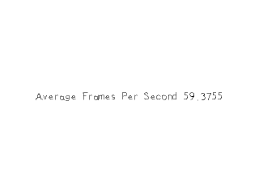

[[<-back](../README.md)]

# Calculating Frame Rate

Now that we know [how to make a timer with SDL](../lesson-23/README.md) it's time to put it to use. We're going to use the timer to measure fps.



----

In order to calculate the frames per second, we need to keep track of the number of frames rendered and the number of seconds passed. Before we enter the main loop, we start a timer used to calculate fps and declare a variable to keep track of the number of frames rendered.

``` C++
            //  Main loop flag
            bool quit = false;

            //  Event handler
            SDL_Event e;

            //  Set text color as black
            SDL_Color textColor = { 0, 0, 0, 255 };

            //  The frames per second timer
            LTimer fpsTimer;

            //  In memory text stream
            std::stringstream timeText;

            //  Start counting frames per second
            int countedFrames = 0;
            fpsTimer.start();
```

To calculate frames per second, you just take the number of rendered frames and divide it by the seconds passed. Now it is possible for there to be a very small amount of time passed for the first frame and have it give us a really high fps. This is why we correct the value if it is really high.

``` C++
                //  Calculate and correct fps
                float avgFPS = countedFrames / ( fpsTimer.getTicks() / 1000.f );
                if  ( avgFPS > 2000000 )
                {
                    avgFPS = 0;
                }
```

After calculating the fps, we render the value as a texture to the screen. After we're done rendering the scene, we increment the frame counter.

Since this program is vsynced, it is probably going to report 60 fps. If you want to find out how much you hardware can do, just create a renderer without vsync.

``` C++
                //  Set text to be rendered
                timeText.str( "" );
                timeText << "Average Frames Per Second " << avgFPS; 

                //  Render text
                if  ( !gFPSTextTexture.loadFromRenderedText( timeText.str().c_str(), textColor ) )
                {
                    printf( "Unable to render FPS texture!\n" );
                }

                //  Clear screen
                SDL_SetRenderDrawColor( gRenderer, 0xFF, 0xFF, 0xFF, 0xFF );
                SDL_RenderClear( gRenderer );

                //  Render textures
                gFPSTextTexture.render( ( SCREEN_WIDTH - gFPSTextTexture.getWidth() ) / 2, ( SCREEN_HEIGHT - gFPSTextTexture.getHeight() ) / 2 );

                //  	Update screen
                SDL_RenderPresent( gRenderer );
                ++countedFrames;
```

----
[[<-back](../README.md)]
