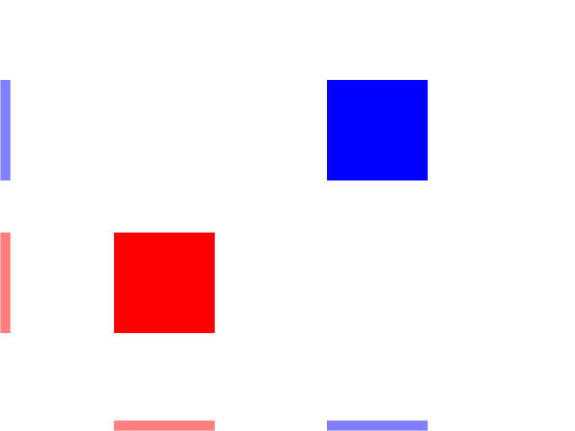
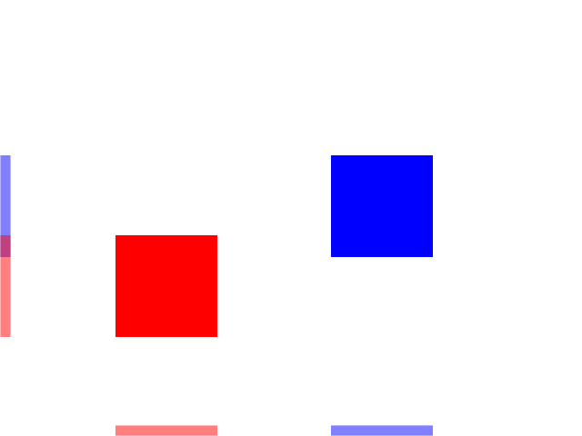
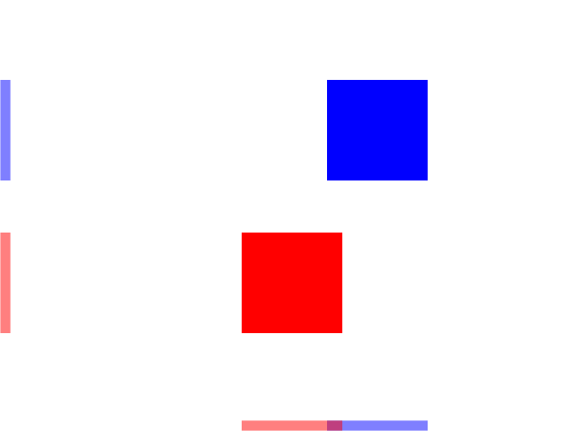
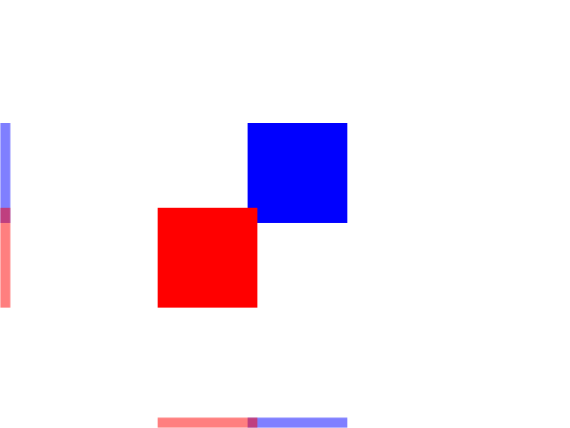

[[<-back](../README.md)]

# Collision Detection
In games you often need to tell if two objects hit each other. For simple games, this is usually done with bounding box collision detection.

----

### Collision boxes

Collision boxes are a standard way to check collision between two objects. Two polygons are in collision when they are not separated.

1.	Here we have two boxes that are not collided. As you can see, their x projections are on the bottom and their y projections are on the left:


2.	Here you see the boxes have collided along the y axis but they are separated on the x axis:


3.	Here the boxes are collided on the x axis but they are separated on the y axis:


4.	When there is no separation on any of the axes there is a collision:


----

### class Dot

Here is the dot from the [motion tutorial](https://lazyfoo.net/tutorials/SDL/26_motion/index.php) with some new features. The move function takes in a rectangle that is the collision box for the wall and the dot has a data member called mCollider to represent the collision box.

``` C++
//	The dot that will move around on the screen
class Dot
{
    public:
        //	The dimensions of the dot
        static const int DOT_WIDTH  = 20;
        static const int DOT_HEIGHT = 20;

        //	Maximum axis velocity of the dot
        static const int DOT_VEL    = 10;

        //	Initializes the variables
        Dot();

        //	Takes key presses and adjusts the dot's velocity
        void handleEvent ( SDL_Event& e );

        //	Moves the dot and checks collision
        void move        ( SDL_Rect&  wall );

        //	Shows the dot on the screen
        void render();

    private:
        //	The X and Y offsets of the dot
        int mPosX, mPosY;

        //	The velocity of the dot
        int mVelX, mVelY;
        
        //	Dot's collision box
        SDL_Rect mCollider;
};
```

We're also declaring a function to check collision between two boxes.

``` C++
//  Starts up SDL and creates window
bool init();

//  Loads media
bool loadMedia();

//  Frees media and shuts down SDL
void close();

//  Box collision detector
bool checkCollision( SDL_Rect a, SDL_Rect b );
```

In the contructor we should make sure the collider's dimensions are set.

``` C++
Dot::Dot()
{
    //  Initialize the offsets
    mPosX = 0;
    mPosY = 0;

    //  Set collision box dimension
    mCollider.w = DOT_WIDTH;
    mCollider.h = DOT_HEIGHT;

    //  Initialize the velocity
    mVelX = 0;
    mVelY = 0;
}
```

----

### move

Here is the new moving function that now checks if we hit the wall. It works much like before only now it makes the dot move back if we go off the screen or hit the wall.

First we move the dot along the x axis, but we also have to change the position of the collider. Whenever we change the dot's position, the collider's position has to follow. Then we check if the dot has gone off screen or hit the wall. If it does we move the dot back along the x axis. Finally, we do this again for motion on the y axis.

``` C++
void Dot::move( SDL_Rect& wall )
{
    //  Move the dot left or right
    mPosX      += mVelX;
    mCollider.x = mPosX;

    //  If the dot collided or went too far to the left or right
    if  (
            ( mPosX < 0 )                           ||
            ( mPosX + DOT_WIDTH > SCREEN_WIDTH )    ||
            checkCollision( mCollider, wall )
        )
    {
        //  Move back
        mPosX      -= mVelX;
        mCollider.x = mPosX;
    }

    //  Move the dot up or down
    mPosY      += mVelY;
    mCollider.y = mPosY;

    //  If the dot collided or went too far up or down
    if  (
            ( mPosY < 0 )                             ||
            ( mPosY + DOT_HEIGHT > SCREEN_HEIGHT )    ||
            checkCollision( mCollider, wall )
        )
    {
        //  Move back
        mPosY      -= mVelY;
        mCollider.y = mPosY;
    }
}
```

----

### checkCollision

Here is where the collision detection happens. This code calculates the top/bottom and left/right of each of the collison boxes.

``` C++
bool checkCollision( SDL_Rect a, SDL_Rect b )
{
    //  The sides of the rectangles
    int leftA  , leftB;
    int rightA , rightB;
    int topA   , topB;
    int bottomA, bottomB;

    //  Calculate the sides of rect A
    leftA   = a.x;
    rightA  = a.x + a.w;
    topA    = a.y;
    bottomA = a.y + a.h;

    //  Calculate the sides of rect B
    leftB   = b.x;
    rightB  = b.x + b.w;
    topB    = b.y;
    bottomB = b.y + b.h;
```

Here is where we do our separating axis test. First we check the top and bottom of the boxes to see if they are separated along the y axis. Then we check the left/right to see if they are separated on the x axis. If there is any separation, then there is no collision and we return `false`. If we cannot find any separation, then there is a collision and we return `true`.

**Note**: SDL does have some [built in collision detection functions](), but for this tutorial set we'll be hand rolling our own. Mainly because it's important to know how these work and secondly because if you can roll your own you can use your collision detection with SDL rendering, OpenGL, Direct3D, Mantle, Metal, or any other rendering API.

``` C++
    //  If any of the sides from A are outside of B
    if  ( bottomA <= topB )
    {
        return false;
    }

    if  ( topA >= bottomB )
    {
        return false;
    }

    if  ( rightA <= leftB )
    {
        return false;
    }

    if  ( leftA >= rightB )
    {
        return false;
    }

    //  If none of the sides from A are outside B
    return true;
}
```

----

### main

Before we enter the main loop, we declare the dot and define the position and dimensions of the wall.

``` C++
            //  Main loop flag
            bool quit = false;

            //  Event handler
            SDL_Event e;

            //  The dot that will be moving around on the screen
            Dot dot;

            //  Set the wall
            SDL_Rect wall;
            wall.x = 300;
            wall.y = 40;
            wall.w = 40;
            wall.h = 400;
```

Here is our main loop with the dot handling events, moving while checking for collision against the wall and finally rendering the wall and the dot onto the screen.

``` C++
            //  While application is running
            while ( !quit )
            {
                //  Handle events on queue
                while ( SDL_PollEvent( &e ) != 0 )
                {
                    //  User requests quit
                    if  ( e.type == SDL_QUIT )
                    {
                        quit = true;
                    }

                    //  Handle input for the dot
                    dot.handleEvent( e );
                }

                //  Move the dot and check collision
                dot.move( wall );

                //  Clear screen
                SDL_SetRenderDrawColor( gRenderer, 0xFF, 0xFF, 0xFF, 0xFF );
                SDL_RenderClear       ( gRenderer );

                //  Render wall
                SDL_SetRenderDrawColor( gRenderer, 0x00, 0x00, 0x00, 0xFF );        
                SDL_RenderDrawRect    ( gRenderer, &wall );
                
                //  Render dot
                dot.render();

                //  Update screen
                SDL_RenderPresent     ( gRenderer );
            }
```

### Physics

These next two sections are for future reference. Odds are if you're reading this tutorial, you're a beginner and this stuff is way too advanced. This is more for down the road when you need to use more advanced collision detection.

Now when you're starting out and just want to make something simple like tetris, this sort of collision detection is fine. For something like a physics simulator things get much more complicated.

For something like a rigid body simulator, we have our logic do this every frame:
1) Apply all the forces to all the objects in the scene (gravity, wind, propulsion, etc).

2) Move the objects by applying the acceleration and velocity to the position.

3) Check collisions for all of the objects and create a set of contacts. A contact is a data structure that typically contains pointers to the two objects that are colliding, a normal vector from the first to the second object, and the amount the objects are penetrating.

4) Take the set of generated contacts and resolve the collisions. This typically involves checking for contacts again (within a limit) and resolving them.

Now if you're barely learning collision detection, this is out of your league for now. This would take an entire tutorial set (that I currently do not have time to make) to explain it. Not only that it involves vector math and physics which is beyond the scope of these tutorials. Just keep this in mind later on when you need games that have large amounts of colliding objects and are wondering how the over all structure for a physics engine works.

### AABBs & OBBs

Another thing is that the boxes we have here are AABBs or axis aligned bounding boxes. This means they have sides that are aligned with the x and y axis. If you want to have boxes that are rotated, you can still use the separating axis test on OBBs (oriented bounding boxes). Instead of projecting the corners on the x and y axis, you project all of the corners of the boxes on the I and J axis for each of the boxes. You then check if the boxes are separated along each axis. You can extend this further for any type of polygon by projecting all of the corners of each axis along each of the polygon's axis to see if there is any separation. This all involves vector math and this as mentioned before is beyond the scope of this tutorial set.

----
[[<-back](../README.md)]
