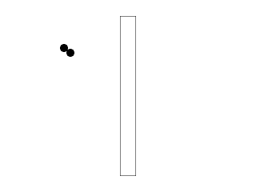

[[<-back](../README.md)]

# Circular Collision Detection

Along with collision boxes, circles are the most common form of collider. Here we'll be checking collision between two circles and a circle and a box.



----

### Principle

Checking collision between two circles is easy. All you have to do is check whether the distance between the center of each circle is less than the sum of their radii (radii is the plural for radius).

For box/circle collision, you have to find the point on the collision box that is closest to the center of the circle. If that point is less than the radius of the circle, there is a collision.

----

SDL has a built in rectangle structure, but we have to make our own circle structure with a position and radius.

``` C++
//  A circle structure
struct Circle
{
    int x, y;
    int r;
};
```

Here is the dot class from [previous collision detection tutorials](../lesson-27/README.md) with some more additions. The move function takes in a circle and a rectangle to check collision against when moving. We also now have a circle collider instead of a rectangle collider.

``` C++
//  The dot that will move around on the screen
class Dot
{
    public:
        //  The dimensions of the dot
        static const int DOT_WIDTH = 20;
        static const int DOT_HEIGHT = 20;

        //  Maximum axis velocity of the dot
        static const int DOT_VEL = 1;

        //  Initializes the variables
        Dot( int x, int y );

        //  Takes key presses and adjusts the dot's velocity
        void handleEvent( SDL_Event& e );

        //  Moves the dot and checks collision
        void move( SDL_Rect& square, Circle& circle );

        //  Shows the dot on the screen
        void render();

        //  Gets collision circle
        Circle& getCollider();

    private:
        //  The X and Y offsets of the dot
        int mPosX, mPosY;

        //  The velocity of the dot
        int mVelX, mVelY;
        
        //  Dot's collision circle
        Circle mCollider;

        //  Moves the collision circle relative to the dot's offset
        void shiftColliders();
};
```

For this tutorial we have our collision detection functions for circle/circle and circle/rectangle collisions. We also have a function that calculates the distance between two points squared.

Using the distance squared instead of the distance is an optimization we'll go into more detail later.

``` C++
//  Circle/Circle collision detector
bool checkCollision   ( Circle& a, Circle& b );

//  Circle/Box collision detector
bool checkCollision   ( Circle& a, SDL_Rect& b );

//  Calculates distance squared between two points
double distanceSquared( int x1, int y1, int x2, int y2 );

```

The constructor takes in a position and initializes the colliders and velocity.

``` C++
Dot::Dot( int x, int y )
{
    //  Initialize the offsets
    mPosX = x;
    mPosY = y;

    //  Set collision circle size
    mCollider.r = DOT_WIDTH / 2;

    //  Initialize the velocity
    mVelX = 0;
    mVelY = 0;

    //  Move collider relative to the circle
    shiftColliders();
}
```

Like in [previous collision detection tutorials](../lesson-28/README.md), we move along the x axis, check collision against the edges of the screen, and check against the other scene objects. If the dot hits something we move back. As always, whenever the dot moves its colliders move with it.

Then we do this again for the y axis.

``` C++
void Dot::move( SDL_Rect& square, Circle& circle )
{
    //  Move the dot left or right
    mPosX += mVelX;
    shiftColliders();

    //  If the dot collided or went too far to the left or right
    if  ( ( mPosX - mCollider.r < 0 ) || ( mPosX + mCollider.r > SCREEN_WIDTH ) || checkCollision( mCollider, square ) || checkCollision( mCollider, circle ) )
    {
        //  Move back
        mPosX -= mVelX;
        shiftColliders();
    }

    //  Move the dot up or down
    mPosY += mVelY;
    shiftColliders();

    //  If the dot collided or went too far up or down
    if  ( ( mPosY - mCollider.r < 0 ) || ( mPosY + mCollider.r > SCREEN_HEIGHT ) || checkCollision( mCollider, square ) || checkCollision( mCollider, circle ) )
    {
        //  Move back
        mPosY -= mVelY;
        shiftColliders();
    }
}
```

The rendering code is a little different. `SDL_Rects` have their position at the top left where our circle structure has the position at the center. This means we need to offset the render position to the top left of the circle by subtracting the radius from the x and y position.

``` C++
void Dot::render()
{
    //  Show the dot
    gDotTexture.render( mPosX - mCollider.r, mPosY - mCollider.r );
}
```

Here is our circle to circle collision detector. It simply checks if the distance squared between the centers is less than the sum of the radii squared. If it is, there is a collision.

Why are we using the distance squared as opposed to the plain distance? Because to calculate the distance involves a square root and calculating a square root is a relatively expensive operation.

Fortunately if x > y then x^2 > y^2, so we can save a square root operation by just comparing the distance squared.

``` C++
bool checkCollision( Circle& a, Circle& b )
{
    //  Calculate total radius squared
    int totalRadiusSquared = a.r + b.r;
    totalRadiusSquared = totalRadiusSquared * totalRadiusSquared;

    //  If the distance between the centers of the circles is less than the sum of their radii
    if  ( distanceSquared( a.x, a.y, b.x, b.y ) < ( totalRadiusSquared ) )
    {
        //  The circles have collided
        return true;
    }

    //  If not
    return false;
}
```

To check if a box and circle collided we need to find the closest point on the box.

If the circle's center is to the left of the box, the x position of the closest point is on the left side of the box


If the circle's center is to the right of the box, the x position of the closest point is on the right side of the box.


If the circle's center is inside of the box, the x position of the closest point is the same as the x position of the circle.


``` C++
bool checkCollision( Circle& a, SDL_Rect& b )
{
    //  Closest point on collision box
    int cX, cY;

    //  Find closest x offset
    if  ( a.x < b.x )
    {
        cX = b.x;
    }
    else if( a.x > b.x + b.w )
    {
        cX = b.x + b.w;
    }
    else
    {
        cX = a.x;
    }
```

Here we find the closest y position much like we did the x position. If the distance squared between the closest point on the box and the center of the circle is less than the circle's radius squared, then there is a collision.

``` C++
    //  Find closest y offset
    if  ( a.y < b.y )
    {
        cY = b.y;
    }
    else if( a.y > b.y + b.h )
    {
        cY = b.y + b.h;
    }
    else
    {
        cY = a.y;
    }

    //  If the closest point is inside the circle
    if  ( distanceSquared( a.x, a.y, cX, cY ) < a.r * a.r )
    {
        //  This box and the circle have collided
        return true;
    }

    //  If the shapes have not collided
    return false;
}
```

Here is the distance squared function. It's just a distance calculation ( squareRoot( x^2 + y^2 ) ) without the square root.

``` C++
double distanceSquared( int x1, int y1, int x2, int y2 )
{
    int deltaX = x2 - x1;
    int deltaY = y2 - y1;
    return deltaX*deltaX + deltaY*deltaY;
}
```

Before we enter the main loop we define the scene objects.

``` C++
            //  The dot that will be moving around on the screen
            Dot dot( Dot::DOT_WIDTH / 2, Dot::DOT_HEIGHT / 2 );
            Dot otherDot( SCREEN_WIDTH / 4, SCREEN_HEIGHT / 4 );

            //  Set the wall
            SDL_Rect wall;
            wall.x = 300;
            wall.y = 40;
            wall.w = 40;
            wall.h = 400;
```

Finally in our main loop we handle input, move the dot with collision check and render the scene objects to the screen.

``` C++
            //  While application is running
            while ( !quit )
            {
                //  Handle events on queue
                while ( SDL_PollEvent( &e ) != 0 )
                {
                    //  User requests quit
                    if  ( e.type == SDL_QUIT )
                    {
                        quit = true;
                    }

                    //  Handle input for the dot
                    dot.handleEvent( e );
                }

                //  Move the dot and check collision
                dot.move( wall, otherDot.getCollider() );

                //  Clear screen
                SDL_SetRenderDrawColor( gRenderer, 0xFF, 0xFF, 0xFF, 0xFF );
                SDL_RenderClear( gRenderer );

                //  Render wall
                SDL_SetRenderDrawColor( gRenderer, 0x00, 0x00, 0x00, 0xFF );        
                SDL_RenderDrawRect( gRenderer, &wall );
                
                //  Render dots
                dot.render();
                otherDot.render();

                //  Update screen
                SDL_RenderPresent( gRenderer );
            }
```


----

[[<-back](../README.md)]