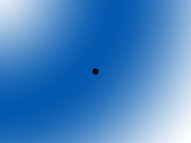

[[<-back](../README.md)]

# Scrolling

Up until now we've only been dealing with levels the size of the screen. With scrolling you can navigate through levels of any size by rendering everything relative to a camera.



----

The basic principle of scrolling is that you have a rectangle that functions as a camera:


And then you only render what's in the camera, which usually involves rendering things relative to the camera or only showing portions of objects inside the camera.


----

Since the level is no longer the size of the screen we have to have a separate set of constants to define the level size.

``` C++
//  The dimensions of the level
const int LEVEL_WIDTH   = 1280;
const int LEVEL_HEIGHT  = 960;

//  Screen dimension constants
const int SCREEN_WIDTH  = 640;
const int SCREEN_HEIGHT = 480;
```

This time the dot has to render relative to the camera, so its rendering function takes in a camera position.

``` C++
//  The dot that will move around on the screen
class Dot
{
    public:
        //  The dimensions of the dot
        static const int DOT_WIDTH  = 20;
        static const int DOT_HEIGHT = 20;

        //  Maximum axis velocity of the dot
        static const int DOT_VEL    = 10;

        //  Initializes the variables
        Dot();

        //  Takes key presses and adjusts the dot's velocity
        void handleEvent( SDL_Event& e );

        //  Moves the dot
        void move();

        //  Shows the dot on the screen relative to the camera
        void render( int camX, int camY );

        //  Position accessors
        int getPosX();
        int getPosY();

    private:
        //  The X and Y offsets of the dot
        int mPosX, mPosY;

        //  The velocity of the dot
        int mVelX, mVelY;
};
```

This time when moving the dot, we check if the dot moved off the level as opposed to checking if it moved off the screen since the screen is going to move around the level.

``` C++
void Dot::move()
{
    //  Move the dot left or right
    mPosX += mVelX;

    //  If the dot went too far to the left or right
    if  ( ( mPosX < 0 ) || ( mPosX + DOT_WIDTH > LEVEL_WIDTH ) )
    {
        //  Move back
        mPosX -= mVelX;
    }

    //  Move the dot up or down
    mPosY += mVelY;

    //  If the dot went too far up or down
    if  ( ( mPosY < 0 ) || ( mPosY + DOT_HEIGHT > LEVEL_HEIGHT ) )
    {
        //  Move back
        mPosY -= mVelY;
    }
}
```

Now when we render objects to the screen, we render them relative to the camera by subtracting the camera offset.

``` C++
void Dot::render( int camX, int camY )
{
    //  Show the dot relative to the camera
    gDotTexture.render( mPosX - camX, mPosY - camY );
}
```

Before we go into the main loop, we declare the dot and the camera that is going to be following it.

``` C++
            //  Main loop flag
            bool quit = false;

            //  Event handler
            SDL_Event e;

            //  The dot that will be moving around on the screen
            Dot dot;

            //  The camera area
            SDL_Rect camera = { 0, 0, SCREEN_WIDTH, SCREEN_HEIGHT };
```

After we move the dot, we want to change the camera position to center over it. We don't want the camera to go outside of the level so we keep it in bounds after moving it.

``` C++
                //  Move the dot
                dot.move();

                //  Center the camera over the dot
                camera.x =
                    ( dot.getPosX() + Dot::DOT_WIDTH  / 2 ) - SCREEN_WIDTH  / 2;
                camera.y =
                    ( dot.getPosY() + Dot::DOT_HEIGHT / 2 ) - SCREEN_HEIGHT / 2;

                //  Keep the camera in bounds
                if  ( camera.x < 0 )
                { 
                    camera.x = 0;
                }
                if  ( camera.y < 0 )
                {
                    camera.y = 0;
                }
                if  ( camera.x > LEVEL_WIDTH - camera.w )
                {
                    camera.x = LEVEL_WIDTH - camera.w;
                }
                if  ( camera.y > LEVEL_HEIGHT - camera.h )
                {
                    camera.y = LEVEL_HEIGHT - camera.h;
                }
```

After the camera is in place we render the portion of the background that is inside that camera and then render the dot relative to the camera position.

``` C++
                //  Clear screen
                SDL_SetRenderDrawColor  ( gRenderer, 0xFF, 0xFF, 0xFF, 0xFF );
                SDL_RenderClear         ( gRenderer );

                //  Render background
                gBGTexture.render       ( 0, 0, &camera );

                //  Render objects
                dot.render              ( camera.x, camera.y );

                //  Update screen
                SDL_RenderPresent       ( gRenderer );
```

----

[[<-back](../README.md)]
