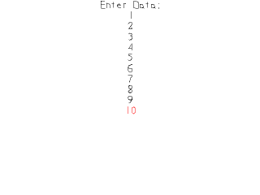

[[<-back](../README.md)]

# File Reading and Writing

Being able to save and load data is needed to keep data between play sessions. SDL_RWops file handling allows us to do cross platform file IO to save data.



----

Here we're declaring an array of Signed integers that are 32 bits long. This will be the data we will be loading and saving. For this demo this array will be of length 10.

``` C++
//  Data points
Sint32 gData[ TOTAL_DATA ];
```

In our media loading function we're opening the save file for reading using [`SDL_RWFromFile`](http://wiki.libsdl.org/SDL_RWFromFile). The first argument is the path to the file and the second argument defines how we will be opening it. "r+b" means it is being opened for reading in binary.

``` C++
    //  Open file for reading in binary
    SDL_RWops*  file =
        SDL_RWFromFile( "./nums.bin", "r+b" );
```

Now if the file does not exist that doesn't exactly mean an error. It could mean this is the first time the program has run and the file has not been created yet. If the file does not exist we prompt a warning and create a file by opening a file with "w+b". This will open a new file for writing in binary.

``` C++
    //  File does not exist
    if  ( file == NULL )
    {
        printf( "Warning: Unable to open file! SDL Error: %s\n", SDL_GetError() );
        
        //  Create file for writing
        file = SDL_RWFromFile( "./nums.bin", "w+b" );
```

If a new file was created successfully we then start writing the initialized data to it using [`SDL_RWwrite`](http://wiki.libsdl.org/SDL_RWwrite). The first argument is the file we're writing to, the second argument is the address of the objects in memory we're writing, the third argument is the number of bytes per object we're writing, and the last one is the number of objects we're writing. After we're done writing out all the objects, we close the file for writing using [`SDL_RWclose`](http://wiki.libsdl.org/SDL_RWclose).

If the file was never created in the first place, we report an error to the console and set the success flag to false.

``` C++
        if  ( file != NULL )
        {
            printf( "New file created!\n" );

            //  Initialize data
            for ( int i = 0; i < TOTAL_DATA; ++i )
            {
                gData[ i ] = 0;    
                SDL_RWwrite( file, &gData[ i ], sizeof(Sint32), 1 );
            }
            
            //  Close file handler
            SDL_RWclose( file );
        }
        else
        {
            printf( "Error: Unable to create file! SDL Error: %s\n", SDL_GetError() );
            success = false;
        }
    }
```

Now if our file loaded successfully on the first try, all we have to do is reading in the data using [`SDL_RWread`](http://wiki.libsdl.org/SDL_RWread), which basically functions like `SDL_RWwrite` but in reverse.

``` C++
    //  File exists
    else
    {
        //  Load data
        printf( "Reading file...!\n" );
        for ( int i = 0; i < TOTAL_DATA; ++i )
        {
            SDL_RWread( file, &gData[ i ], sizeof(Sint32), 1 );
        }

        //  Close file handler
        SDL_RWclose( file );
    }
```

After the file is loaded we render the text textures that correspond with each of our data numbers. Our [`loadFromRenderedText`](../lesson-16/README.md) function only accepts strings so we have to convert the integers to strings.

``` C++
    //  Initialize data textures
    gDataTextures[ 0 ].loadFromRenderedText( std::to_string( gData[ 0 ] ), highlightColor );
    for ( int i = 1; i < TOTAL_DATA; ++i )
    {
        gDataTextures[ i ].loadFromRenderedText( std::to_string( gData[ i ] ), textColor );
    }
```

When we close the program, we open up the file again for writing and write out all the data.

``` C++
void close()
{
    //  Open data for writing
    SDL_RWops*  file =
        SDL_RWFromFile( "./nums.bin", "w+b" );

    if  ( file != NULL )
    {
        //  Save data
        for ( int i = 0; i < TOTAL_DATA; ++i )
        {
            SDL_RWwrite( file, &gData[ i ], sizeof(Sint32), 1 );
        }

        //  Close file handler
        SDL_RWclose( file );
    }
    else
    {
        printf( "Error: Unable to save file! %s\n", SDL_GetError() );
    }
```

Before we go into the main loop we declare currentData to keep track of which of our data integers we're altering. We also declare a plain text color and a highlight color for rendering text.

``` C++
            //  Main loop flag
            bool quit = false;

            //  Event handler
            SDL_Event e;

            //  Text rendering color
            SDL_Color textColor         = { 0, 0, 0, 0xFF };
            SDL_Color highlightColor    = { 0xFF, 0, 0, 0xFF };

            //  Current input point
            int currentData = 0;
```

When we press up or down we want to rerender the the old current data in plain color, move to the next data point (with some bounds checking), and rerender the new current data in the highlight color.

``` C++
                    else if ( e.type == SDL_KEYDOWN )
                    {
                        switch ( e.key.keysym.sym )
                        {
                            //  Previous data entry
                            case SDLK_UP:
                            //  Rerender previous entry input point
                            gDataTextures[ currentData ].loadFromRenderedText( std::to_string( gData[ currentData ] ), textColor );
                            --currentData;
                            if  ( currentData < 0 )
                            {
                                currentData = TOTAL_DATA - 1;
                            }
                            
                            //  Rerender current entry input point
                            gDataTextures[ currentData ].loadFromRenderedText( std::to_string( gData[ currentData ] ), highlightColor );
                            break;
                            
                            //  Next data entry
                            case SDLK_DOWN:
                            //  Rerender previous entry input point
                            gDataTextures[ currentData ].loadFromRenderedText( std::to_string( gData[ currentData ] ), textColor );
                            ++currentData;
                            if  ( currentData == TOTAL_DATA )
                            {
                                currentData = 0;
                            }
                            
                            //  Rerender current entry input point
                            gDataTextures[ currentData ].loadFromRenderedText( std::to_string( gData[ currentData ] ), highlightColor );
                            break;
```

When we press left or right we decrement or increment the current data and rerender the texture associated with it.

``` C++
                            //  Decrement input point
                            case SDLK_LEFT:
                            --gData[ currentData ];
                            gDataTextures[ currentData ].loadFromRenderedText( std::to_string( gData[ currentData ] ), highlightColor );
                            break;
                            
                            //  Increment input point
                            case SDLK_RIGHT:
                            ++gData[ currentData ];
                            gDataTextures[ currentData ].loadFromRenderedText( std::to_string( gData[ currentData ] ), highlightColor );
                            break;
                        }
                    }
```

At the end of the main loop we render all the textures to the screen.

``` C++
                //  Clear screen
                SDL_SetRenderDrawColor  ( gRenderer, 0xFF, 0xFF, 0xFF, 0xFF );
                SDL_RenderClear         ( gRenderer );

                //  Render text textures
                gPromptTextTexture.render( ( SCREEN_WIDTH - gPromptTextTexture.getWidth() ) / 2, 0 );
                for ( int i = 0; i < TOTAL_DATA; ++i )
                {
                    gDataTextures[ i ].render( ( SCREEN_WIDTH - gDataTextures[ i ].getWidth() ) / 2, gPromptTextTexture.getHeight() + gDataTextures[ 0 ].getHeight() * i );
                }

                //  Update screen
                SDL_RenderPresent( gRenderer );
```

----

### Dump the saved file
You can display the content of the binary file where variables are saved.
Use the `od` command to do it.

``` Shell
# -A d : Display address as decimal
# -i   : Display data as signed integer
# -w4  : Display 4 bytes per line
# -v   : Display consecutives duplicated lines

> od -A d -i -w4 -v nums.bin

0000000          -1
0000004           0
0000008           4
0000012           0
0000016           0
0000020           5
0000024           0
0000028           0
0000032          -6
0000036           0
```

----

[[<-back](../README.md)]
