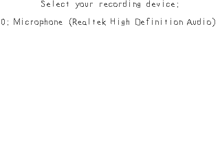
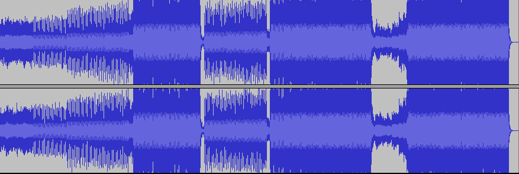
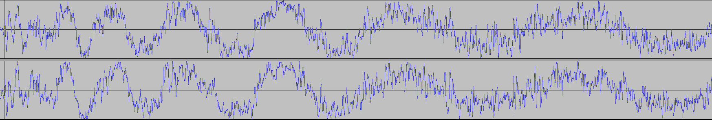

[[<-back](../README.md)]

# Audio Recording

There's more than you can do with audio than just hit play. This tutorial will cover some of the basics audio programming recording and playback.

Also, make sure you're using the latest version of SDL. I had to upgrade to SDL 2.0.8 to get audio recording to work properly.



----

### Audio data

To understand how audio recording works, it helps to understand how audio data works.

This is a song (with too much gain):



Now, let's zoom in on it:



As you can see, sound is a wave. A wave can be represented by a sequence of values (or in the case of this stereo song, two sequences with one for each sound wave). Playing audio is just sending a sequence of values to the audio driver and recording audio is copying a sequence of values from the audio driver.

----

Here are a couple constants we'll be using.

First there's a constant defining that we'll only support up to 10 recording devices to choose from (we only need one for this program to work). Then we have the maximum time we allow for recording and the maximum time we can store in the buffer. We'll be recording for 5 seconds, but we allow for 6 seconds of recording for the sake of padding in case the application records 5.1 seconds or so.

Lastly we have a set of enumerations for the different states in the program. First the user can select a recording device. Then after the user selects a device, the user is stopped waiting to start the recording. Then the user starts the recording for 5 seconds. After the user has finished recording, they can either start playback or record again. If anything results in an error, it will go in an error state.

Typically in these tutorials we go down the source code explaining what everything means along the way, but in this tutorial we are going to jump around more by flow of execution. It makes things easier to understand than just going the down source code. So don't get lost as we jump around in the source file.

``` C++
//  Maximum number of supported recording devices
const int MAX_RECORDING_DEVICES = 10;

//  Maximum recording time
const int MAX_RECORDING_SECONDS = 5;

//  Maximum recording time plus padding
const int RECORDING_BUFFER_SECONDS = MAX_RECORDING_SECONDS + 1;

//  The various recording actions we can take
enum RecordingState
{
    SELECTING_DEVICE,
    STOPPED,
    RECORDING,
    RECORDED,
    PLAYBACK,
    ERROR
};
```

These two callbacks are going to be doing the actual recording to and playing from our audio buffer. We'll get into details on how these work later.

``` C++
//  Recording/playback callbacks
void audioRecordingCallback ( void* userdata, Uint8* stream, int len );
void audioPlaybackCallback  ( void* userdata, Uint8* stream, int len );
```

Here we have some textures. One to prompt the user to let them know what's going on and another array of textures to store the names of the recording devices. We also have an integer to keep track of how many devices we have available.

We also have two SDL_AudioSpec variables. An [`SDL_AudioSpec`](https://wiki.libsdl.org/SDL_AudioSpec) is an audio specification which basically defines how audio is recorded or played back. When we open an audio device for recording or playing, we request a specification but we may not get what we requested back because the audio driver does not support it. This is why we are going to store the specification we get back from the driver for recording and playback.

``` C++
//  Prompt texture
LTexture gPromptTexture;

//  The text textures that specify recording device names
LTexture gDeviceTextures[ MAX_RECORDING_DEVICES ];

//  Number of available devices
int gRecordingDeviceCount = 0;

//  Recieved audio spec
SDL_AudioSpec gReceivedRecordingSpec;
SDL_AudioSpec gReceivedPlaybackSpec;
```

The "gRecordingBuffer" is a buffer of unsigned bytes that'll store our audio data. "gBufferByteSize" will store how many bytes the buffer will hold. "gBufferBytePosition" controls where we are in the buffer during recording or playback. "gBufferByteMaxPosition" controls the maximum piece of the buffer we will be using.

If that's confusing, remember that "gBufferByteSize" is 6 seconds of bytes (5 seconds + 1 second of padding) and "gBufferByteMaxPosition" is 5 seconds of bytes we'll be using.

``` C++
//  Recording data buffer
Uint8*  gRecordingBuffer    = NULL;

//  Size of data buffer
Uint32  gBufferByteSize     = 0;

//  Position in data buffer
Uint32  gBufferBytePosition = 0;

//  Maximum position in data buffer for recording
Uint32  gBufferByteMaxPosition  = 0;
```

Make sure to remember to initialize audio before recording or playback. It's an easy thing to forget.

``` C++
    //  Initialize SDL
    if  ( SDL_Init( SDL_INIT_VIDEO | SDL_INIT_AUDIO ) < 0 )
    {
        printf( "SDL could not initialize! SDL Error: %s\n", SDL_GetError() );
        success = false;
    }
```

After loading the font and rendering the initial prompt message we get the number of available recording devices using [`SDL_GetNumAudioDevices`](https://wiki.libsdl.org/SDL_GetNumAudioDevices). When you pass in a `SDL_TRUE` argument it will give us the number of recording devices. With `SDL_FALSE`, it will give us playback devices.

If there isn't at least one recording devices connected, we error out of the function.

``` C++
bool loadMedia()
{
    //  Loading success flag
    bool success = true;

    //  Open the font
    gFont = TTF_OpenFont( "./lazy.ttf", 28 );
    if  ( gFont == NULL )
    {
        printf( "Failed to load lazy font! SDL_ttf Error: %s\n", TTF_GetError() );
        success = false;
    }
    else
    {
        //  Set starting prompt 
        gPromptTexture.loadFromRenderedText( "Select your recording device:", gTextColor );

        //  Get capture device count
        gRecordingDeviceCount = SDL_GetNumAudioDevices( SDL_TRUE );

        //  No recording devices
        if  ( gRecordingDeviceCount < 1 )
        {
            printf( "Unable to get audio capture device! SDL Error: %s\n", SDL_GetError() );
            success = false;
        }
```

If there are recording devices connected, we cap the number we use to 10 (which may dissapoint those with 11 microphones hooked up to their PC) and then go through the devices rendering their names to a texture. We get the device name using [`SDL_GetAudioDeviceName`](https://wiki.libsdl.org/SDL_GetAudioDeviceName) and passing in the fact that we want recording device names with `SDL_TRUE` and the index of the recording device.

``` C++
        //  At least one device connected
        else
        {
            //  Cap recording device count
            if  ( gRecordingDeviceCount > MAX_RECORDING_DEVICES )
            {
                gRecordingDeviceCount = MAX_RECORDING_DEVICES;
            }

            //  Render device names
            std::stringstream promptText;
            for ( int i = 0; i < gRecordingDeviceCount; ++i )
            {
                //  Get capture device name
                promptText.str( "" );
                promptText << i << ": " << SDL_GetAudioDeviceName( i, SDL_TRUE );

                //  Set texture from name
                gDeviceTextures[ i ].loadFromRenderedText( promptText.str().c_str(), gTextColor );
            }
        }
    }

    return success;
}
```

In the main function after initializing and loading we set the initial recording state and declare two audio device IDs which are just integers to represent the recording and playback devices.

``` C++
            //  Main loop flag
            bool quit = false;

            //  Event handler
            SDL_Event e;

            //  Set the default recording state
            RecordingState currentState = SELECTING_DEVICE;

            //  Audio device IDs
            SDL_AudioDeviceID   recordingDeviceId = 0;
            SDL_AudioDeviceID    playbackDeviceId = 0;
```

In the event handling loop we have a switch statement that handles the different states. When the user presses 0-9, we convert it to an index which is easy because the SDLK constants are sequential and can be converted by subtracting the keysym by `SDLK_0`.

``` C++
                    //  Do current state event handling
                    switch ( currentState )
                    {
                        //  User is selecting recording device
                        case SELECTING_DEVICE:

                            //  On key press
                            if  ( e.type == SDL_KEYDOWN )
                            {
                                //  Handle key press from 0 to 9 
                                if  ( e.key.keysym.sym >= SDLK_0 && e.key.keysym.sym <= SDLK_9 )
                                {
                                    //  Get selection index
                                    int index = e.key.keysym.sym - SDLK_0;
```

If the user pressed a valid index key, we then specify the recording audio spec.

First we initialize the audio spec with SDL_zero. Always initialize memory before using it. Ask the SREs that had to deal with the heartbleed bug what happens when you don't.

We set the frequency to 44.1 khz which is CD quality. We're using 32bit floating point format for the data. We have 2 channels since we want stereo. Samples are set to 4096 because that's a pretty standard size. Lastly we give it the audio recording callback.

With the spec set, we call [`SDL_OpenAudioDevice`](https://wiki.libsdl.org/SDL_OpenAudioDevice) and pass in the recording device name, the fact that we want a recording device with SDL_TRUE, the spec we want to have, a pointer to the spec we get back from the driver, and lastly a flag that says we're ok with SDL_OpenAudioDevice giving us a different format than we requested.

``` C++
                                    //  Index is valid
                                    if  ( index < gRecordingDeviceCount )
                                    {
                                        //  Default audio spec
                                        SDL_AudioSpec desiredRecordingSpec;
                                        SDL_zero(desiredRecordingSpec);
                                        desiredRecordingSpec.freq       = 44100;
                                        desiredRecordingSpec.format     = AUDIO_F32;
                                        desiredRecordingSpec.channels   = 2;
                                        desiredRecordingSpec.samples    = 4096;
                                        desiredRecordingSpec.callback   = audioRecordingCallback;

                                        //  Open recording device
                                        recordingDeviceId =
                                            SDL_OpenAudioDevice(
                                                SDL_GetAudioDeviceName( index, SDL_TRUE )   ,
                                                SDL_TRUE                                    ,
                                                  &desiredRecordingSpec                     ,
                                                &gReceivedRecordingSpec                     ,
                                                SDL_AUDIO_ALLOW_FORMAT_CHANGE
                                            );
```

If we get no device ID, we go to an error state. If the device opened successfully, we create a playback spec that's mostly the same as the recording spec. The major difference is that it uses the playback callback instead of the recording callback.

Opening the playback device is also mostly the same. For this tutorial, we don't care which playback device we get so we pass in `NULL` to grab the first available one. Secondly, we pass in `SDL_FALSE` for the second argument to open up a playback device instead of a recording device.

``` C++
                                        //  Device failed to open
                                        if  ( recordingDeviceId == 0 )
                                        {
                                            //  Report error
                                            printf( "Failed to open recording device! SDL Error: %s", SDL_GetError() );
                                            gPromptTexture.loadFromRenderedText( "Failed to open recording device!", gTextColor );
                                            currentState = ERROR;
                                        }
                                        //  Device opened successfully
                                        else
                                        {
                                            //  Default audio spec
                                            SDL_AudioSpec   desiredPlaybackSpec;
                                            SDL_zero(desiredPlaybackSpec);
                                            desiredPlaybackSpec.freq        = 44100;
                                            desiredPlaybackSpec.format      = AUDIO_F32;
                                            desiredPlaybackSpec.channels    = 2;
                                            desiredPlaybackSpec.samples     = 4096;
                                            desiredPlaybackSpec.callback    = audioPlaybackCallback;

                                            //  Open playback device
                                            playbackDeviceId =
                                                SDL_OpenAudioDevice(
                                                    NULL                            ,
                                                    SDL_FALSE                       ,
                                                      &desiredPlaybackSpec          ,
                                                    &gReceivedPlaybackSpec          ,
                                                    SDL_AUDIO_ALLOW_FORMAT_CHANGE
                                                );
```

If we get no playback device ID, we go to an error state. If the device opened successfully, we create a byte buffer to to hold the audio data we'll be recording and playing back.

To calculate how much space we need first we need to calculate the bytes per sample. If we have 2 channels and 32 bits per channel sample (which we can get using [`SDL_AUDIO_BITSIZE`](https://wiki.libsdl.org/SDL_AudioFormat) on the audio format), we'll get 2 channels * ( 32 bits / 8 bits per byte ) which is 8 bytes per sample.

To get the bytes per second, we multiply the bytes per sample times the frequency which is the number sample per second. 8 bytes per sample * 44 100 samples per seconds get us 705600 bytes per second.

We want to have 6 seconds of buffer (5 seconds + 1 second of padding) so we set the buffer size to be 4 233 600 bytes. That seems like a lot, but it's a litle more than 4 megabytes. Remember, because of the max position, we only use 5 seconds of the 6 second buffer.

After calculating the buffer size, we allocate the buffer and initialize it with memset. Finally, we set the prompt texture and move on to the next state.

```C++
                                            //  Device failed to open
                                            if  ( playbackDeviceId == 0 )
                                            {
                                                //  Report error
                                                printf( "Failed to open playback device! SDL Error: %s", SDL_GetError() );
                                                gPromptTexture.loadFromRenderedText( "Failed to open playback device!", gTextColor );
                                                currentState = ERROR;
                                            }
                                            //  Device opened successfully
                                            else
                                            {
                                                //  Calculate per sample bytes
                                                int bytesPerSample = gReceivedRecordingSpec.channels * ( SDL_AUDIO_BITSIZE( gReceivedRecordingSpec.format ) / 8 );

                                                //  Calculate bytes per second
                                                int bytesPerSecond = gReceivedRecordingSpec.freq * bytesPerSample;

                                                //  Calculate buffer size
                                                gBufferByteSize = RECORDING_BUFFER_SECONDS * bytesPerSecond;

                                                //  Calculate max buffer use
                                                gBufferByteMaxPosition = MAX_RECORDING_SECONDS * bytesPerSecond;

                                                //  Allocate and initialize byte buffer
                                                gRecordingBuffer = new Uint8[ gBufferByteSize ];
                                                memset( gRecordingBuffer, 0, gBufferByteSize );

                                                //  Go on to next state
                                                gPromptTexture.loadFromRenderedText("Press 1 to record for 5 seconds.", gTextColor);
                                                currentState = STOPPED;
                                            }
                                        }
                                    }
                                }
                            }
                            break;
```

After we've allocated the buffer, we're ready to start recording. If the user presses 1, we set the buffer position back to 0 and unpause the audio device using [`SDL_PauseAudioDevice`](https://wiki.libsdl.org/SDL_PauseAudioDevice). The first argument is the device we want to pause/unpause and the second argument determines whether we want to pause or unpause. Passing `SDL_FALSE` will unpause a device.

__Audio devices are paused be default__ meaning they will not record or play until you unpause them. If you're wondering why your callback isn't doing anything, this may be why.

``` C++
                        //  User getting ready to record
                        case STOPPED:

                            //  On key press
                            if  ( e.type == SDL_KEYDOWN )
                            {
                                //  Start recording
                                if  ( e.key.keysym.sym == SDLK_1 )
                                {
                                    //  Go back to beginning of buffer
                                    gBufferBytePosition = 0;

                                    //  Start recording
                                    SDL_PauseAudioDevice( recordingDeviceId, SDL_FALSE );

                                    //  Go on to next state
                                    gPromptTexture.loadFromRenderedText( "Recording...", gTextColor );
                                    currentState = RECORDING;
                                }
                            }
                            break;
```

When the recording device is unpaused it will start calling the recording callback we gave it at regular intervals.

As you can see it doesn't do much. All it does is copy bytes from the device stream into the current position in our recording buffer and then move the position in the buffer. That is all recording is, just grabbing chunks of audio data. Just remember that "len" is the size of the chunk from the stream in bytes.

``` C++
void audioRecordingCallback( void* userdata, Uint8* stream, int len )
{
    //  Copy audio from stream
    memcpy( &gRecordingBuffer[ gBufferBytePosition ], stream, len );

    //  Move along buffer
    gBufferBytePosition += len;
}
```

Here we're jumping to the update part of the main loop. When we're recording, we need to check whether we've filled the 5 seconds of buffer. Before we can check the buffer position we have to call SDL_LockAudioDevice. The thing is, the callback is being run in another thread and we don't want to have two threads accessing the same variable at the same time. [`SDL_LockAudioDevice`](https://wiki.libsdl.org/SDL_LockAudioDevice) stops the callback from being called while we need to access the buffer position which the callback also manipulates.

Once the recording device is locked, we check if the buffer position is past 5 seconds of data. If it is, we pause the recording device to halt recording and we move on to the next state. Lastly, we call [`SDL_UnlockAudioDevice`](https://wiki.libsdl.org/SDL_UnlockAudioDevice) so if there's still data to record the recording device can continue.

This is a very simple example of multithreading. If you would like to know more on the subject you can check tutorials on [multithreading](../lesson-46/README.md), [semaphores](../lesson-47/README.md), and [mutexes](../lesson-49/README.md).

``` C++
                //  Updating recording
                if  ( currentState == RECORDING )
                {
                    //  Lock callback
                    SDL_LockAudioDevice( recordingDeviceId );

                    //  Finished recording
                    if  ( gBufferBytePosition > gBufferByteMaxPosition )
                    {
                        //  Stop recording audio
                        SDL_PauseAudioDevice( recordingDeviceId, SDL_TRUE );

                        //  Go on to next state
                        gPromptTexture.loadFromRenderedText( "Press 1 to play back. Press 2 to record again.", gTextColor );
                        currentState = RECORDED;
                    }

                    //  Unlock callback
                    SDL_UnlockAudioDevice( recordingDeviceId );
                }
```

Here we're jumping back to event handling for after we recorded 5 seconds.

As you can see, it's similar to when we started recording. We set the buffer position back to the beginning, unpause the playback device, and set the next state.

``` C++
                        //  User has finished recording
                        case RECORDED:

                            //  On key press
                            if  ( e.type == SDL_KEYDOWN )
                            {
                                //  Start playback
                                if  ( e.key.keysym.sym == SDLK_1 )
                                {
                                    //  Go back to beginning of buffer
                                    gBufferBytePosition = 0;

                                    //  Start playback
                                    SDL_PauseAudioDevice( playbackDeviceId, SDL_FALSE );

                                    //  Go on to next state
                                    gPromptTexture.loadFromRenderedText( "Playing...", gTextColor );
                                    currentState = PLAYBACK;
                                }
```

The playback callback is also similar to the recording callback. The key difference here is that instead of copying from the device to the buffer, we're taking the data we recorded in the buffer and copying it back to the device.

``` C++
void audioPlaybackCallback( void* userdata, Uint8* stream, int len )
{
    //  Copy audio to stream
    memcpy( stream, &gRecordingBuffer[ gBufferBytePosition ], len );

    //  Move along buffer
    gBufferBytePosition += len;
}
```

Updating playback is again similar to recording. We lock the playback device, check the playback position, stop playback if the buffer position is past the end point, and unlock the playback device.

``` C++
                //  Updating playback
                else if ( currentState == PLAYBACK )
                {
                    //  Lock callback
                    SDL_LockAudioDevice( playbackDeviceId );

                    //  Finished playback
                    if  ( gBufferBytePosition > gBufferByteMaxPosition )
                    {
                        //  Stop playing audio
                        SDL_PauseAudioDevice( playbackDeviceId, SDL_TRUE );

                        //  Go on to next state
                        gPromptTexture.loadFromRenderedText( "Press 1 to play back. Press 2 to record again.", gTextColor );
                        currentState = RECORDED;
                    }

                    //  Unlock callback
                    SDL_UnlockAudioDevice( playbackDeviceId );
                }

```

Jumping back to event handling for after the user has recorded, we allow for the user to rerecord. When we want to record again, we just jump the buffer position back to the beginning, initialize the buffer, and unpause the recording device.

``` C++
                                //  Record again
                                if  ( e.key.keysym.sym == SDLK_2 )
                                {
                                    //  Reset the buffer
                                    gBufferBytePosition = 0;
                                    memset( gRecordingBuffer, 0, gBufferByteSize );

                                    //  Start recording
                                    SDL_PauseAudioDevice( recordingDeviceId, SDL_FALSE );

                                    //  Go on to next state
                                    gPromptTexture.loadFromRenderedText( "Recording...", gTextColor );
                                    currentState = RECORDING;
                                }
                            }
                            break;
                    }
```

As always, don't forget to deallocate the buffer after using it to prevent memory leaks.

Now, audio programming is a very large field which I am by no means an expert in. However, now that you know how to handle raw audio data, you can look into using audio libraries and frameworks to do more complicated things like audio compression and voice chat.

``` C++
void close()
{
    //  Free textures
    gPromptTexture.free();
    for ( int i = 0; i < MAX_RECORDING_DEVICES; ++i )
    {
        gDeviceTextures[ i ].free();
    }

    //  Free global font
    TTF_CloseFont( gFont );
    gFont = NULL;

    //  Destroy window    
    SDL_DestroyRenderer( gRenderer );
    SDL_DestroyWindow( gWindow );
    gWindow     = NULL;
    gRenderer   = NULL;

    //  Free playback audio
    if  ( gRecordingBuffer != NULL )
    {
        delete[] gRecordingBuffer;
        gRecordingBuffer = NULL;
    }

    //  Quit SDL subsystems
    TTF_Quit();
    IMG_Quit();
    SDL_Quit();
}
```

----

[[<-back](../README.md)]
