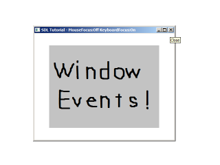

[[<-back](../README.md)]

# Window Events

SDL also supports resizable windows. When you have resizable windows there are additional events to handle, which is what we'll be doing here.



----

Here is our window class we'll be using as a wrapper for the SDL_Window. It has a constructor, an initializer that creates the window, a function to create a renderer from the window, an event handler, a deallocator, and some accessor functions to get various attributes from the window.

In terms of data members, we have the window we're wrapping, the dimensions of the window, and flags for the types of focus the windows has. We'll go into more detail further in the program.

``` C++
class LWindow
{
    public:
        //  Intializes internals
        LWindow();

        //  Creates window
        bool init();

        //  Creates renderer from internal window
        SDL_Renderer* createRenderer();

        //  Handles window events
        void handleEvent( SDL_Event& e );

        //  Deallocates internals
        void free();

        //  Window dimensions
        int getWidth();
        int getHeight();

        //  Window focii
        bool hasMouseFocus();
        bool hasKeyboardFocus();
        bool isMinimized();

    private:
        //  Window data
        SDL_Window* mWindow;

        //  Window dimensions
        int mWidth;
        int mHeight;

        //  Window focus
        bool mMouseFocus;
        bool mKeyboardFocus;
        bool mFullScreen;
        bool mMinimized;
};
```

We'll be using our window as a global object.

``` C++
//  Our custom window
LWindow gWindow;

//  The window renderer
SDL_Renderer* gRenderer = NULL;

//  Scene textures
LTexture gSceneTexture;
```

In the constructor we initialize all our variables.

``` C++
LWindow::LWindow()
{
    //  Initialize non-existant window
    mWindow         = NULL;
    mMouseFocus     = false;
    mKeyboardFocus  = false;
    mFullScreen     = false;
    mMinimized      = false;
    mWidth          = 0;
    mHeight         = 0;
}
```

Our initialization function creates the window with the [`SDL_WINDOW_RESIZABLE`](http://wiki.libsdl.org/SDL_WindowFlags) flag which allows for our window to be resizable. If the function succeeds we set the corresponding flags and dimensions. Then we return whether the window is null or not.

``` C++
bool LWindow::init()
{
    //  Create window
    mWindow =
        SDL_CreateWindow(
            "SDL Tutorial"              ,
            SDL_WINDOWPOS_UNDEFINED     ,
            SDL_WINDOWPOS_UNDEFINED     ,
            SCREEN_WIDTH                ,
            SCREEN_HEIGHT               ,
            SDL_WINDOW_SHOWN | SDL_WINDOW_RESIZABLE
        );

    if  ( mWindow != NULL )
    {
        mMouseFocus     = true;
        mKeyboardFocus  = true;
        mWidth          = SCREEN_WIDTH;
        mHeight         = SCREEN_HEIGHT;
    }

    return mWindow != NULL;
}
```

Here we're handling the creation of a renderer from the member window. We're returning the created renderer because rendering will be handled outside of the class.

``` C++
SDL_Renderer* LWindow::createRenderer()
{
    return SDL_CreateRenderer( mWindow, -1, SDL_RENDERER_ACCELERATED | SDL_RENDERER_PRESENTVSYNC );
}
```

In our window's event handler we'll be looking for events of type [`SDL_WINDOWEVENT`](http://wiki.libsdl.org/SDL_WindowEvent). SDL_WindowEvents are actually a family of events. Depending on the event we may have to update the caption of the window, so we have a flag that keeps track of that.

``` C++
void LWindow::handleEvent( SDL_Event& e )
{
    //  Window event occured
    if  ( e.type == SDL_WINDOWEVENT )
    {
        //  Caption update flag
        bool updateCaption = false;
```

When we have a window event we then want to check the [`SDL_WindowEventID`](http://wiki.libsdl.org/SDL_WindowEventID) to see what type of event it is.
An `SDL_WINDOWEVENT_SIZE_CHANGED` is a resize event, so we get the new dimensions and refresh the image on the screen.

An `SDL_WINDOWEVENT_EXPOSED` just means that window was obscured in some way and now is not obscured so we want to repaint the window.

``` C++
        switch  ( e.window.event )
        {
            //  Get new dimensions and repaint on window size change
            case    SDL_WINDOWEVENT_SIZE_CHANGED:
                mWidth  = e.window.data1;
                mHeight = e.window.data2;
                SDL_RenderPresent( gRenderer );
                break;

            //  Repaint on exposure
            case    SDL_WINDOWEVENT_EXPOSED:
                SDL_RenderPresent( gRenderer );
                break;

```

`SDL_WINDOWEVENT_ENTER`/`SDL_WINDOWEVENT_LEAVE` handles when the mouse moves into and out of the window. `SDL_WINDOWEVENT_FOCUS_GAINED`/`SDL_WINDOWEVENT_FOCUS_LOST` have to do when the window is getting input from the keyboard. Since our caption keeps track of mouse/keyboard focus, we set the update caption flag when any of these events happen.

``` C++
            //  Mouse entered window
            case    SDL_WINDOWEVENT_ENTER:
                mMouseFocus     = true;
                updateCaption   = true;
                break;
            
            //  Mouse left window
            case    SDL_WINDOWEVENT_LEAVE:
                mMouseFocus     = false;
                updateCaption   = true;
                break;

            //  Window has keyboard focus
            case    SDL_WINDOWEVENT_FOCUS_GAINED:
                mKeyboardFocus  = true;
                updateCaption   = true;
                break;

            //  Window lost keyboard focus
            case    SDL_WINDOWEVENT_FOCUS_LOST:
                mKeyboardFocus  = false;
                updateCaption   = true;
                break;
```

Finally here we handle when the window was minimized, maximized, or restored from being minimized.

``` C++
            //  Window minimized
            case    SDL_WINDOWEVENT_MINIMIZED:
                mMinimized      = true;
                break;

            //  Window maxized
            case    SDL_WINDOWEVENT_MAXIMIZED:
                mMinimized      = false;
                break;
            
            //  Window restored
            case    SDL_WINDOWEVENT_RESTORED:
                mMinimized      = false;
                break;
        }
```

If the caption needs to be updated, we load a string stream with the updated data and update the caption with [`SDL_SetWindowTitle`](http://wiki.libsdl.org/SDL_SetWindowTitle).

``` C++
        //  Update window caption with new data
        if  ( updateCaption )
        {
            std::stringstream   caption;
            caption                                 <<
                "SDL Tutorial - MouseFocus:"        <<
                ( ( mMouseFocus ) ? "On" : "Off" )  <<
                " KeyboardFocus:"                   <<
                ( ( mKeyboardFocus ) ? "On" : "Off" );

            SDL_SetWindowTitle( mWindow, caption.str().c_str() );
        }
    }
```

If the caption needs to be updated, we load a string stream with the updated data and update the caption with [`SDL_SetWindowTitle`](http://wiki.libsdl.org/SDL_SetWindowTitle).

``` C++
        //  Update window caption with new data
        if  ( updateCaption )
        {
            std::stringstream caption;
            caption                                 <<
                "SDL Tutorial - MouseFocus:"        <<
                ( ( mMouseFocus ) ? "On" : "Off" )  <<
                " KeyboardFocus:"                   <<
                ( ( mKeyboardFocus ) ? "On" : "Off" );

            SDL_SetWindowTitle( mWindow, caption.str().c_str() );
        }
    }
```

For this demo we'll be toggling fullscreen with the return key. We can set fullscreen mode using [`SDL_SetWindowFullscreen`](http://wiki.libsdl.org/SDL_SetWindowFullscreen).

``` C++
    //  Enter exit full screen on return key
    else if ( e.type == SDL_KEYDOWN && e.key.keysym.sym == SDLK_RETURN )
    {
        if  ( mFullScreen )
        {
            SDL_SetWindowFullscreen( mWindow, SDL_FALSE );
            mFullScreen = false;
        }
        else
        {
            SDL_SetWindowFullscreen( mWindow, SDL_TRUE );
            mFullScreen = true;
            mMinimized  = false;
        }
    }
}
```

Here is a quick rundown of the accessors we use.

``` C++
int LWindow::getWidth()
{
    return mWidth;
}

int LWindow::getHeight()
{
    return mHeight;
}

bool LWindow::hasMouseFocus()
{
    return mMouseFocus;
}

bool LWindow::hasKeyboardFocus()
{
    return mKeyboardFocus;
}

bool LWindow::isMinimized()
{
    return mMinimized;
}
```

In our initialization function we create our window and renderer only this time with our window wrapper.

``` C++
        //  Create window
        if  ( !gWindow.init() )
        {
            printf( "Window could not be created! SDL Error: %s\n", SDL_GetError() );
            success = false;
        }
        else
        {
            //  Create renderer for window
            gRenderer = gWindow.createRenderer();
            if  ( gRenderer == NULL )
            {
                printf( "Renderer could not be created! SDL Error: %s\n", SDL_GetError() );
                success = false;
            }

```

In our clean up function we still deallocate our window and renderer.

``` C++
void close()
{
    //  Free loaded images
    gSceneTexture.free();

    //  Destroy window    
    SDL_DestroyRenderer( gRenderer );
    gWindow.free();

    //  Quit SDL subsystems
    IMG_Quit();
    SDL_Quit();
}
```

In the main loop we make sure to pass events to the window wrapper to handle resize events and in the rendering part of our code we make sure to only render when the window is not minimized because this can cause some bugs when we try to render to a minimized window.

``` C++
            //  While application is running
            while   ( !quit )
            {
                //  Handle events on queue
                while   ( SDL_PollEvent( &e ) != 0 )
                {
                    //  User requests quit
                    if  ( e.type == SDL_QUIT )
                    {
                        quit = true;
                    }

                    //  Handle window events
                    gWindow.handleEvent( e );
                }

                //  Only draw when not minimized
                if  ( !gWindow.isMinimized() )
                {
                    //  Clear screen
                    SDL_SetRenderDrawColor  ( gRenderer, 0xFF, 0xFF, 0xFF, 0xFF );
                    SDL_RenderClear         ( gRenderer );

                    //  Render text textures
                    gSceneTexture.render(
                        ( gWindow. getWidth() - gSceneTexture. getWidth() ) / 2 ,
                        ( gWindow.getHeight() - gSceneTexture.getHeight() ) / 2
                    );

                    //  Update screen
                    SDL_RenderPresent( gRenderer );
                }
            }
```

----

[[<-back](../README.md)]
