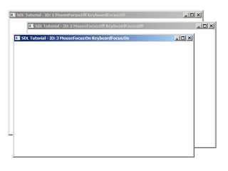

[[<-back](../README.md)]

# Multiple Windows

One of the new features SDL 2 has is being able to handle multiple windows at once. In this tutorial we'll be moving around 3 resizable windows.



----

Here is our [window wrapper from before](../lesson-35/README.md) with a few adjustments. We want to be able to grab focus and we want to tell if the window is shown so we add functions to do that.

Each window is going to have their own renderer so we add a member variable for that. We also keep track of the window ID to tell which events belong to which window and we also added a flag to keep track of whether the window is shown.

``` C++
//  Total windows
const int TOTAL_WINDOWS = 3;

class LWindow
{
    public:
        //  Intializes internals
        LWindow();

        //  Creates window
        bool init();

        //  Handles window events
        void handleEvent( SDL_Event& e );

        //  Focuses on window
        void focus();

        //  Shows windows contents
        void render();

        //  Deallocates internals
        void free();

        //  Window dimensions
        int getWidth();
        int getHeight();

        //  Window focii
        bool hasMouseFocus();
        bool hasKeyboardFocus();
        bool isMinimized();
        bool isShown();

    private:
        //  Window data
        SDL_Window*     mWindow;
        SDL_Renderer*   mRenderer;
        int mWindowID;

        //  Window dimensions
        int mWidth;
        int mHeight;

        //  Window focus
        bool mMouseFocus;
        bool mKeyboardFocus;
        bool mFullScreen;
        bool mMinimized;
        bool mShown;
};
```

For this program we'll have 3 globally allocated windows.

``` C++
//  Our custom windows
LWindow gWindows[ TOTAL_WINDOWS ];

```

Here is our window and renderer creation code. It is pretty much the same as we have always done it, only now it's happening inside our wrapper class. We do have to make sure to grab the window ID after creating the window as we'll need the ID for event handling.

``` C++
bool LWindow::init()
{
    //  Create window
    mWindow =
        SDL_CreateWindow(
            "SDL Tutorial"          ,
            SDL_WINDOWPOS_UNDEFINED ,
            SDL_WINDOWPOS_UNDEFINED ,
            SCREEN_WIDTH            ,
            SCREEN_HEIGHT           ,
            SDL_WINDOW_SHOWN | SDL_WINDOW_RESIZABLE
        );

    if  ( mWindow != NULL )
    {
        mMouseFocus     = true;
        mKeyboardFocus  = true;
        mWidth          = SCREEN_WIDTH;
        mHeight         = SCREEN_HEIGHT;

        //  Create renderer for window
        mRenderer =
            SDL_CreateRenderer(
                mWindow         ,
                -1              ,
                SDL_RENDERER_ACCELERATED | SDL_RENDERER_PRESENTVSYNC
            );

        if  ( mRenderer == NULL )
        {
            printf( "Renderer could not be created! SDL Error: %s\n", SDL_GetError() );
            SDL_DestroyWindow( mWindow );
            mWindow = NULL;
        }
        else
        {
            //  Initialize renderer color
            SDL_SetRenderDrawColor( mRenderer, 0xFF, 0xFF, 0xFF, 0xFF );

            //  Grab window identifier
            mWindowID   = SDL_GetWindowID( mWindow );

            //  Flag as opened
            mShown      = true;
        }
    }
    else
    {
        printf( "Window could not be created! SDL Error: %s\n", SDL_GetError() );
    }

    return mWindow != NULL && mRenderer != NULL;
}
```

All events from all windows go onto the same event queue, so to know which events belong to which window we check that the event's window ID matches ours.

``` C++
void LWindow::handleEvent( SDL_Event& e )
{
    //  If an event was detected for this window
    if  ( e.type == SDL_WINDOWEVENT && e.window.windowID == mWindowID )
    {
        //  Caption update flag
        bool updateCaption = false;
```

When you have multiple windows, Xing out the window doesn't necessarily mean we're quitting the program. What we're going to do instead is have each window hide when Xed out. So we'll need keep track of when the window is hidden/shown by checking for `SDL_WINDOWEVENT_SHOWN`/`SDL_WINDOWEVENT_HIDDEN` events.

``` C++
        switch( e.window.event )
        {
            //  Window appeared
            case    SDL_WINDOWEVENT_SHOWN:
                mShown          = true;
                break;

            //  Window disappeared
            case    SDL_WINDOWEVENT_HIDDEN:
                mShown          = false;
                break;

            //  Get new dimensions and repaint
                case SDL_WINDOWEVENT_SIZE_CHANGED:
                mWidth          = e.window.data1;
                mHeight         = e.window.data2;
                SDL_RenderPresent( mRenderer );
                break;

            //  Repaint on expose
            case    SDL_WINDOWEVENT_EXPOSED:
                SDL_RenderPresent( mRenderer );
                break;

            //  Mouse enter
            case    SDL_WINDOWEVENT_ENTER:
                mMouseFocus     = true;
                updateCaption   = true;
                break;
            
            //  Mouse exit
            case    SDL_WINDOWEVENT_LEAVE:
                mMouseFocus     = false;
                updateCaption   = true;
                break;

            //  Keyboard focus gained
            case    SDL_WINDOWEVENT_FOCUS_GAINED:
                mKeyboardFocus  = true;
                updateCaption   = true;
                break;
            
            //  Keyboard focus lost
            case    SDL_WINDOWEVENT_FOCUS_LOST:
                mKeyboardFocus  = false;
                updateCaption   = true;
                break;

            //  Window minimized
            case    SDL_WINDOWEVENT_MINIMIZED:
                mMinimized      = true;
                break;

            //  Window maxized
            case    SDL_WINDOWEVENT_MAXIMIZED:
                mMinimized      = false;
                break;
            
            //  Window restored
            case    SDL_WINDOWEVENT_RESTORED:
                mMinimized      = false;
                break;
```

When you have multiple windows, Xing out the window gets interpreted as `SDL_WINDOWEVENT_CLOSE` window events. When we get these events we're going to hide the window using [`SDL_HideWindow`](http://wiki.libsdl.org/SDL_HideWindow).

``` C++
            //  Hide on close
            case    SDL_WINDOWEVENT_CLOSE:
                SDL_HideWindow( mWindow );
                break;
        }

        //  Update window caption with new data
        if  ( updateCaption )
        {
            std::stringstream caption;
            caption                                 <<
                "SDL Tutorial - ID: "               <<
                mWindowID                           <<
                " MouseFocus:"                      <<
                ( ( mMouseFocus ) ? "On" : "Off" )  <<
                " KeyboardFocus:"                   <<
                ( ( mKeyboardFocus ) ? "On" : "Off" );

            SDL_SetWindowTitle( mWindow, caption.str().c_str() );
        }
    }
}
```

Here is our function for grabbing focus to a window. First we check if our window is even being shown and then show it with [`SDL_ShowWindow`](http://wiki.libsdl.org/SDL_ShowWindow) if it isn't being shown. Next we call [`SDL_RaiseWindow`](http://wiki.libsdl.org/SDL_RaiseWindow) to focus the window.

``` C++
void LWindow::focus()
{
    //  Restore window if needed
    if  ( !mShown )
    {
        SDL_ShowWindow( mWindow );
    }

    //  Move window forward
    SDL_RaiseWindow( mWindow );
}
```

Like before, we only want to render if the window is not minimized.

``` C++
void LWindow::render()
{
    if  ( !mMinimized )
    {    
        //  Clear screen
        SDL_SetRenderDrawColor  ( mRenderer, 0xFF, 0xFF, 0xFF, 0xFF );
        SDL_RenderClear         ( mRenderer );

        //  Update screen
        SDL_RenderPresent( mRenderer );
    }
}
```

In the initialization function we open up a single window to check if window creation is functioning properly.

``` C++
bool init()
{
    //  Initialization flag
    bool success = true;

    //  Initialize SDL
    if  ( SDL_Init( SDL_INIT_VIDEO ) < 0 )
    {
        printf( "SDL could not initialize! SDL Error: %s\n", SDL_GetError() );
        success = false;
    }
    else
    {
        //  Set texture filtering to linear
        if  ( !SDL_SetHint( SDL_HINT_RENDER_SCALE_QUALITY, "1" ) )
        {
            printf( "Warning: Linear texture filtering not enabled!" );
        }

        //  Create window
        if  ( !gWindows[ 0 ].init() )
        {
            printf( "Window 0 could not be created!\n" );
            success = false;
        }
    }

    return success;
}
```

In the clean up function we close out any windows that might be open.

``` C++
void close()
{
    //  Destroy windows
    for ( int i = 0; i < TOTAL_WINDOWS; ++i )
    {
        gWindows[ i ].free();
    }

    //  Quit SDL subsystems
    SDL_Quit();
}
```

Before we enter the main loop we open up the rest of the windows we have.

``` C++
        //  Initialize the rest of the windows
        for ( int i = 1; i < TOTAL_WINDOWS; ++i )
        {
            gWindows[ i ].init();
        }

        //  Main loop flag
        bool quit = false;

        //  Event handler
        SDL_Event e;
```

In the main loop after we handle the events for all the windows, we handle some special key presses. For this demo, when we press 1, 2, or 3 it will bring the corresponding window to focus.

``` C++
        //  While application is running
        while   ( !quit )
        {
            //  Handle events on queue
            while   ( SDL_PollEvent( &e ) != 0 )
            {
                //  User requests quit
                if  ( e.type == SDL_QUIT )
                {
                    quit = true;
                }

                //  Handle window events
                for ( int i = 0; i < TOTAL_WINDOWS; ++i )
                {
                    gWindows[ i ].handleEvent( e );
                }

                //  Pull up window
                if  ( e.type == SDL_KEYDOWN )
                {
                    switch  ( e.key.keysym.sym )
                    {
                        case    SDLK_1:
                            gWindows[ 0 ].focus();
                            break;

                        case    SDLK_2:
                            gWindows[ 1 ].focus();
                            break;
                            
                        case    SDLK_3:
                            gWindows[ 2 ].focus();
                            break;
                    }
                }
            }
```

Next we render all the windows and then go through all the windows to check if any of them are shown. If all of them have been closed out we set the quit flag to true to end the program.

Now in this demo we did not actually render anything inside of the windows. This would involve having to manage renderers and windows and having them share resources. There is no right way to do this and the best way depends entirely on what type of application you're building. I recommend reading through the SDL documentation to understand how renderers work and then experimenting to figure out the best way for you to manage your resources.

``` C++
            //  Update all windows
            for ( int i = 0; i < TOTAL_WINDOWS; ++i )
            {
                gWindows[ i ].render();
            }
                
            //  Check all windows
            bool allWindowsClosed = true;
            for ( int i = 0; i < TOTAL_WINDOWS; ++i )
            {
                if  ( gWindows[ i ].isShown() )
                {
                    allWindowsClosed = false;
                    break;
                }
            }

            //  Application closed all windows
            if  ( allWindowsClosed )
            {
                quit = true;
            }
        }
```

----

[[<-back](../README.md)]
