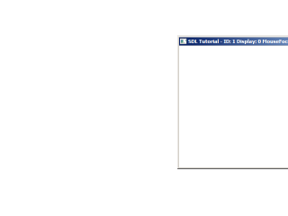
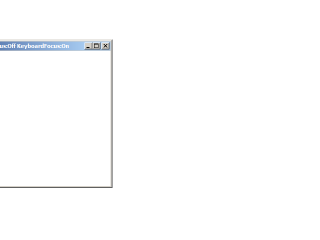

[[<-back](../README.md)]

# Multiple Displays

Another neat new feature with SDL 2 is the ability to handle multiple displays. Here we'll be making our window jump from display to display.

 

----

Here is our window from previous tutorials with a window display ID to keep track of which display the window is on.

``` C++
class LWindow
{
    public:
        //  Intializes internals
        LWindow();

        //  Creates window
        bool init();

        //  Handles window events
        void handleEvent( SDL_Event& e );

        //  Focuses on window
        void focus();

        //  Shows windows contents
        void render();

        //  Deallocates internals
        void free();

        //  Window dimensions
        int getWidth();
        int getHeight();

        //  Window focii
        bool hasMouseFocus();
        bool hasKeyboardFocus();
        bool isMinimized();
        bool isShown();

    private:
        //  Window data
        SDL_Window*     mWindow;
        SDL_Renderer*   mRenderer;
        int mWindowID;
        int mWindowDisplayID;

        //  Window dimensions
        int mWidth;
        int mHeight;

        //  Window focus
        bool mMouseFocus;
        bool mKeyboardFocus;
        bool mFullScreen;
        bool mMinimized;
        bool mShown;
};
```

Our displays all have an integer ID and a rectangle associated with them so we know the position and dimensions of each display on our desktop.

``` C++
//  Our custom window
LWindow gWindow;

//  Display data
int         gTotalDisplays  = 0;
SDL_Rect*   gDisplayBounds  = NULL; 
```

Our window creation code is pretty much the same as before only now we made a call to [`SDL_GetWindowDisplayIndex`](http://wiki.libsdl.org/SDL_GetWindowDisplayIndex) so we know which display the window was created on.

``` C++
bool LWindow::init()
{
    //  Create window
    mWindow =
        SDL_CreateWindow(
            "SDL Tutorial"              ,
            SDL_WINDOWPOS_UNDEFINED     ,
            SDL_WINDOWPOS_UNDEFINED     ,
            SCREEN_WIDTH                ,
            SCREEN_HEIGHT               ,
            SDL_WINDOW_SHOWN | SDL_WINDOW_RESIZABLE
        );

    if  ( mWindow != NULL )
    {
        mMouseFocus     = true;
        mKeyboardFocus  = true;
        mWidth          = SCREEN_WIDTH;
        mHeight         = SCREEN_HEIGHT;

        //  Create renderer for window
        mRenderer =
            SDL_CreateRenderer(
                mWindow             ,
                -1                  ,
                SDL_RENDERER_ACCELERATED | SDL_RENDERER_PRESENTVSYNC
            );

        if  ( mRenderer == NULL )
        {
            printf( "Renderer could not be created! SDL Error: %s\n", SDL_GetError() );
            SDL_DestroyWindow( mWindow );
            mWindow = NULL;
        }
        else
        {
            //  Initialize renderer color
            SDL_SetRenderDrawColor( mRenderer, 0xFF, 0xFF, 0xFF, 0xFF );

            //  Grab window identifiers
            mWindowID           = SDL_GetWindowID( mWindow );
            mWindowDisplayID    = SDL_GetWindowDisplayIndex( mWindow );

            //Flag as opened
            mShown = true;
        }
    }
    else
    {
        printf( "Window could not be created! SDL Error: %s\n", SDL_GetError() );
    }

    return mWindow != NULL && mRenderer != NULL;
}
```

Here in our window's event handler we handle a `SDL_WINDOWEVENT_MOVED` event so we can update the display the window is on using `SDL_GetWindowDisplayIndex`.

``` C++
void LWindow::handleEvent( SDL_Event& e )
{
    //  Caption update flag
    bool updateCaption = false;

    //  If an event was detected for this window
    if  ( e.type == SDL_WINDOWEVENT && e.window.windowID == mWindowID )
    {
        switch  ( e.window.event )
        {
            //  Window moved
            case    SDL_WINDOWEVENT_MOVED:
                mWindowDisplayID = SDL_GetWindowDisplayIndex( mWindow );
                updateCaption    = true;
                break;

            //  Window appeared
            case    SDL_WINDOWEVENT_SHOWN:
                mShown          = true;
                break;

            //  Window disappeared
            case    SDL_WINDOWEVENT_HIDDEN:
                mShown          = false;
                break;

            //  Get new dimensions and repaint
            case    SDL_WINDOWEVENT_SIZE_CHANGED:
                mWidth          = e.window.data1;
                mHeight         = e.window.data2;
                SDL_RenderPresent( mRenderer );
                break;

            //  Repaint on expose
            case    SDL_WINDOWEVENT_EXPOSED:
                SDL_RenderPresent( mRenderer );
                break;

            //  Mouse enter
            case    SDL_WINDOWEVENT_ENTER:
                mMouseFocus     = true;
                updateCaption   = true;
                break;
            
            //  Mouse exit
            case    SDL_WINDOWEVENT_LEAVE:
                mMouseFocus     = false;
                updateCaption   = true;
                break;

            //  Keyboard focus gained
            case    SDL_WINDOWEVENT_FOCUS_GAINED:
                mKeyboardFocus  = true;
                updateCaption   = true;
                break;
            
            //  Keyboard focus lost
            case    SDL_WINDOWEVENT_FOCUS_LOST:
                mKeyboardFocus  = false;
                updateCaption   = true;
                break;

            //  Window minimized
            case    SDL_WINDOWEVENT_MINIMIZED:
                mMinimized      = true;
                break;

            //  Window maxized
            case    SDL_WINDOWEVENT_MAXIMIZED:
                mMinimized      = false;
                break;
            
            //  Window restored
            case    SDL_WINDOWEVENT_RESTORED:
                mMinimized      = false;
                break;

            //  Hide on close
            case    SDL_WINDOWEVENT_CLOSE:
                SDL_HideWindow( mWindow );
                break;
        }
    }
```

When we press up or down we change the display index to move to the next display.

``` C++
    else if( e.type == SDL_KEYDOWN )
    {
        //  Display change flag
        bool switchDisplay = false;

        //  Cycle through displays on up/down
        switch  ( e.key.keysym.sym )
        {
            case    SDLK_UP:
                ++mWindowDisplayID;
                switchDisplay = true;
                break;

            case    SDLK_DOWN:
                --mWindowDisplayID;
                switchDisplay = true;
                break;
        }
```

If we need to move to the next display, we first make sure the display is a valid index by bounding it. We then update the position of the window with [`SDL_SetWindowPosition`](http://wiki.libsdl.org/SDL_SetWindowPosition). This call here will center the window in the next display.

``` C++
        //  Display needs to be updated
        if  ( switchDisplay )
        {
            //  Bound display index
            if  ( mWindowDisplayID < 0 )
            {
                mWindowDisplayID = gTotalDisplays - 1;
            }
            else if ( mWindowDisplayID >= gTotalDisplays )
            {
                mWindowDisplayID = 0;
            }

            //  Move window to center of next display
            SDL_SetWindowPosition(
                mWindow     ,
                gDisplayBounds[ mWindowDisplayID ].x + ( gDisplayBounds[ mWindowDisplayID ].w -  mWidth ) / 2,
                gDisplayBounds[ mWindowDisplayID ].y + ( gDisplayBounds[ mWindowDisplayID ].h - mHeight ) / 2
            );
            updateCaption = true;
        }
    }

    //  Update window caption with new data
    if  ( updateCaption )
    {
        std::stringstream caption;
        caption                                         <<
            "SDL Tutorial - ID: "                       <<
            mWindowID                                   <<
            " Display: "                                <<
            mWindowDisplayID                            <<
            " MouseFocus:"                              <<
            ( ( mMouseFocus ) ? "On" : "Off" )          <<
            " KeyboardFocus:"                           <<
            ( ( mKeyboardFocus ) ? "On" : "Off" );

        SDL_SetWindowTitle( mWindow, caption.str().c_str() );
    }
}
```

In our initialization function we find out how many displays are connected to the computer using [`SDL_GetNumVideoDisplays`](http://wiki.libsdl.org/SDL_GetNumVideoDisplays). If there's only 1 display we output a warning.

``` C++
bool init()
{
    //  Initialization flag
    bool success = true;

    //  Initialize SDL
    if  ( SDL_Init( SDL_INIT_VIDEO ) < 0 )
    {
        printf( "SDL could not initialize! SDL Error: %s\n", SDL_GetError() );
        success = false;
    }
    else
    {
        //  Set texture filtering to linear
        if  ( !SDL_SetHint( SDL_HINT_RENDER_SCALE_QUALITY, "1" ) )
        {
            printf( "Warning: Linear texture filtering not enabled!" );
        }

        //  Get number of displays
        gTotalDisplays = SDL_GetNumVideoDisplays();
        if  ( gTotalDisplays < 2 )
        {
            printf( "Warning: Only one display connected!" );
        }
```

Now that we know how many displays are connected, we allocate rectangles for each of them and get the bounds for each one using [`SDL_GetDisplayBounds`](http://wiki.libsdl.org/SDL_GetDisplayBounds). After this we initialize our window.

``` C++
        //  Get bounds of each display
        gDisplayBounds = new SDL_Rect[ gTotalDisplays ];
        for ( int i = 0; i < gTotalDisplays; ++i )
        {
            SDL_GetDisplayBounds( i, &gDisplayBounds[ i ] );
        }

        //  Create window
        if  ( !gWindow.init() )
        {
            printf( "Window could not be created!\n" );
            success = false;
        }
    }

    return success;
}
```

Since our code is well encapsulated the main loop hasn't changed since all the changes have happened under the hood.

```  C++
        //  Main loop flag
        bool quit = false;

        //  Event handler
        SDL_Event e;

        //  While application is running
        while   ( !quit )
        {
            //  Handle events on queue
            while   ( SDL_PollEvent( &e ) != 0 )
            {
                //  User requests quit
                if  ( e.type == SDL_QUIT )
                {
                    quit = true;
                }

                //  Handle window events
                gWindow.handleEvent( e );
            }

            //  Update window
            gWindow.render();
        }
```

----

[[<-back](../README.md)]
