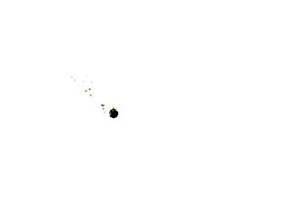

[[<-back](../README.md)]

# Particle Engines

Particles are just mini-animations. What we're going to do is take these animations:


and spawn them around a dot to create a trail of colored shimmering particles.



----

Here is a simple particle class. We have a constructor to set the position, a function to render it, and a function to tell if the particle is dead. In terms of data members we have a position, a frame of animation, and a texture we'll render with.

``` C++
//  Particle count
const int TOTAL_PARTICLES = 20;

class Particle
{
    public:
        //  Initialize position and animation
        Particle( int x, int y );

        //  Shows the particle
        void render();

        //  Checks if particle is dead
        bool isDead();

    private:
        //  Offsets
        int mPosX, mPosY;

        //  Current frame of animation
        int mFrame;

        //  Type of particle
        LTexture *  mTexture;
};
```

Here is our dot with an array of particles and a function to render the particles on the dot.

``` C++
//  The dot that will move around on the screen
class Dot
{
    public:
        //  The dimensions of the dot
        static const int DOT_WIDTH  = 20;
        static const int DOT_HEIGHT = 20;

        //  Maximum axis velocity of the dot
        static const int DOT_VEL    = 10;

        //  Initializes the variables and allocates particles
        Dot();

        //  Deallocates particles
        ~Dot();

        //  Takes key presses and adjusts the dot's velocity
        void handleEvent( SDL_Event& e );

        //  Moves the dot
        void move();

        //  Shows the dot on the screen
        void render();

    private:
        //  The particles
        Particle*   particles[ TOTAL_PARTICLES ];

        //  Shows the particles
        void renderParticles();

        //  The X and Y offsets of the dot
        int mPosX, mPosY;

        //  The velocity of the dot
        int mVelX, mVelY;
};
```

For our particle constructor we initialize the position around the given position with some randomness to it. We then initialize the frame of animation with some randomness so the particles will have varying life. Finally we pick the type of texture we'll use for the particle also at random.

``` C++
Particle::Particle( int x, int y )
{
    //  Set offsets
    mPosX = x - 5 + ( rand() % 25 );
    mPosY = y - 5 + ( rand() % 25 );

    //  Initialize animation
    mFrame = rand() % 5;

    //  Set type
    switch  ( rand() % 3 )
    {
        case 0: mTexture = &gRedTexture;    break;
        case 1: mTexture = &gGreenTexture;  break;
        case 2: mTexture = &gBlueTexture;   break;
    }
}
```

In the rendering function we render our texture selected in the constructor and then every other frame we render a semitransparent shimmer texture over it to make it look like the particle is shining. We then update the frame of animation.

``` C++
void Particle::render()
{
    //  Show image
    mTexture->render( mPosX, mPosY );

    //  Show shimmer
    if  ( mFrame % 2 == 0 )
    {
        gShimmerTexture.render( mPosX, mPosY );
    }

    //  Animate
    mFrame++;
}
```

Once the particle has rendered for a max of 10 frames, we mark it as dead.

``` C++
bool Particle::isDead()
{
    return mFrame > 10;
}
```

The constructor/destructor now have to allocate/deallocate the particles we render over the dot.

``` C++
Dot::Dot()
{
    //  Initialize the offsets
    mPosX = 0;
    mPosY = 0;

    //  Initialize the velocity
    mVelX = 0;
    mVelY = 0;

    //  Initialize particles
    for ( int i = 0; i < TOTAL_PARTICLES; ++i )
    {
        particles[ i ] = new Particle( mPosX, mPosY );
    }
}

Dot::~Dot()
{
    //  Delete particles
    for ( int i = 0; i < TOTAL_PARTICLES; ++i )
    {
        delete particles[ i ];
    }
}
```

Our dot's rendering function now calls our particle rendering function. The particle rendering function checks if there are any particles that are dead and replaces them. After the dead particles are replaced we render all the current particles to the screen.

``` C++
void Dot::render()
{
    //  Show the dot
    gDotTexture.render( mPosX, mPosY );

    //  Show particles on top of dot
    renderParticles();
}

void Dot::renderParticles()
{
    //  Go through particles
    for ( int i = 0; i < TOTAL_PARTICLES; ++i )
    {
        //  Delete and replace dead particles
        if  ( particles[ i ]->isDead() )
        {
            delete particles[ i ];
            particles[ i ] = new Particle( mPosX, mPosY );
        }
    }

    //  Show particles
    for( int i = 0; i < TOTAL_PARTICLES; ++i )
    {
        particles[ i ]->render();
    }
}
```

To give our particles a semi transparent look we set their alpha to 192.

``` C++
bool loadMedia()
{
    //  Loading success flag
    bool success = true;

    //  Load dot texture
    if  ( !gDotTexture.loadFromFile( "38_particle_engines/dot.bmp" ) )
    {
        printf( "Failed to load dot texture!\n" );
        success = false;
    }

    //  Load red texture
    if  ( !gRedTexture.loadFromFile( "38_particle_engines/red.bmp" ) )
    {
        printf( "Failed to load red texture!\n" );
        success = false;
    }

    //  Load green texture
    if  ( !gGreenTexture.loadFromFile( "38_particle_engines/green.bmp" ) )
    {
        printf( "Failed to load green texture!\n" );
        success = false;
    }

    //  Load blue texture
    if  ( !gBlueTexture.loadFromFile( "38_particle_engines/blue.bmp" ) )
    {
        printf( "Failed to load blue texture!\n" );
        success = false;
    }

    //  Load shimmer texture
    if  ( !gShimmerTexture.loadFromFile( "38_particle_engines/shimmer.bmp" ) )
    {
        printf( "Failed to load shimmer texture!\n" );
        success = false;
    }
    
    //  Set texture transparency
    gRedTexture.    setAlpha( 192 );
    gGreenTexture.  setAlpha( 192 );
    gBlueTexture.   setAlpha( 192 );
    gShimmerTexture.setAlpha( 192 );

    return success;
}
```

Again, since our code is well encapsulated the code in the main loop hardly changes.

Now like most of the tutorials this is a super simplified example. In larger program there would be particles controlled by a particle emitter that's its own class, but for the sake of simplicity we're having the Dot class function as a particle emitter.

``` C++
            //  Main loop flag
            bool quit = false;

            //  Event handler
            SDL_Event e;

            //  The dot that will be moving around on the screen
            Dot dot;

            //  While application is running
            while   ( !quit )
            {
                //  Handle events on queue
                while   ( SDL_PollEvent( &e ) != 0 )
                {
                    //  User requests quit
                    if  ( e.type == SDL_QUIT )
                    {
                        quit = true;
                    }

                    //  Handle input for the dot
                    dot.handleEvent( e );
                }

                //  Move the dot
                dot.move();

                //  Clear screen
                SDL_SetRenderDrawColor  ( gRenderer, 0xFF, 0xFF, 0xFF, 0xFF );
                SDL_RenderClear         ( gRenderer );

                //  Render objects
                dot.render();

                //  Update screen
                SDL_RenderPresent       ( gRenderer );
            }
```

----

[[<-back](../README.md)]

