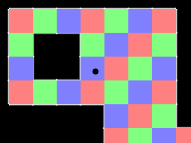

[[<-back](../README.md)]

# Tiling

Tiling is a way of making levels out of uniformly sized reusable pieces. In this tutorial we'll be making a 1280x960 sized level of out only a 160x120 sized tile set.



----

Say if we want to make a level like this:


We could make one huge level or we could create a tile set of 12 pieces:


And then create a level out of those pieces allowing us to save memory and save time by reusing pieces. This is why back in the early days of gaming tiling engines were so popular on low resource systems and are still used today in some games.

----

In our previous tutorials we did our [file reading and writing with SDL RWOps](../lesson-33/README.md). Here we'll be using fstream which is part of the standard C++ library and is relatively easy to use with text files.

``` C++
//  Using SDL, SDL_image, standard IO, strings, and file streams
#include <SDL.h>
#include <SDL_image.h>
#include <stdio.h>
#include <string>
#include <fstream>
```

Here we're defining some constants. We'll be using [scrolling](../lesson-30/README.md) so we have constants for both the screen and the level. We'll also have constants to define the tiles and the tile types.

``` C++
//  Screen dimension constants
const int SCREEN_WIDTH      = 640;
const int SCREEN_HEIGHT     = 480;

//  The dimensions of the level
const int LEVEL_WIDTH       = 1280;
const int LEVEL_HEIGHT      = 960;

//  Tile constants
const int TILE_WIDTH        = 80;
const int TILE_HEIGHT       = 80;
const int TOTAL_TILES       = 192;
const int TOTAL_TILE_SPRITES= 12;

//  The different tile sprites
const int TILE_RED          = 0;
const int TILE_GREEN        = 1;
const int TILE_BLUE         = 2;
const int TILE_CENTER       = 3;
const int TILE_TOP          = 4;
const int TILE_TOPRIGHT     = 5;
const int TILE_RIGHT        = 6;
const int TILE_BOTTOMRIGHT  = 7;
const int TILE_BOTTOM       = 8;
const int TILE_BOTTOMLEFT   = 9;
const int TILE_LEFT         = 10;
const int TILE_TOPLEFT      = 11;
```

Here is our tile class with a constructor that defines position and type, a renderer that uses a camera, and some accessors to get the tile's type and collision box. In terms of data members we have a collision box and type indicator.

Normally it's a good idea to have [position and collider separate when doing collision detection](../lesson-27/README.md), but for the sake of simplicity we're using the collider to hold position.

``` C++
//  The tile
class Tile
{
    public:
        //  Initializes position and type
        Tile( int x, int y, int tileType );

        //  Shows the tile
        void render( SDL_Rect& camera );

        //  Get the tile type
        int getType();

        //  Get the collision box
        SDL_Rect getBox();

    private:
        //  The attributes of the tile
        SDL_Rect mBox;

        //  The tile type
        int mType;
};
```

Here is the dot class yet again, now with the ability to check for collision against the tiles when moving.

``` C++
//The dot that will move around on the screen
class Dot
{
    public:
        //  The dimensions of the dot
        static const int DOT_WIDTH  = 20;
        static const int DOT_HEIGHT = 20;

        //  Maximum axis velocity of the dot
        static const int DOT_VEL    = 10;

        //  Initializes the variables
        Dot();

        //  Takes key presses and adjusts the dot's velocity
        void handleEvent( SDL_Event& e );

        //  Moves the dot and check collision against tiles
        void move( Tile *tiles[] );

        //  Centers the camera over the dot
        void setCamera( SDL_Rect& camera );

        //  Shows the dot on the screen
        void render( SDL_Rect& camera );

    private:
        //  Collision box of the dot
        SDL_Rect mBox;

        //  The velocity of the dot
        int mVelX, mVelY;
};

```

Our media loading function will also be initializing tiles so it needs to take them in as an argument.

We also have the touchesWall function that checks a collision box against every wall in a tile set which will be used when we need to check the dot against the whole tile set. Finally the setTiles function loads and sets the tiles.

``` C++
//  Starts up SDL and creates window
bool init();

//  Loads media
bool loadMedia  ( Tile* tiles[] );

//  Frees media and shuts down SDL
void close      ( Tile* tiles[] );

//  Box collision detector
bool checkCollision( SDL_Rect a, SDL_Rect b );

//  Checks collision box against set of tiles
bool touchesWall( SDL_Rect box, Tile* tiles[] );

//  Sets tiles from tile map
bool setTiles( Tile *tiles[] );
```

The tile constructor initializes position, dimensions, and type.

``` C++
Tile::Tile( int x, int y, int tileType )
{
    //  Get the offsets
    mBox.x = x;
    mBox.y = y;

    //  Set the collision box
    mBox.w = TILE_WIDTH;
    mBox.h = TILE_HEIGHT;

    //  Get the tile type
    mType = tileType;
}
```

### Rendering

When we render we only want to show tiles that are in the camera's sight:


So we check if the tile collides with the camera before rendering it. Notice also that we render the tile relative to the camera.

``` C++
void Tile::render( SDL_Rect& camera )
{
    //  If the tile is on screen
    if  ( checkCollision( camera, mBox ) )
    {
        //  Show the tile
        gTileTexture.render(
            mBox.x - camera.x   ,
            mBox.y - camera.y   ,
            &gTileClips[ mType ]
        );
    }
}
```

And here are the accessors to get the tile's type and collision box.

``` C++
int Tile::getType()
{
    return mType;
}

SDL_Rect Tile::getBox()
{
    return mBox;
}
```

When we move the dot we check if it goes off the level or hits a wall tile. If it does we correct it.

``` C++
void Dot::move( Tile *tiles[] )
{
    //  Move the dot left or right
    mBox.x += mVelX;

    //  If the dot went too far to the left or right or touched a wall
    if  ( ( mBox.x < 0 ) || ( mBox.x + DOT_WIDTH > LEVEL_WIDTH ) || touchesWall( mBox, tiles ) )
    {
        //  move back
        mBox.x -= mVelX;
    }

    //  Move the dot up or down
    mBox.y += mVelY;

    //  If the dot went too far up or down or touched a wall
    if  (
            ( mBox.y < 0 )                          ||
            ( mBox.y + DOT_HEIGHT > LEVEL_HEIGHT )  ||
            touchesWall( mBox, tiles )
        )
    {
        //  move back
        mBox.y -= mVelY;
    }
}
```

Here is the rendering code largely lifted from the scrolling/camera tutorial.

``` C++
void Dot::setCamera( SDL_Rect& camera )
{
    //  Center the camera over the dot
    camera.x = ( mBox.x + DOT_WIDTH  / 2 ) - SCREEN_WIDTH  / 2;
    camera.y = ( mBox.y + DOT_HEIGHT / 2 ) - SCREEN_HEIGHT / 2;

    //  Keep the camera in bounds
    if  ( camera.x < 0 )
    { 
        camera.x = 0;
    }
    if  ( camera.y < 0 )
    {
        camera.y = 0;
    }
    if  ( camera.x > LEVEL_WIDTH - camera.w )
    {
        camera.x = LEVEL_WIDTH - camera.w;
    }
    if  ( camera.y > LEVEL_HEIGHT - camera.h )
    {
        camera.y = LEVEL_HEIGHT - camera.h;
    }
}

void Dot::render( SDL_Rect& camera )
{
    //  Show the dot
    gDotTexture.render( mBox.x - camera.x, mBox.y - camera.y );
}
```

In our loading function we not only load the textures but also the tile set.

``` C++
bool loadMedia( Tile* tiles[] )
{
    //  Loading success flag
    bool success = true;

    //  Load dot texture
    if  ( !gDotTexture.loadFromFile( "39_tiling/dot.bmp" ) )
    {
        printf( "Failed to load dot texture!\n" );
        success = false;
    }

    //  Load tile texture
    if  ( !gTileTexture.loadFromFile( "39_tiling/tiles.png" ) )
    {
        printf( "Failed to load tile set texture!\n" );
        success = false;
    }

    //  Load tile map
    if  ( !setTiles( tiles ) )
    {
        printf( "Failed to load tile set!\n" );
        success = false;
    }

    return success;
}
```

Near the top of the setTiles function we declare x/y offsets that define where we'll be placing the tiles. As we load in more tiles we'll be shifting the x/y position left to right and top to bottom.

We then open the `lazy.map` file which is just a text file with the following contents:

``` C++
00 01 02 00 01 02 00 01 02 00 01 02 00 01 02 00
01 02 00 01 02 00 01 02 00 01 02 00 01 02 00 01
02 00 11 04 04 04 04 04 04 04 04 04 04 05 01 02
00 01 10 03 03 03 03 03 03 03 03 03 03 06 02 00
01 02 10 03 08 08 08 08 08 08 08 03 03 06 00 01
02 00 10 06 00 01 02 00 01 02 00 10 03 06 01 02
00 01 10 06 01 11 05 01 02 00 01 10 03 06 02 00
01 02 10 06 02 09 07 02 00 01 02 10 03 06 00 01
02 00 10 06 00 01 02 00 01 02 00 10 03 06 01 02
00 01 10 03 04 04 04 05 02 00 01 09 08 07 02 00
01 02 09 08 08 08 08 07 00 01 02 00 01 02 00 01
02 00 01 02 00 01 02 00 01 02 00 01 02 00 01 02
```

Using `fstream` we can read text from a file much like we would read keyboard input with `iostream`. Before we can continue we have to check if the map loaded correctly. If it failed we abort and if not we continue loading the file. 

``` C++
bool setTiles( Tile* tiles[] )
{
    //  Success flag
    bool tilesLoaded = true;

    //  The tile offsets
    int x = 0, y = 0;

    //  Open the map
    std::ifstream map( "./lazy.map" );

    //  If the map couldn't be loaded
    if  ( map.fail() )
    {
        printf( "Unable to load map file!\n" );
        tilesLoaded = false;
    }
```

If the file loaded successfully we have a for loop that reads in all the numbers from the text file. We read a number into the tileType variable and then check if the read failed. If the read failed, we abort.

If not we then check if the tile type number is valid. If it is valid we create a new tile of the given type, if not we print an error and stop loading tiles.

``` C++
    else
    {
        //  Initialize the tiles
        for ( int i = 0; i < TOTAL_TILES; ++i )
        {
            //  Determines what kind of tile will be made
            int tileType = -1;

            //  Read tile from map file
            map >> tileType;

            //  If the was a problem in reading the map
            if  ( map.fail() )
            {
                //  Stop loading map
                printf( "Error loading map: Unexpected end of file!\n" );
                tilesLoaded = false;
                break;
            }

            //  If the number is a valid tile number
            if  (
                    ( tileType >= 0 )                   &&
                    ( tileType < TOTAL_TILE_SPRITES )
                )
            {
                tiles[ i ] = new Tile( x, y, tileType );
            }
            //  If we don't recognize the tile type
            else
            {
                //  Stop loading map
                printf( "Error loading map: Invalid tile type at %d!\n", i );
                tilesLoaded = false;
                break;
            }

```

After loading a tile we move to the text tile position to the right. If we reached the end of a line of tiles, we move down to the next row.

``` C++
            //  Move to next tile spot
            x += TILE_WIDTH;

            //  If we've gone too far
            if  ( x >= LEVEL_WIDTH )
            {
                //  Move back
                x = 0;

                //  Move to the next row
                y += TILE_HEIGHT;
            }
        }
```

After all the tiles are loaded we set the clip rectangles for the tile sprites. Finally we close the map file and return.

``` C++
        //  Clip the sprite sheet
        if  ( tilesLoaded )
        {
            gTileClips[ TILE_RED        ].x = 0;
            gTileClips[ TILE_RED        ].y = 0;
            gTileClips[ TILE_RED        ].w = TILE_WIDTH;
            gTileClips[ TILE_RED        ].h = TILE_HEIGHT;

            gTileClips[ TILE_GREEN      ].x = 0;
            gTileClips[ TILE_GREEN      ].y = 80;
            gTileClips[ TILE_GREEN      ].w = TILE_WIDTH;
            gTileClips[ TILE_GREEN      ].h = TILE_HEIGHT;

            gTileClips[ TILE_BLUE       ].x = 0;
            gTileClips[ TILE_BLUE       ].y = 160;
            gTileClips[ TILE_BLUE       ].w = TILE_WIDTH;
            gTileClips[ TILE_BLUE       ].h = TILE_HEIGHT;

            gTileClips[ TILE_TOPLEFT    ].x = 80;
            gTileClips[ TILE_TOPLEFT    ].y = 0;
            gTileClips[ TILE_TOPLEFT    ].w = TILE_WIDTH;
            gTileClips[ TILE_TOPLEFT    ].h = TILE_HEIGHT;

            gTileClips[ TILE_LEFT       ].x = 80;
            gTileClips[ TILE_LEFT       ].y = 80;
            gTileClips[ TILE_LEFT       ].w = TILE_WIDTH;
            gTileClips[ TILE_LEFT       ].h = TILE_HEIGHT;

            gTileClips[ TILE_BOTTOMLEFT ].x = 80;
            gTileClips[ TILE_BOTTOMLEFT ].y = 160;
            gTileClips[ TILE_BOTTOMLEFT ].w = TILE_WIDTH;
            gTileClips[ TILE_BOTTOMLEFT ].h = TILE_HEIGHT;

            gTileClips[ TILE_TOP        ].x = 160;
            gTileClips[ TILE_TOP        ].y = 0;
            gTileClips[ TILE_TOP        ].w = TILE_WIDTH;
            gTileClips[ TILE_TOP        ].h = TILE_HEIGHT;

            gTileClips[ TILE_CENTER     ].x = 160;
            gTileClips[ TILE_CENTER     ].y = 80;
            gTileClips[ TILE_CENTER     ].w = TILE_WIDTH;
            gTileClips[ TILE_CENTER     ].h = TILE_HEIGHT;

            gTileClips[ TILE_BOTTOM     ].x = 160;
            gTileClips[ TILE_BOTTOM     ].y = 160;
            gTileClips[ TILE_BOTTOM     ].w = TILE_WIDTH;
            gTileClips[ TILE_BOTTOM     ].h = TILE_HEIGHT;

            gTileClips[ TILE_TOPRIGHT   ].x = 240;
            gTileClips[ TILE_TOPRIGHT   ].y = 0;
            gTileClips[ TILE_TOPRIGHT   ].w = TILE_WIDTH;
            gTileClips[ TILE_TOPRIGHT   ].h = TILE_HEIGHT;

            gTileClips[ TILE_RIGHT      ].x = 240;
            gTileClips[ TILE_RIGHT      ].y = 80;
            gTileClips[ TILE_RIGHT      ].w = TILE_WIDTH;
            gTileClips[ TILE_RIGHT      ].h = TILE_HEIGHT;

            gTileClips[ TILE_BOTTOMRIGHT ].x = 240;
            gTileClips[ TILE_BOTTOMRIGHT ].y = 160;
            gTileClips[ TILE_BOTTOMRIGHT ].w = TILE_WIDTH;
            gTileClips[ TILE_BOTTOMRIGHT ].h = TILE_HEIGHT;
        }
    }

    //  Close the file
    map.close();

    //  If the map was loaded fine
    return tilesLoaded;
}
```

The touchesWall function checks a given collision box against tiles of type `TILE_CENTER`, `TILE_TOP`, `TILE_TOPRIGHT`, `TILE_RIGHT`, `TILE_BOTTOMRIGHT`, `TILE_BOTTOM`, `TILE_BOTTOMLEFT`, `TILE_LEFT`, and `TILE_TOPLEFT` which are all wall tiles. If you check back when we defined these constants, you'll see that these are numbered right next to each other so all we have to do is check if the type is between `TILE_CENTER` and `TILE_TOPLEFT`.

If the given collision box collides with any tile that is a wall this function returns true,

``` C++
bool touchesWall( SDL_Rect box, Tile* tiles[] )
{
    //  Go through the tiles
    for ( int i = 0; i < TOTAL_TILES; ++i )
    {
        //  If the tile is a wall type tile
        if  (
                ( tiles[ i ]->getType() >= TILE_CENTER  )   &&
                ( tiles[ i ]->getType() <= TILE_TOPLEFT )
            )
        {
            //  If the collision box touches the wall tile
            if  ( checkCollision( box, tiles[ i ]->getBox() ) )
            {
                return true;
            }
        }
    }

    //  If no wall tiles were touched
    return false;
}

```

In the main function right before we load the media we declare our array of tile pointers.

``` C++
        //  The level tiles
        Tile* tileSet[ TOTAL_TILES ];

        //  Load media
        if  ( !loadMedia( tileSet ) )
        {
            printf( "Failed to load media!\n" );
        }

```

Our main loop is pretty much the same with some adjustments. When we move the dot we pass in the tile set and then set the camera over the dot after it moved. We then render the tile set and finally render the dot over the level.

``` C++
            //  While application is running
            while   ( !quit )
            {
                //  Handle events on queue
                while   ( SDL_PollEvent( &e ) != 0 )
                {
                    //  User requests quit
                    if  ( e.type == SDL_QUIT )
                    {
                        quit = true;
                    }

                    //  Handle input for the dot
                    dot.handleEvent( e );
                }

                //  Move the dot
                dot.move( tileSet );
                dot.setCamera( camera );

                //  Clear screen
                SDL_SetRenderDrawColor  ( gRenderer, 0xFF, 0xFF, 0xFF, 0xFF );
                SDL_RenderClear         ( gRenderer );

                //  Render level
                for ( int i = 0; i < TOTAL_TILES; ++i )
                {
                    tileSet[ i ]->render( camera );
                }

                //  Render dot
                dot.render( camera );

                //  Update screen
                SDL_RenderPresent( gRenderer );
            }
```

----

[[<-back](../README.md)]
