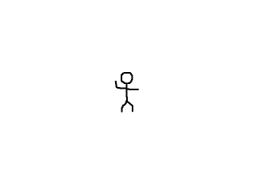

[[<-back](../README.md)]

# Texture Manipulation

To do graphics effects often requires pixel access. In this tutorial we'll be altering an image's pixels to white out the background.



----

Here we're adding new functionality to the texture class. We have functions to lock/unlock the texture because in order to access a texture's pixels we have to lock it and once we're done messing with the pixels we have to unlock it.

We have a function to get the raw pixels and a function to get the pitch. The pitch is basically the width of the texture in memory. On some older and mobile hardware, there are limitations of what size texture you can have. If you create a texture with a width of 100 pixels, it may get padded to 128 pixels wide (the next power of two). Using the pitch, we know how the image is in memory.

In terms of data members we have a pointer to the pixels after we lock the texture and the pitch.

``` C++
//Texture wrapper class
class LTexture
{
    public:
        //  Initializes variables
        LTexture();

        //  Deallocates memory
        ~LTexture();

        //  Loads image at specified path
        bool loadFromFile( std::string path );
        
        #if defined(SDL_TTF_MAJOR_VERSION)
        //  Creates image from font string
        bool loadFromRenderedText( std::string textureText, SDL_Color textColor );
        #endif

        //  Deallocates texture
        void free();

        //  Set color modulation
        void setColor   ( Uint8 red, Uint8 green, Uint8 blue );

        //  Set blending
        void setBlendMode( SDL_BlendMode blending );

        //  Set alpha modulation
        void setAlpha   ( Uint8 alpha );
        
        //  Renders texture at given point
        void render     ( int x, int y, SDL_Rect* clip = NULL, double angle = 0.0, SDL_Point* center = NULL, SDL_RendererFlip flip = SDL_FLIP_NONE );

        //  Gets image dimensions
        int     getWidth();
        int     getHeight();

        //  Pixel manipulators
        bool    lockTexture();
        bool    unlockTexture();
        void*   getPixels();
        int     getPitch();

    private:
        //  The actual hardware texture
        SDL_Texture*    mTexture;
        void*           mPixels;
        int             mPitch;

        //  Image dimensions
        int             mWidth;
        int             mHeight;
};
```

To allow ourselves the ability to edit the texture, we have to load our textures differently. When we created textures from surfaces before, they had the default [`SDL_TextureAccess`](http://wiki.libsdl.org/SDL_TextureAccess) of `SDL_TEXTUREACCESS_STATIC`, which means we can't change it after it is created. In order to be able to edit the texture's pixels we have to create the texture with `SDL_TEXTUREACCESS_STREAMING`.

First we have the load the image as a surface like before. We then have to convert the surface to the same pixel format as the window using [`SDL_ConvertSurfaceFormat`](http://wiki.libsdl.org/SDL_ConvertSurfaceFormat) because we can't mix texture rendering and surface rendering calls. We then create a blank texture with [`SDL_CreateTexture`](http://wiki.libsdl.org/SDL_CreateTexture).

``` C++
bool LTexture::loadFromFile( std::string path )
{
    //  Get rid of preexisting texture
    free();

    //  The final texture
    SDL_Texture*    newTexture = NULL;

    //  Load image at specified path
    SDL_Surface*    loadedSurface = IMG_Load( path.c_str() );
    if  ( loadedSurface == NULL )
    {
        printf( "Unable to load image %s! SDL_image Error: %s\n", path.c_str(), IMG_GetError() );
    }
    else
    {
        //  Convert surface to display format
        SDL_Surface*    formattedSurface =
            SDL_ConvertSurfaceFormat(
                loadedSurface       ,
                SDL_GetWindowPixelFormat( gWindow ), 0
            );

        if  ( formattedSurface == NULL )
        {
            printf( "Unable to convert loaded surface to display format! SDL Error: %s\n", SDL_GetError() );
        }
        else
        {
            //  Create blank streamable texture
            newTexture =
                SDL_CreateTexture(
                    gRenderer                           ,
                    SDL_GetWindowPixelFormat( gWindow ) ,
                    SDL_TEXTUREACCESS_STREAMING         ,
                    formattedSurface->w                 ,
                    formattedSurface->h
                );

            if  ( newTexture == NULL )
            {
                printf( "Unable to create blank texture! SDL Error: %s\n", SDL_GetError() );
            }
```

After the texture is created we have to manually copy the pixels from the surface to the texture. To grab the pixels from the texture we use [`SDL_LockTexture`](http://wiki.libsdl.org/SDL_LockTexture). The first argument is the texture we'll be grabbing pixels from. The second argument is the region we want to grab pixels from and since we're getting the pixels from the whole texture we set this argument to `NULL`. The third argument is the pointer that will be set to the address of the pixels and the last argument will be set to the texture's pitch.

After we have the texture's pixels, we copy the pixels from the surface to the texture using memcpy. The first argument is the destination, the second argument is the source, and the third argument is the number of bytes we'll be copying. Fortunately, the pitch SDL gives us is the number of bytes per row of pixels so all we have to do is multiply by the height of the surface to copy in all the pixels from the image.

After we're done copying the pixels from the surface to the texture, we unlock the texture to update it with the new pixels using [`SDL_UnlockTexture`](http://wiki.libsdl.org/SDL_UnlockTexture). After the texture is unlocked the pixel pointer is invalid so we set it to `NULL`.

With the pixels from the surface copied into the texture, we then get rid of the old surfaces and return true if the texture loaded successfully.

``` C++
            else
            {
                //  Lock texture for manipulation
                SDL_LockTexture( newTexture, NULL, &mPixels, &mPitch );

                //  Copy loaded/formatted surface pixels
                memcpy(
                    mPixels                     ,
                    formattedSurface->pixels    ,
                    formattedSurface->pitch * formattedSurface->h
                );

                //  Unlock texture to update
                SDL_UnlockTexture( newTexture );
                mPixels = NULL;

                //  Get image dimensions
                mWidth  = formattedSurface->w;
                mHeight = formattedSurface->h;
            }

            //  Get rid of old formatted surface
            SDL_FreeSurface( formattedSurface );
        }    
        
        //  Get rid of old loaded surface
        SDL_FreeSurface( loadedSurface );
    }

    //  Return success
    mTexture = newTexture;
    return mTexture != NULL;
}
```

Here are our functions to lock/unlock the texture after loading the image.

``` C++
bool LTexture::lockTexture()
{
    bool success = true;

    //  Texture is already locked
    if  ( mPixels != NULL )
    {
        printf( "Texture is already locked!\n" );
        success = false;
    }
    //  Lock texture
    else
    {
        if  ( SDL_LockTexture( mTexture, NULL, &mPixels, &mPitch ) != 0 )
        {
            printf( "Unable to lock texture! %s\n", SDL_GetError() );
            success = false;
        }
    }

    return success;
}

bool LTexture::unlockTexture()
{
    bool success = true;

    //  Texture is not locked
    if  ( mPixels == NULL )
    {
        printf( "Texture is not locked!\n" );
        success = false;
    }
    //  Unlock texture
    else
    {
        SDL_UnlockTexture( mTexture );
        mPixels = NULL;
        mPitch  = 0;
    }

    return success;
}
```

Finally here are the accessors to get the pixels and pitch while the texture is locked. Now that we can create a streamable texture and lock/unlock it, it is time to do some texture pixel processing.

``` C++
void* LTexture::getPixels()
{
    return mPixels;
}

int LTexture::getPitch()
{
    return mPitch;
}
```

In our media loading function after we load the texture we lock it so we can alter its pixels.

``` C++
bool loadMedia()
{
    //  Loading success flag
    bool success = true;

    //  Load foo' texture
    if  ( !gFooTexture.loadFromFile( "./foo.png" ) )
    {
        printf( "Failed to load corner texture!\n" );
        success = false;
    }
    else
    {
        //  Lock texture
        if  ( !gFooTexture.lockTexture() )
        {
            printf( "Unable to lock Foo' texture!\n" );
        }
```

After the texture is locked, we're going to go through the pixels and make all the background pixels transparent. What we're doing is essentially manually color keying the image.

First we allocate a pixel format using `SDL_GetWindowPixelFormat` and [`SDL_AllocFormat`](http://wiki.libsdl.org/SDL_AllocFormat). We then need to grab the pixels. Our pixel accessor returns a void pointer and we want 32bit pixels so we type cast it to a 32bit unsigned integer.

Next we want to get the number of pixels. We get the pitch which is the width in bytes. We need the width in pixels and since there are 4 bytes per pixel all we need to do is divide by 4 to get the pitch in pixels. Then we multiply the pitch width by the height to get the total number of pixels.

``` C++
        //  Manual color key
        else
        {            
            //  Allocate format from window
            Uint32 format = SDL_GetWindowPixelFormat( gWindow );
            SDL_PixelFormat* mappingFormat = SDL_AllocFormat( format );
            
            //  Get pixel data
            Uint32* pixels = (Uint32*)gFooTexture.getPixels();
            int pixelCount = ( gFooTexture.getPitch() / 4 ) * gFooTexture.getHeight();
```

What we're going to do is find all the pixels that are the color key color and then replace them with transparent pixels. First we map the color key color and the transparent color using the window's pixel format. Then we go through all the pixels and check if any of the pixels match the color key. If it does, we give it the value of a transparent pixel.

After we're done going through the pixels we unlock the texture to update it with the new pixels. Lastly we can't forget to call [`SDL_FreeFormat`](http://wiki.libsdl.org/SDL_FreeFormat) to deallocate the pixel format we created.

``` C++
            //  Map colors
            Uint32 colorKey     = SDL_MapRGB ( mappingFormat, 0, 0xFF, 0xFF );
            Uint32 transparent  = SDL_MapRGBA( mappingFormat, 0xFF, 0xFF, 0xFF, 0x00 );

            //  Color key pixels
            for ( int i = 0; i < pixelCount; ++i )
            {
                if  ( pixels[ i ] == colorKey )
                {
                    pixels[ i ] = transparent;
                }
            }

            //  Unlock texture
            gFooTexture.unlockTexture();
            
            //  Free format
            SDL_FreeFormat( mappingFormat );
        }
    }

    return success;
}
```

----

[[<-back](../README.md)]
