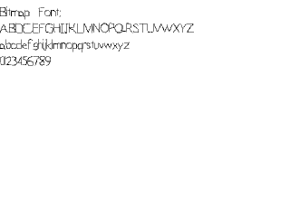

[[<-back](../README.md)]

# Bitmap Fonts

Sometimes TTF fonts are flexible enough. Since rendering text is just rendering images of characters, we can use bitmap fonts to render text.



----

If you think of each character in a string as a sprite, you can think of font rendering as arranging a bunch of sprites:


Bitmap fonts work by taking a sprite sheet of glyphs (character images) and rendering them in order to form strings on the screen.

----

In previous tutorials when we did [texture pixel manipulation](../lesson-40/README.md), we didn't care which pixel we got since we wanted to grab all the pixels. Here we need to get pixels at exact x/y coordinates which is why we're adding a getPixel32 function. This function works specifically for 32bit pixels.

``` C++
//Texture wrapper class
class LTexture
{
    public:
        //  Initializes variables
        LTexture();

        //  Deallocates memory
        ~LTexture();

        //  Loads image at specified path
        bool loadFromFile( std::string path );
        
        #if defined(SDL_TTF_MAJOR_VERSION)
        //  Creates image from font string
        bool loadFromRenderedText(
            std::string textureText ,
            SDL_Color   textColor
            );
        #endif

        //  Deallocates texture
        void free();

        //  Set color modulation
        void setColor( Uint8 red, Uint8 green, Uint8 blue );

        //  Set blending
        void setBlendMode( SDL_BlendMode blending );

        //  Set alpha modulation
        void setAlpha( Uint8 alpha );
        
        //  Renders texture at given point
        void render( int x, int y, SDL_Rect* clip = NULL, double angle = 0.0, SDL_Point* center = NULL, SDL_RendererFlip flip = SDL_FLIP_NONE );

        //  Gets image dimensions
        int getWidth();
        int getHeight();

        //  Pixel manipulators
        bool    lockTexture();
        bool    unlockTexture();
        void*   getPixels();
        int     getPitch();
        Uint32  getPixel32( unsigned int x, unsigned int y );

    private:
        //  The actual hardware texture
        SDL_Texture*    mTexture;
        void*           mPixels;
        int             mPitch;

        //  Image dimensions
        int     mWidth;
        int     mHeight;
};
```

Here is our bitmap font which functions as a wrapper for a sprite sheet of glyphs. It has a constructor to initialize internal variables, a function to build the font, and a function to render the text.

When the bitmap font is built we go through the texture and find all the character sprites for the 256 characters (that are stored in the mChars array) and calculate the distance for a new line and a space.

```
//  Our bitmap font
class LBitmapFont
{
    public:
        //  The default constructor
        LBitmapFont();

        //  Generates the font
        bool buildFont( LTexture *bitmap );

        //  Shows the text
        void renderText( int x, int y, std::string text );

    private:
        //  The font texture
        LTexture*   mBitmap;

        //  The individual characters in the surface
        SDL_Rect    mChars[ 256 ];

        //  Spacing Variables
        int mNewLine, mSpace;
};
```

Here is our texture loading from the previous tutorial with some more tweaks. We did the color keying externally in the previous tutorial, and here we're doing it internally in the texture loading function.

Secondly, we're specifying the texture pixel format as `SDL_PIXELFORMAT_RGBA8888` so we know we'll get 32bit RGBA pixels.

``` C++
bool LTexture::loadFromFile( std::string path )
{
    //  Get rid of preexisting texture
    free();

    //  The final texture
    SDL_Texture*    newTexture = NULL;

    //  Load image at specified path
    SDL_Surface*    loadedSurface = IMG_Load( path.c_str() );
    if  ( loadedSurface == NULL )
    {
        printf( "Unable to load image %s! SDL_image Error: %s\n", path.c_str(), IMG_GetError() );
    }
    else
    {
        //  Convert surface to display format
        SDL_Surface*    formattedSurface =
            SDL_ConvertSurfaceFormat(
                loadedSurface               ,
                SDL_PIXELFORMAT_RGBA8888    ,
                0
            );
        if  ( formattedSurface == NULL )
        {
            printf( "Unable to convert loaded surface to display format! %s\n", SDL_GetError() );
        }
        else
        {
            //  Create blank streamable texture
            newTexture =
                SDL_CreateTexture(
                    gRenderer                   ,
                    SDL_PIXELFORMAT_RGBA8888    ,
                    SDL_TEXTUREACCESS_STREAMING ,
                    formattedSurface->w         ,
                    formattedSurface->h
                );
            if  ( newTexture == NULL )
            {
                printf( "Unable to create blank texture! SDL Error: %s\n", SDL_GetError() );
            }
            else
            {
                //  Enable blending on texture
                SDL_SetTextureBlendMode( newTexture, SDL_BLENDMODE_BLEND );

                //  Lock texture for manipulation
                SDL_LockTexture(
                    newTexture                      ,
                    &formattedSurface->clip_rect    ,
                    &mPixels                        ,
                    &mPitch
                );

                //  Copy loaded/formatted surface pixels
                memcpy(
                    mPixels                     ,
                    formattedSurface->pixels    ,
                    formattedSurface->pitch * formattedSurface->h
                );

                //  Get image dimensions
                mWidth  = formattedSurface->w;
                mHeight = formattedSurface->h;

                //  Get pixel data in editable format
                Uint32*     pixels      = (Uint32*)mPixels;
                int         pixelCount  = ( mPitch / 4 ) * mHeight;

                //  Map colors                
                Uint32 colorKey     = SDL_MapRGB ( formattedSurface->format, 0, 0xFF, 0xFF );
                Uint32 transparent  = SDL_MapRGBA( formattedSurface->format, 0x00, 0xFF, 0xFF, 0x00 );

                //  Color key pixels
                for ( int i = 0; i < pixelCount; ++i )
                {
                    if  ( pixels[ i ] == colorKey )
                    {
                        pixels[ i ] = transparent;
                    }
                }

                //  Unlock texture to update
                SDL_UnlockTexture( newTexture );
                mPixels = NULL;
            }

            //  Get rid of old formatted surface
            SDL_FreeSurface( formattedSurface );
        }    
        
        //  Get rid of old loaded surface
        SDL_FreeSurface( loadedSurface );
    }

    //  Return success
    mTexture = newTexture;
    return mTexture != NULL;
}
```

---

Here is our function to get a pixel at a specific offset.

The important thing to know is that even though we have a 2 dimensional texture image like this:


Pixels are stored in one dimension like this:


So if you wanted to get the blue pixel in row 1, column 1 (the first row/column is row/column 0), you would have to calculate the offset like this:
__Y Offset * Pitch + X Offset__

Which comes out to:
__1 * 5 + 1 = 6__

And as you can see, the pixel at index 6 on the 1 dimensional pixels is the same as the one on row 1 column 1 on the 2 dimensional pixels.

And if you're wondering why we divide the pitch by 4, remember that the pitch is in bytes. Since we need the pitch in pixels and there's 4 bytes per pixel, we divide the pitch by 4.

``` C++
Uint32 LTexture::getPixel32( unsigned int x, unsigned int y )
{
    //  Convert the pixels to 32 bit
    Uint32 *    pixels = (Uint32*)mPixels;

    //  Get the pixel requested
    return pixels[ ( y * ( mPitch / 4 ) ) + x ];
}
```

Here in the constructor we initialize the internals.

``` C++
LBitmapFont::LBitmapFont()
{
    //  Initialize variables
    mBitmap = NULL;
    mNewLine= 0;
    mSpace  = 0;
}
```

Now we're entering the function that's going to go through the bitmap font and define all the clip rectanges for all the sprites. To do that we'll have to lock the texture to access its pixels.

``` C++
{
    bool success = true;
    
    //  Lock pixels for access
    if  ( !bitmap->lockTexture() )
    {
        printf( "Unable to lock bitmap font texture!\n" );
        success = false;
    }
```

In order for this bitmap font loading to work, the character glyphs need to be arranged in cells:


The cells all need to all have the same width and height, arranged in 16 columns and 16 rows, and need to be in ASCII order. The bitmap font loader is going to go through each of the cells, find the sides of the glyph sprites and set the clip rectangle for the sprite.

First we get the background color which we'll need to find the edges of the glyph sprites. Then we calculate the cell width and height. We have the variable called top which we will keep track of the top of the tallest glyph in the sprite sheet. The variable baseA will keep track of the offset of the bottom of the capital A glyph which will use as a base line for rendering characters.

Lastly we have the currentChar which keeps track of the current character glyph we're looking for.

```
    else
    {
        //  Set the background color
        Uint32 bgColor = bitmap->getPixel32( 0, 0 );

        //  Set the cell dimensions
        int cellW = bitmap->getWidth()  / 16;
        int cellH = bitmap->getHeight() / 16;

        //  New line variables
        int top     = cellH;
        int baseA   = cellH;

        //  The current character we're setting
        int currentChar = 0;
```

These two nested for loops are for going through the cell rows/columns.

At the top of per cell loop, we initialize the glyph sprite positon at the top of the cell and the sprite dimensions to be the cell dimensions. This means by default the glyph sprite is the full cell.

``` C++
        //  Go through the cell rows
        for ( int rows = 0; rows < 16; ++rows )
        {
            //  Go through the cell columns
            for ( int cols = 0; cols < 16; ++cols )
            {
                //  Set the character offset
                mChars[ currentChar ].x = cellW * cols;
                mChars[ currentChar ].y = cellH * rows;

                //  Set the dimensions of the character
                mChars[ currentChar ].w = cellW;
                mChars[ currentChar ].h = cellH;
```

For each cell we need to go through all the pixels in the cell to find the edge of the glyph sprite. In this loop we go through each column from top to bottom and look for the first pixel that is not the background color. Once we find a pixel that is not the background color it means we found the left edge of the sprite:


When we find the left side of the glyph we set it as x position of the sprite and then break the loops.

``` C++
                //  Find Left Side
                //  Go through pixel columns
                for ( int pCol = 0; pCol < cellW; ++pCol )
                {
                    //  Go through pixel rows
                    for ( int pRow = 0; pRow < cellH; ++pRow )
                    {
                        //  Get the pixel offsets
                        int pX = ( cellW * cols ) + pCol;
                        int pY = ( cellH * rows ) + pRow;

                        //  If a non colorkey pixel is found
                        if  ( bitmap->getPixel32( pX, pY ) != bgColor )
                        {
                            //  Set the x offset
                            mChars[ currentChar ].x = pX;

                            //  Break the loops
                            pCol = cellW;
                            pRow = cellH;
                        }
                    }
                }
```

Here we're looking for the pixel on the right side. It works pretty much the same as finding the left side, only now we're moving from right to left instead of left to right.

When we find the right pixel, we use it to set the width. Since the pixel array starts at `0`, we need to add 1 to the width.

``` C++
                //  Find Right Side
                //  Go through pixel columns
                for ( int pColW = cellW - 1; pColW >= 0; --pColW )
                {
                    //  Go through pixel rows
                    for ( int pRowW = 0; pRowW < cellH; ++pRowW )
                    {
                        //  Get the pixel offsets
                        int pX = ( cellW * cols ) + pColW;
                        int pY = ( cellH * rows ) + pRowW;

                        //  If a non colorkey pixel is found
                        if  ( bitmap->getPixel32( pX, pY ) != bgColor )
                        {
                            //  Set the width
                            mChars[ currentChar ].w = ( pX - mChars[ currentChar ].x ) + 1;

                            //  Break the loops
                            pColW = -1;
                            pRowW = cellH;
                        }
                    }
                }
```

Here is the code to find the top of the sprite. When we find a top that is higher than the current highest top, we set it as the new top.

Note that since the y axis is inverted, the highest top actually has the lowest y offset.

``` C++
                //  Find Top
                //  Go through pixel rows
                for ( int pRow = 0; pRow < cellH; ++pRow )
                {
                    //  Go through pixel columns
                    for ( int pCol = 0; pCol < cellW; ++pCol )
                    {
                        //  Get the pixel offsets
                        int pX = ( cellW * cols ) + pCol;
                        int pY = ( cellH * rows ) + pRow;

                        //  If a non colorkey pixel is found
                        if  ( bitmap->getPixel32( pX, pY ) != bgColor )
                        {
                            //  If new top is found
                            if  ( pRow < top )
                            {
                                top = pRow;
                            }

                            //  Break the loops
                            pCol = cellW;
                            pRow = cellH;
                        }
                    }
                }
```

In terms of looking for the bottom of the glyphs, the only one we care about is the capital A. For this bitmap font builder we're going to use the bottom of the A glyph sprite as the base line so characters like "g", "j", "y", etc that hang below the baseline don't define the bottom. You don't have to do it this way, but it's given me good results before.

``` C++
                //  Find Bottom of A
                if  ( currentChar == 'A' )
                {
                    //  Go through pixel rows
                    for ( int pRow = cellH - 1; pRow >= 0; --pRow )
                    {
                        //  Go through pixel columns
                        for ( int pCol = 0; pCol < cellW; ++pCol )
                        {
                            //  Get the pixel offsets
                            int pX = ( cellW * cols ) + pCol;
                            int pY = ( cellH * rows ) + pRow;

                            //  If a non colorkey pixel is found
                            if  ( bitmap->getPixel32( pX, pY ) != bgColor )
                            {
                                //  Bottom of a is found
                                baseA = pRow;

                                //  Break the loops
                                pCol = cellW;
                                pRow = -1;
                            }
                        }
                    }
                }

                //  Go to the next character
                ++currentChar;
            }
        }
```

After we're done defining all the sprites, we have some post processing to do. First we calculate how long a space is. Here we're defining it as half a cell width. We then calculate the height of a new line by using the baseline and the highest sprite top.

We then lop off the extra space at the top of each glyph to prevent there from being too much space between lines. Finally we unlock the texture and set the bitmap for the bitmap font.

Now the way we constructed the bitmap font isn't the only way to do it. You can define spaces, new lines, and base lines another way. You use an XML file to define the positions of the sprites instead of using cells. I decided to go with this method because it's a common one and it has worked for me.

```
        //  Calculate space
        mSpace = cellW / 2;

        //  Calculate new line
        mNewLine = baseA - top;

        //  Lop off excess top pixels
        for ( int i = 0; i < 256; ++i )
        {
            mChars[ i ].y += top;
            mChars[ i ].h -= top;
        }

        bitmap->unlockTexture();
        mBitmap = bitmap;
    }

    return success;
}
```

Now that we have all the glyph sprites defined, it's time to render them to the screen. First we check that there is a bitmap to render with, then we declare x/y offsets that we'll be using to render the current glyph sprite.

``` C++
void LBitmapFont::renderText( int x, int y, std::string text )
{
    //  If the font has been built
    if  ( mBitmap != NULL )
    {
        //  Temp offsets
        int curX = x, curY = y;
```

Here is the for loop that goes through the string to render each glyph sprite. However there are two ASCII values we're not actually going to render anything for. When we have a space, all we have to do is move over the space width. When we have a new line we move down a new line and back to the base x offset.

``` C++
        //  Go through the text
        for ( int i = 0; i < text.length(); ++i )
        {
            //  If the current character is a space
            if  ( text[ i ] == ' ' )
            {
                //  Move over
                curX += mSpace;
            }
            //  If the current character is a newline
            else if ( text[ i ] == '\n' )
            {
                //  Move down
                curY += mNewLine;

                //  Move back
                curX = x;
            }
```

For nonspecial characters, we render the sprite. As you can see, it's as simple as getting the ASCII value, rendering the sprite associated with the ASCII value and then moving over the width of the sprite.

The for loop will then keep going through all the characters and rendering the sprite for each of them one after the other.

``` C++
            else
            {
                //  Get the ASCII value of the character
                int ascii = (unsigned char) text[ i ];

                //  Show the character
                mBitmap->render( curX, curY, &mChars[ ascii ] );

                //  Move over the width of the character with one pixel of padding
                curX += mChars[ ascii ].w + 1;
            }
        }
    }
}
```

---

[[<-back](../README.md)]
