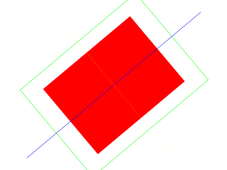

[[<-back](../README.md)]

# Render to Texture

For some effects being able to render a scene to texture is needed. Here we'll be rendering a scene to a texture to achieve a spinning scene effect.



---

Here we are adding more functionality to the texture class. The createBlank function now takes in another argument that defines how it is accessed. We also have the setAsRenderTarget function which makes it so we can render to this texture.

``` C++
//  Texture wrapper class
class LTexture
{
    public:
        //  Initializes variables
        LTexture();

        //Deallocates memory
        ~LTexture();

        //  Loads image at specified path
        bool loadFromFile( std::string path );
        
        #if defined(SDL_TTF_MAJOR_VERSION)
        //  Creates image from font string
        bool loadFromRenderedText( std::string textureText, SDL_Color textColor );
        #endif

        //  Creates blank texture
        bool createBlank( int width, int height, SDL_TextureAccess = SDL_TEXTUREACCESS_STREAMING );

        //  Deallocates texture
        void free();

        //  Set color modulation
        void setColor( Uint8 red, Uint8 green, Uint8 blue );

        //  Set blending
        void setBlendMode( SDL_BlendMode blending );

        //  Set alpha modulation
        void setAlpha( Uint8 alpha );
        
        //  Renders texture at given point
        void render( int x, int y, SDL_Rect* clip = NULL, double angle = 0.0, SDL_Point* center = NULL, SDL_RendererFlip flip = SDL_FLIP_NONE );

        //  Set self as render target
        void setAsRenderTarget();

        //  Gets image dimensions
        int getWidth();
        int getHeight();

        //  Pixel manipulators
        bool    lockTexture();
        bool    unlockTexture();
        void*   getPixels();
        void    copyPixels( void* pixels );
        int     getPitch();
        Uint32  getPixel32( unsigned int x, unsigned int y );

    private:
        //  The actual hardware texture
        SDL_Texture*    mTexture;
        void*           mPixels;
        int             mPitch;

        //  Image dimensions
        int mWidth;
        int mHeight;
};
```

When we want to render to a texture we need to set its texture access to [`SDL_TEXTUREACCESS_TARGET`](http://wiki.libsdl.org/SDL_TextureAccess), which is why this function takes an additional argument now.

``` C++
bool LTexture::createBlank( int width, int height, SDL_TextureAccess access )
{
    //  Create uninitialized texture
    mTexture =
        SDL_CreateTexture(
            gRenderer               ,
            SDL_PIXELFORMAT_RGBA8888,
            access                  ,
            width                   ,
            height
        );
    if  ( mTexture == NULL )
    {
        printf( "Unable to create blank texture! SDL Error: %s\n", SDL_GetError() );
    }
    else
    {
        mWidth  = width;
        mHeight = height;
    }

    return mTexture != NULL;
}
```

To render to a texture we have to set it as the render target which is done here using a call to [`SDL_SetRenderTarget`](http://wiki.libsdl.org/SDL_SetRenderTarget).

``` C++
void LTexture::setAsRenderTarget()
{
    //  Make self render target
    SDL_SetRenderTarget( gRenderer, mTexture );
}
```

We create our target texture in the media loading function.

``` C++
bool loadMedia()
{
    //  Loading success flag
    bool success = true;

    //  Load texture target
    if  ( !gTargetTexture.createBlank(
            SCREEN_WIDTH    ,
            SCREEN_HEIGHT   ,
            SDL_TEXTUREACCESS_TARGET
          )
        )
    {
        printf( "Failed to create target texture!\n" );
        success = false;
    }

    return success;
}
```

For this demo we'll render some geometry to a texture and spin that texture around the center of the screen. This is why we have variables for angle of rotation and center of screen.

``` C++
            //  Main loop flag
            bool quit = false;

            //  Event handler
            SDL_Event e;

            //  Rotation variables
            double angle = 0;
            SDL_Point screenCenter = { SCREEN_WIDTH / 2, SCREEN_HEIGHT / 2 };
```

In our main loop before we do any rendering we set the target texture as a target. We then render our scene full of geometry and once we're done rendering to a texture we call SDL_SetRenderTarget with a NULL texture so any rendering done afterward will be done to the screen.

With our scene rendered to a texture, we then render the target texture to the screen at a rotated angle.

``` C++
            //  While application is running
            while   ( quit == false )
            {
                //  Handle events on queue
                while   ( SDL_PollEvent( &e ) != 0 )
                {
                    //  User requests quit
                    if  ( e.type == SDL_QUIT )
                    {
                        quit = true;
                    }
                }

                //  rotate
                angle += 2;
                if  ( angle > 360 )
                {
                    angle -= 360;
                }

                //  Set self as render target
                gTargetTexture.setAsRenderTarget();

                //  Clear screen
                SDL_SetRenderDrawColor  ( gRenderer, 0xFF, 0xFF, 0xFF, 0xFF );
                SDL_RenderClear         ( gRenderer );

                //  Render red filled quad
                SDL_Rect fillRect =
                    {
                        SCREEN_WIDTH    / 4 ,
                        SCREEN_HEIGHT   / 4 ,
                        SCREEN_WIDTH    / 2 ,
                        SCREEN_HEIGHT   / 2
                    };
                SDL_SetRenderDrawColor( gRenderer, 0xFF, 0x00, 0x00, 0xFF );        
                SDL_RenderFillRect  ( gRenderer, &fillRect );

                //  Render green outlined quad
                SDL_Rect outlineRect =
                    {
                        SCREEN_WIDTH      / 6   ,
                        SCREEN_HEIGHT     / 6   ,
                        SCREEN_WIDTH  * 2 / 3   ,
                        SCREEN_HEIGHT * 2 / 3
                    };
                SDL_SetRenderDrawColor( gRenderer, 0x00, 0xFF, 0x00, 0xFF );        
                SDL_RenderDrawRect( gRenderer, &outlineRect );
                
                //  Draw blue horizontal line
                SDL_SetRenderDrawColor( gRenderer, 0x00, 0x00, 0xFF, 0xFF );        
                SDL_RenderDrawLine(
                        gRenderer           ,
                        0                   ,
                        SCREEN_HEIGHT / 2   ,
                        SCREEN_WIDTH        ,
                        SCREEN_HEIGHT / 2
                    );

                //  Draw vertical line of yellow dots
                SDL_SetRenderDrawColor( gRenderer, 0xFF, 0xFF, 0x00, 0xFF );
                for ( int i = 0; i < SCREEN_HEIGHT; i += 4 )
                {
                    SDL_RenderDrawPoint( gRenderer, SCREEN_WIDTH / 2, i );
                }

                //  Reset render target
                SDL_SetRenderTarget( gRenderer, NULL );

                //  Show rendered to texture
                gTargetTexture.render( 0, 0, NULL, angle, &screenCenter );

                //  Update screen
                SDL_RenderPresent( gRenderer );
            }
```

---

[[<-back](../README.md)]
