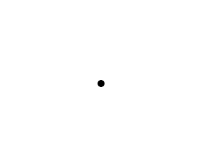

[[<-back](../README.md)]

# Frame Independent Movement



Whether you want to be able to handle unstable frame rates or support multiple frame rates, you can set your movement based on time to make it independent of frame rate.

---

The dot class returns adapted for frame independent movement. Notice how the velocity is now 640. The way we did per frame velocity previously would have caused this to fly across the screen in a single frame. For this demo we're going to base things on time and the standard unit of time is 1 second. 640 pixels per second translates into little more than 10 pixels per frame in a 60 frames per second application.

In order to move based on frame time, the move function needs to know how much time is moving per frame. This is why the move function takes in a time step which is how much time has passed since the last update.

Also notice how the position and velocity are floats instead of integers. If we used integers the motion would be always truncated to the nearest integer which would cause greater inaccuracies.

``` C++
//  The dot that will move around on the screen
class Dot
{
    public:
        //  The dimensions of the dot
        static const int DOT_WIDTH  = 20;
        static const int DOT_HEIGHT = 20;

        //  Maximum axis velocity of the dot
        static const int DOT_VEL    = 640;

        //  Initializes the variables
        Dot();

        //  Takes key presses and adjusts the dot's velocity
        void handleEvent( SDL_Event& e );

        //  Moves the dot
        void move( float timeStep );

        //  Shows the dot on the screen
        void render();

    private:
        float mPosX, mPosY;
        float mVelX, mVelY;
};
```

Here is the move function changed for time based movement as opposed to frame based movement.

We update the position by moving it over by velocity * time. Say if we had (for simplicity's sake) a velocity of 600 pixels per second and a time step of 1 60th of a second. This means we would move over by 600 * 1/60 pixels or 10 pixels.

Because of the non uniform movement we can't just move back when we go off screen, we have to correct the value to be something on screen.

``` C++
void Dot::move( float timeStep )
{
    //  Move the dot left or right
    mPosX += mVelX * timeStep;

    //  If the dot went too far to the left or right
    if  ( mPosX < 0 )
    {
        mPosX = 0;
    }
    else if ( mPosX > SCREEN_WIDTH - DOT_WIDTH )
    {
        mPosX = SCREEN_WIDTH - DOT_WIDTH;
    }
    
    //  Move the dot up or down
    mPosY += mVelY * timeStep;

    //  If the dot went too far up or down
    if  ( mPosY < 0 )
    {
        mPosY = 0;
    }
    else if ( mPosY > SCREEN_HEIGHT - DOT_HEIGHT )
    {
        mPosY = SCREEN_HEIGHT - DOT_HEIGHT;
    }
}
```

To prevent the compiler from barking at us, we convert the positions to integers when rendering the dot.

``` C++
void Dot::render()
{
    //  Show the dot
    gDotTexture.render( (int) mPosX, (int) mPosY );
}
```

For this demo we disabled vsync to show it can run regardless of the frame rate. In order to know how much time has passed between renders, we need a timer to keep track of the time step.

``` C++
            //  Main loop flag
            bool quit = false;

            //  Event handler
            SDL_Event e;

            //  The dot that will be moving around on the screen
            Dot dot;

            //  Keeps track of time between steps
            LTimer stepTimer;
```

When we move around the dot we first get the time from the step time so we know how much time has passed since the last time we moved. We turn it from milliseconds into seconds and pass it to the move function. After we're done moving we restart the step timer so we'll know how much time has passed for when we need to move again. Finally we render as we normally do.

For most of these tutorials, things are simplified to make things easier to digest. For most if not all applications we use time based movement as opposed to frame based movement. Even when we have a fixed frame rate, we just use a constant time step. The thing is when using time based movement you run into problems with floating point errors which require vector math to fix, and vector math is beyond the scope of this tutorial which is why frame based movement is used for most of the tutorials.

``` C++
            //  While application is running
            while   ( !quit )
            {
                //  Handle events on queue
                while   ( SDL_PollEvent( &e ) != 0 )
                {
                    //  User requests quit
                    if  ( e.type == SDL_QUIT )
                    {
                        quit = true;
                    }

                    //  Handle input for the dot
                    dot.handleEvent( e );
                }

                //  Calculate time step
                float timeStep = stepTimer.getTicks() / 1000.f;

                //  Move for time step
                dot.move( timeStep );

                //  Restart step timer
                stepTimer.start();

                //  Clear screen
                SDL_SetRenderDrawColor  ( gRenderer, 0xFF, 0xFF, 0xFF, 0xFF );
                SDL_RenderClear         ( gRenderer );

                //  Render dot
                dot.render();

                //  Update screen
                SDL_RenderPresent( gRenderer );
            }
```

---

[[<-back](../README.md)]
