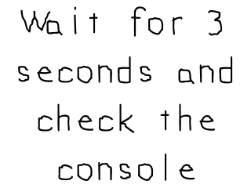

[[<-back](../README.md)]

# Timer Callbacks

We've covered [timers with SDL before](../lesson-23/README.md), but there are also timer callbacks which execute a function after a given amount of time. In this tutorial we'll make a simple program that prints to the console after a set time.



---

When creating a call back function, know that they have to be declared a certain way. You can't just create any type of function and use it as a callback.

The call back function needs to have a 32 bit integer as its first argument, a void pointer as its second argument, and it has to return a 32 bit integer.

``` C++
//  Our test callback function
Uint32 callback( Uint32 interval, void* param );

```

Here is our simple call back function which prints a message to the console after a given amount of time. The interval argument isn't used here but is typically used for timer call backs that need to repeat themselves.

Since void pointers can point to anything, this function is going to take in a string and print it to the console.

``` C++
Uint32 callback( Uint32 interval, void* param )
{
    //  Print callback message
    printf( "Callback called back with message: %s\n", (char*)param );

    return 0;
}
```

Do make sure to initialize with `SDL_INIT_TIMER` to use timer callbacks.

``` C++
    //  Initialize SDL
    if  (SDL_Init( SDL_INIT_VIDEO | SDL_INIT_TIMER ) < 0 )
    {
        printf( "SDL could not initialize! SDL Error: %s\n", SDL_GetError() );
        success = false;
    }
```

We kick off our timer callback using [`SDL_AddTimer`](http://wiki.libsdl.org/SDL_AddTimer). The first argument is how long the callback will take which in this case is set to 3000 milliseconds or 3 seconds. The second argument is the callback function and the last argument is the void data pointer we're sending it.

This application will kick off the call back and then run the main loop. While the main loop is running the callback may spit out the message to the console. In case the callback doesn't happen before the main loop ends, we remove the callback timer using [`SDL_RemoveTimer`](http://wiki.libsdl.org/SDL_RemoveTimer). Careful, the timer call back is asynchronous which means it can happen while we're doing something else. Don't have your call back mess with data while your main thread is messing with that same piece of data.

``` C++
            //  Set callback
            SDL_TimerID timerID = SDL_AddTimer( 3 * 1000, callback, "3 seconds waited!" );

            //  While application is running
            while   ( !quit )
            {
                //  Handle events on queue
                while   ( SDL_PollEvent( &e ) != 0 )
                {
                    //  User requests quit
                    if  ( e.type == SDL_QUIT )
                    {
                        quit = true;
                    }
                }

                //  Clear screen
                SDL_SetRenderDrawColor  ( gRenderer, 0xFF, 0xFF, 0xFF, 0xFF );
                SDL_RenderClear         ( gRenderer );

                //  Render splash
                gSplashTexture.render( 0, 0 );

                //  Update screen
                SDL_RenderPresent( gRenderer );
            }

            //  Remove timer in case the call back was not called
            SDL_RemoveTimer( timerID );
```

---

[[<-back](../README.md)]
