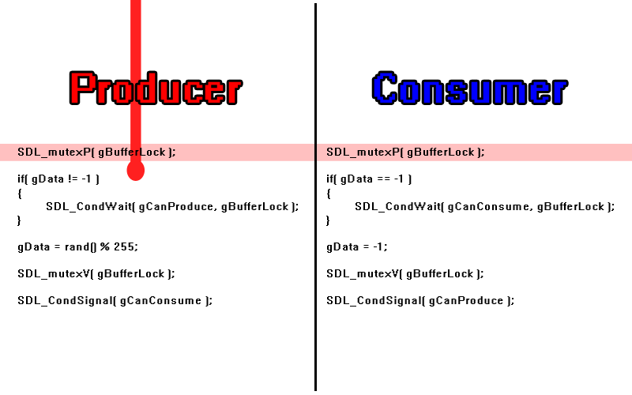
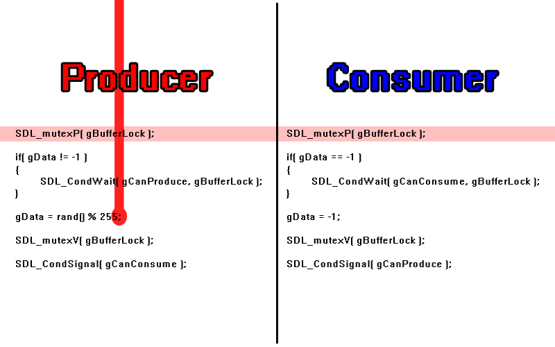
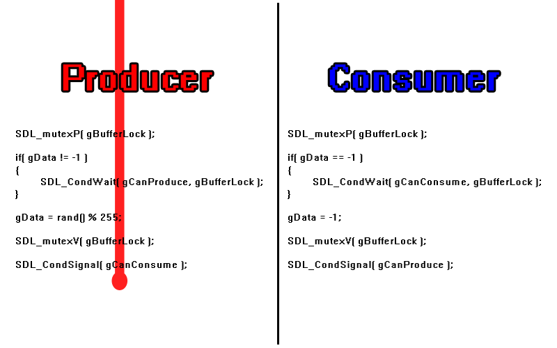
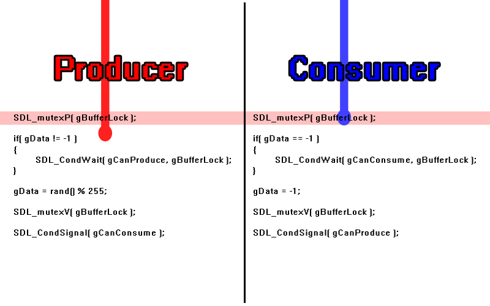
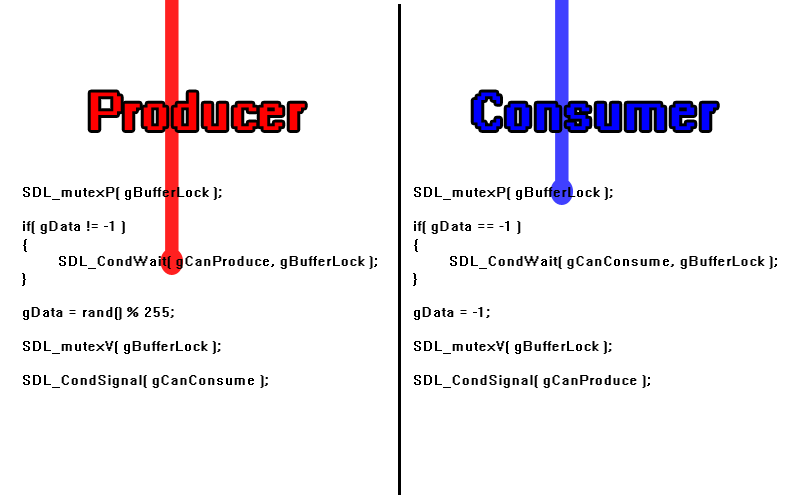
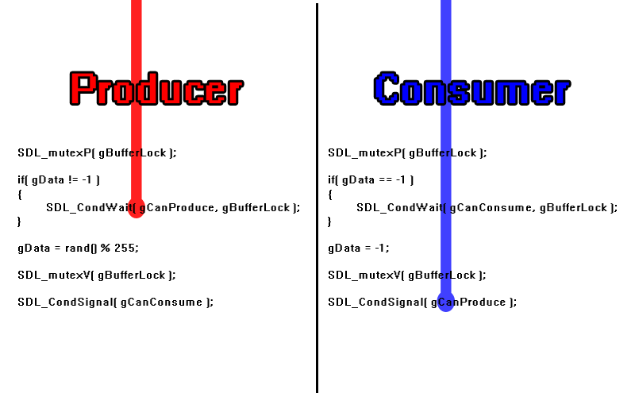
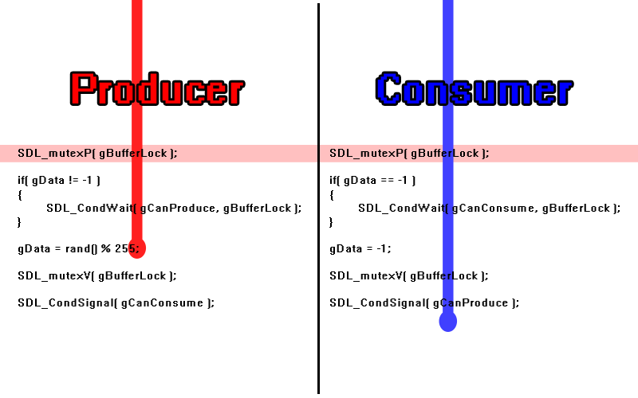

[[<-back](../README.md)]

# Mutexes and Conditions

Not only can you lock [critical sections](../lesson-47/README.md) in threads, but with mutexes and conditions it is possible for threads to tell each other when to unlock.


---

### Coding

For this demo we'll have two threads: a producer which fills a buffer and a consumer that empties a buffer. Not only can the two threads not use the same buffer at the same time, but a consumer can't read from an empty buffer and a producer can't fill a buffer that's already full.

We'll use a mutex (mutually exclusive) to prevent the two threads from grabbing the same piece of data and conditions to let the threads know when they can consume and can produce.

``` C++
//  Our worker functions
int     producer( void* data );
int     consumer( void* data );
void    produce ();
void    consume ();
```

Here we're globally declaring the mutex and conditions that will be used by the threads.

``` C++
//  The protective mutex
SDL_mutex*  gBufferLock = NULL;

//  The conditions
SDL_cond*   gCanProduce = NULL;
SDL_cond*   gCanConsume = NULL;

//  The "data buffer"
int         gData       = -1;
```

To allocate mutexes and conditons we use [`SDL_CreateMutex`](http://wiki.libsdl.org/SDL_CreateMutex) and [`SDL_CreateCond`](http://wiki.libsdl.org/SDL_CreateCond) respectively.

``` C++
bool loadMedia()
{
    //  Create the mutex
    gBufferLock = SDL_CreateMutex();
            
    //  Create conditions
    gCanProduce = SDL_CreateCond();
    gCanConsume = SDL_CreateCond();

    //  Loading success flag
    bool success = true;
    
    //  Load splash texture
    if  ( !gSplashTexture.loadFromFile( "./splash.png" ) )
    {
        printf( "Failed to load splash texture!\n" );
        success = false;
    }

    return success;
}
```

And to deallocate mutexes and conditions we use [`SDL_DestroyMutex`](http://wiki.libsdl.org/SDL_DestroyMutex) and [`SDL_DestroyCond`](http://wiki.libsdl.org/SDL_DestroyCond).

``` C++
void close()
{
    //  Free loaded images
    gSplashTexture.free();

    //  Destroy the mutex
    SDL_DestroyMutex( gBufferLock );
    gBufferLock = NULL;
            
    //  Destroy conditions
    SDL_DestroyCond ( gCanProduce );
    SDL_DestroyCond ( gCanConsume );
    gCanProduce = NULL;
    gCanConsume = NULL;

    //  Destroy window    
    SDL_DestroyRenderer ( gRenderer );
    SDL_DestroyWindow   ( gWindow );
    gWindow     = NULL;
    gRenderer   = NULL;

    //  Quit SDL subsystems
    IMG_Quit();
    SDL_Quit();
}
```

So here are our two worker threads. The producer tries to produce 5 times and the consumer tries to consume 5 times.

``` C++
int producer( void *data )
{
    printf( "\nProducer started...\n" );

    //  Seed thread random
    srand( SDL_GetTicks() );
    
    //  Produce
    for ( int i = 0; i < 5; ++i )
    {
        //  Wait
        SDL_Delay( rand() % 1000 );
        
        //  Produce
        produce();
    }

    printf( "\nProducer finished!\n" );
    
    return 0;

}

int consumer( void *data )
{
    printf( "\nConsumer started...\n" );

    //  Seed thread random
    srand( SDL_GetTicks() );

    for ( int i = 0; i < 5; ++i )
    {
        //  Wait
        SDL_Delay( rand() % 1000 );
        
        //  Consume
        consume();
    }
    
    printf( "\nConsumer finished!\n" );

    return 0;
}
```

---

### Producer / Consumer

Here are the functions that produce and consume. Producing a buffer means generating a random number and consuming a buffer means reseting the generated number. The best way to show how this works is go through an example.

Let's say the producer fires first and locks the mutex with [`SDL_LockMutex`](http://wiki.libsdl.org/SDL_LockMutex) much like it would a semaphore with a value of one:



The buffer is empty so it goes through and produces:



It then exits the function to unlock the critical section with [`SDL_UnlockMutex`](http://wiki.libsdl.org/SDL_UnlockMutex) so the consumer can consume:



Ideally, we would want the consumer to consume, but imagine if the producer fired again:


And after the producer locked the critical section the consumer tries to get it but the critical section is already locked to the producer:



With just a binary semaphore, this would be a problem because the producer can't produce into a full buffer and the consumer is locked behind a mutex. However, mutexes have the ability to be used with conditions.

What the condition allows us to do is if the buffer is already full, we can wait on a condition with [`SDL_CondWait`](http://wiki.libsdl.org/SDL_CondWait) and unlock the mutex for other threads:



Now that the consumer is unlocked it can go through and consume:


And once it's done it signals the producer with [`SDL_CondSignal`](http://wiki.libsdl.org/SDL_CondSignal) to produce again:



And then it can continue through:



With the critical section protected by a mutex and the ability of the threads to talk to each other, the worker threads will work even though we do not know in which order they will execute.

``` C++
void produce()
{
    //  Lock
    SDL_LockMutex( gBufferLock );
    
    //  If the buffer is full
    if  ( gData != -1 )
    {
        //  Wait for buffer to be cleared
        printf(
            "\nProducer encountered full buffer, "
            "waiting for consumer to empty buffer...\n"
        );
        SDL_CondWait( gCanProduce, gBufferLock );
    }

    //  Fill and show buffer
    gData = rand() % 255;
    printf( "\nProduced %d\n", gData );
    
    //  Unlock
    SDL_UnlockMutex( gBufferLock );
    
    //  Signal consumer
    SDL_CondSignal( gCanConsume );
}

void consume()
{
    //  Lock
    SDL_LockMutex( gBufferLock );
    
    //  If the buffer is empty
    if  ( gData == -1 )
    {
        //  Wait for buffer to be filled
        printf(
            "\nConsumer encountered empty buffer, "
            "waiting for producer to fill buffer...\n"
        );
        SDL_CondWait( gCanConsume, gBufferLock );
    }

    //  Show and empty buffer
    printf( "\nConsumed %d\n"   , gData );
    gData = -1;
    
    //  Unlock
    SDL_UnlockMutex ( gBufferLock );
    
    //  Signal producer
    SDL_CondSignal  ( gCanProduce );
}
```

---

[[<-back](../README.md)]
