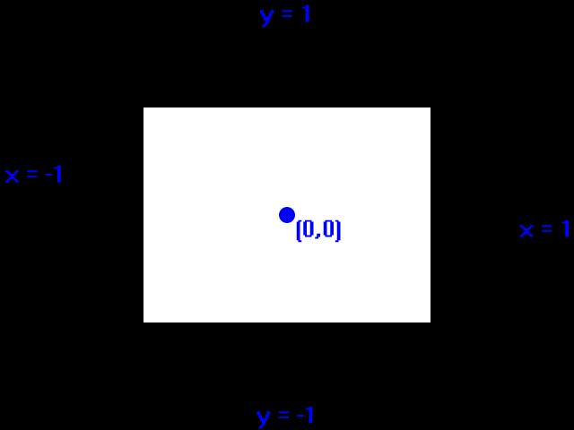

[[<-back](../README.md)]

# SDL and OpenGL 2

One SDL's most powerful features is its ability to combine with OpenGL. Here we'll make a basic OpenGL demo using easier to use legacy OpenGL.


---

### Coding

To use OpenGL with SDL, make sure to include the SDL OpenGL header. We'll also be using GLU (OpenGL Utilities) for this demo.

Also make sure to check the readme.txt file to check which libraries you need to link against.

```
//  Using SDL, SDL OpenGL, standard IO, and, strings
#include <SDL.h>
#include <SDL_opengl.h>
#include <GL\GLU.h>
#include <stdio.h>
#include <string>
```

In terms of new functions, we have a dedicated OpenGL initialization function with initGL. We also have dedicated key handlers, updating, and rendering functions for the main loop.

We also have a GL Context. An OpenGL context is just something that handles OpenGL calls and you need to have one for any OpenGL rendering. Finally, we have a boolean flag that toggles rendering.

``` C++
//  Starts up SDL, creates window, and initializes OpenGL
bool init();

//  Initializes matrices and clear color
bool initGL();

//  Input handler
void handleKeys( unsigned char key, int x, int y );

//  Per frame update
void update();

//  Renders quad to the screen
void render();

//  Frees media and shuts down SDL
void close();

//  The window we'll be rendering to
SDL_Window* gWindow = NULL;

//  OpenGL context
SDL_GLContext gContext;

//  Render flag
bool gRenderQuad = true;
```

When creating an SDL OpenGL window, there are a few more steps we have to take.

Before creating the window we need to specify the version we want. We want OpenGL 2.1 so we call [`SDL_GL_SetAttribute`](http://wiki.libsdl.org/SDL_GL_SetAttribute) to set the major version to 2 and the minor version to 1. After the version is set we can create an OpenGL window by passing the `SDL_WINDOW_OPENGL` flag to `SDL_CreateWindow`.

``` C++
bool init()
{
    //  Initialization flag
    bool success = true;

    //  Initialize SDL
    if  ( SDL_Init( SDL_INIT_VIDEO ) < 0 )
    {
        printf(
            "SDL could not initialize! "
            "SDL Error: %s\n"           ,
            SDL_GetError()
        );
        success = false;
    }
    else
    {
        //  Use OpenGL 2.1
        SDL_GL_SetAttribute( SDL_GL_CONTEXT_MAJOR_VERSION, 2 );
        SDL_GL_SetAttribute( SDL_GL_CONTEXT_MINOR_VERSION, 1 );

        //  Create window
        gWindow     =
            SDL_CreateWindow(
                "SDL Tutorial"          ,
                SDL_WINDOWPOS_UNDEFINED ,
                SDL_WINDOWPOS_UNDEFINED ,
                SCREEN_WIDTH            ,
                SCREEN_HEIGHT           ,
                SDL_WINDOW_OPENGL | SDL_WINDOW_SHOWN
            );
        if  ( gWindow == NULL )
        {
            printf(
                "Window could not be created! "
                "SDL Error: %s\n"               ,
                SDL_GetError()
            );
            success = false;
        }
```

After the window has been created successfully we call [`SDL_GL_CreateContext`](http://wiki.libsdl.org/SDL_GL_CreateContext) to create the OpenGL rendering context. If that was successful, we enable Vsync with [`SDL_GL_SetSwapInterval`](http://wiki.libsdl.org/SDL_GL_SetSwapInterval).

After the SDL OpenGL window is created, we then initialize OpenGL's internals with our own initGL function.


``` C++
        else
        {
            //  Create context
            gContext = SDL_GL_CreateContext( gWindow );
            if  ( gContext == NULL )
            {
                printf(
                    "OpenGL context could not be created! "
                    "SDL Error: %s\n"                       ,
                    SDL_GetError()
                );
                success = false;
            }
            else
            {
                //  Use Vsync
                if  ( SDL_GL_SetSwapInterval( 1 ) < 0 )
                {
                    printf(
                        "Warning: Unable to set VSync! "
                        "SDL Error: %s\n"               ,
                        SDL_GetError()
                    );
                }

                //  Initialize OpenGL
                if  ( !initGL() )
                {
                    printf( "Unable to initialize OpenGL!\n" );
                    success = false;
                }
            }
        }
    }

    return success;
}
```

Here is our first bit of actual OpenGL code. If you were hoping to know all of OpenGL by the end of this tutorial, that is not going to be possible. OpenGL is oceanic in size and complexity and there's no way we could cover it in a single tutorial. What we're doing in this demo is learning how to use OpenGL with SDL.

First we initialize the projection matrix which controls how perspective works in OpenGL. We initialize it here by setting it to the identity matrix. We check if there was an error and print it to the console. Then we do the same thing with the model view matrix which controls how your rendered objects are viewed and placed.

``` C++
bool initGL()
{
    bool    success = true;
    GLenum  error   = GL_NO_ERROR;

    //  Initialize Projection Matrix
    glMatrixMode    ( GL_PROJECTION );
    glLoadIdentity  ();
    
    //  Check for error
    error = glGetError();
    if  ( error != GL_NO_ERROR )
    {
        printf(
            "Error initializing OpenGL! %s\n"   ,
            gluErrorString( error )
        );
        success = false;
    }

    //  Initialize Modelview Matrix
    glMatrixMode    ( GL_MODELVIEW );
    glLoadIdentity  ();

    //  Check for error
    error = glGetError();
    if  ( error != GL_NO_ERROR )
    {
        printf(
            "Error initializing OpenGL! %s\n"   ,
            gluErrorString( error )
        );
        success = false;
    }
```

Lastly, we set the clear color which is the color that the screen is wiped with when we call glClear.

We didn't go into much detail about how these functions work because our main concern is getting SDL working with OpenGL. If you want more detail you can look it up in the [OpenGL 2.1 documentation](http://www.opengl.org/sdk/docs/man2/).

``` C++
    //  Initialize clear color
    glClearColor( 0.f, 0.f, 0.f, 1.f );

    //  Check for error
    error = glGetError();
    if  ( error != GL_NO_ERROR )
    {
        printf(
            "Error initializing OpenGL! %s\n"   ,
            gluErrorString( error )
        );
        success = false;
    }
    
    return success;
}
```

Here are our key input and update handlers. The key input handler toggles the render flag and the update handler is just there for compatibility's sake.

``` C++
void handleKeys( unsigned char key, int x, int y )
{
    //  Toggle quad
    if  ( key == 'q' )
    {
        gRenderQuad = !gRenderQuad;
    }
}

void update()
{
    //  No per frame update needed
}
```

Here in the renderer we're clearing the screen and then if rendering is enabled, we render a quad.

The important thing to know is that OpenGL uses normalized coordinates. This means they go from -1 to 1:



This means our quad is wider than it is tall. In order to get a coordinate system like SDL's, you're going to have to set the project matrix to an orthographic perspective.

``` C++
void render()
{
    //  Clear color buffer
    glClear( GL_COLOR_BUFFER_BIT );
    
    //  Render quad
    if  ( gRenderQuad )
    {
        glBegin( GL_QUADS );
            glVertex2f( -0.5f, -0.5f );
            glVertex2f(  0.5f, -0.5f );
            glVertex2f(  0.5f,  0.5f );
            glVertex2f( -0.5f,  0.5f );
        glEnd();
    }
}
```

Here is our main loop with our main loop functions snapped in.

An important thing to know is that when you use OpenGL's rendering you cannot use SDL's rendering call for surfaces, texturing, and such. As you can see here we need [`SDL_GL_SwapWindow`](http://wiki.libsdl.org/SDL_GL_SwapWindow) to update the screen.

We only flew over the details of OpenGL rendering, but if you want to go into more detail there's an [OpenGL tutorial](https://lazyfoo.net/tutorials/OpenGL/index.php) for that. The tutorial uses FreeGLUT, but using this tutorial it should be easy to port it to SDL 2 for window and event handling. For most of the OpenGL tutorial version 2.1 is used which is old but easier to use. You may not want to use old OpenGL, but think of it this way: Many of the core graphics algorithms like phoung shading were developed in the 1970s. What's changed is that we have different tools to render them with, but the core concepts have not changed.

If you understand the core concepts, you realize that OpenGL 2, OpenGL 3, OpenGL 4, and even Direct3D are more similar than they are different. What's important is that you know how geometry based rendering systems work and getting your hands dirty by getting real experience.

``` C++
        //  Enable text input
        SDL_StartTextInput();

        //  While application is running
        while   ( !quit )
        {
            //  Handle events on queue
            while   ( SDL_PollEvent( &e ) != 0 )
            {
                //  User requests quit
                if  ( e.type == SDL_QUIT )
                {
                    quit = true;
                }
                //  Handle keypress with current mouse position
                else if ( e.type == SDL_TEXTINPUT )
                {
                    int x = 0, y = 0;
                    SDL_GetMouseState( &x, &y );
                    handleKeys( e.text.text[ 0 ], x, y );
                }
            }

            //  Render quad
            render();
            
            //  Update screen
            SDL_GL_SwapWindow( gWindow );
        }
        
        //  Disable text input
        SDL_StopTextInput();
```

---

[[<-back](../README.md)]
